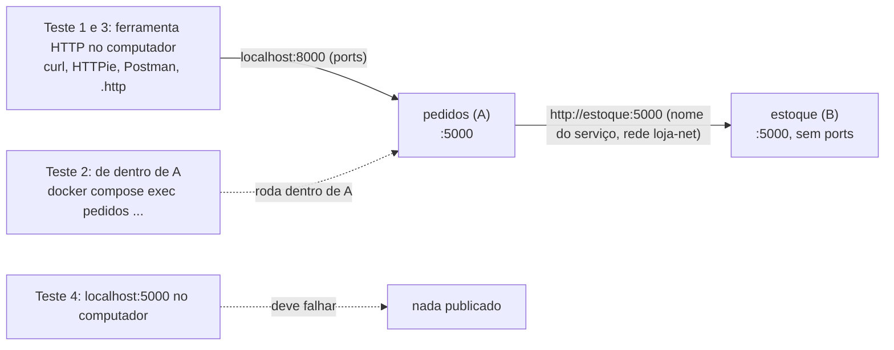
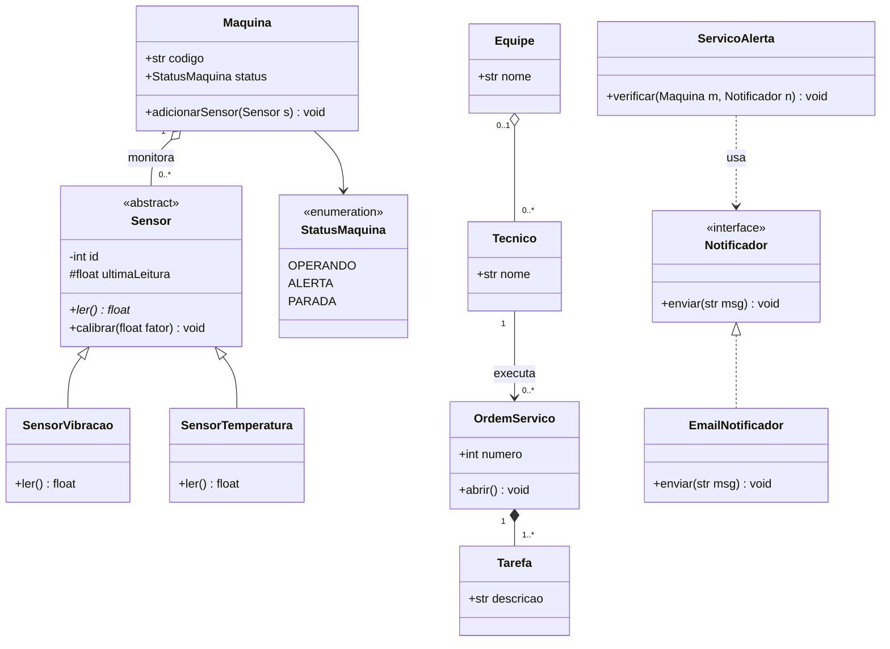
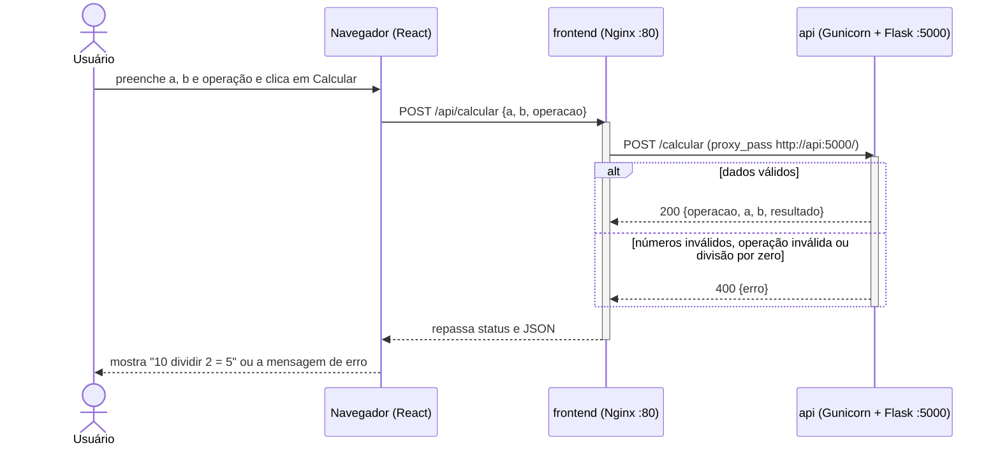
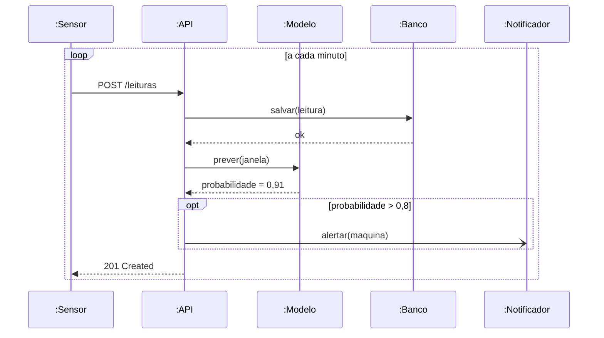
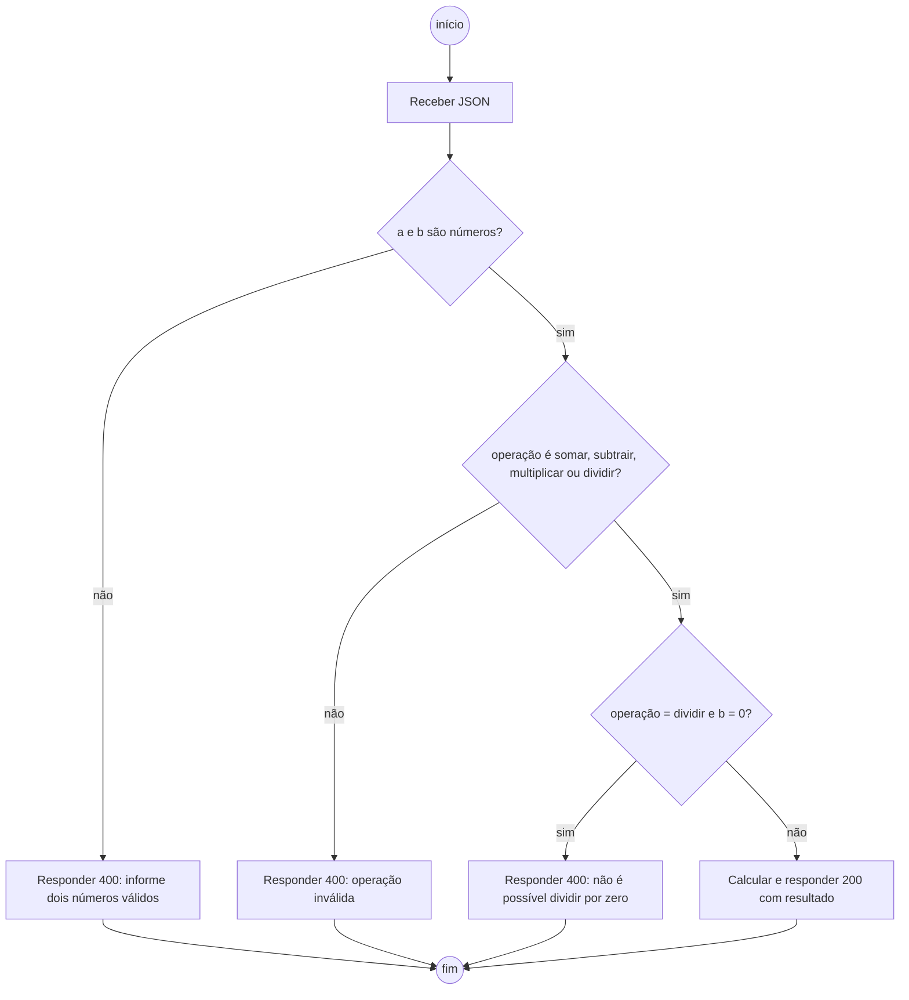
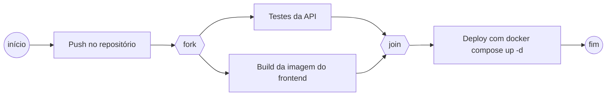
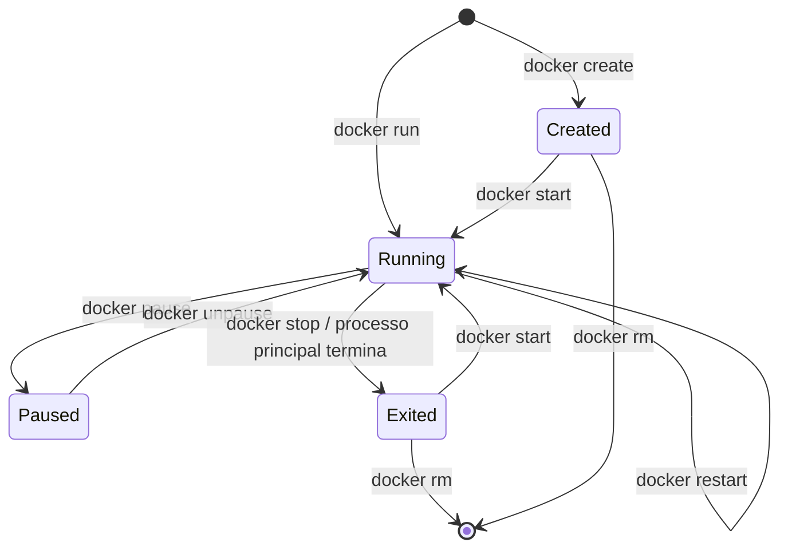
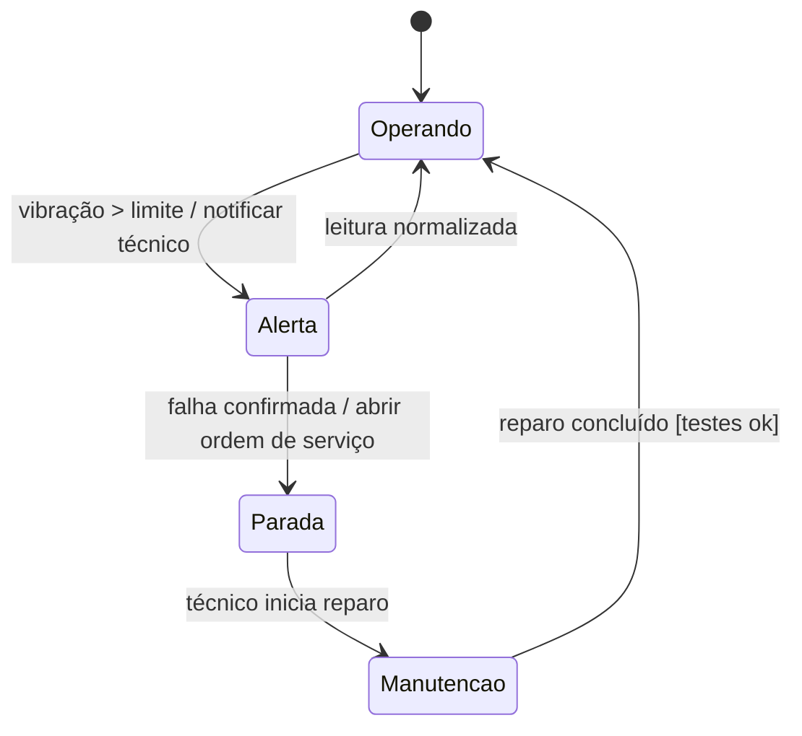
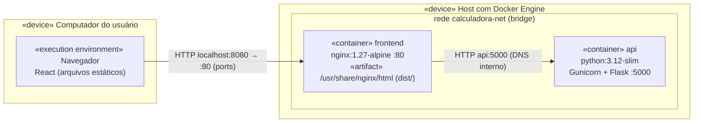
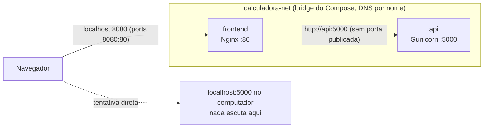

# Ponderada-MLU-Docker

# Guia de consulta: UML e Docker (conteúdo do prof. Murilo)

Material de consulta para a ponderada. Cobre **UML** (todos os diagramas, com foco em classes e sequência), **padrões de projeto**, **Docker** (imagem, container, Dockerfile, CLI), **build multi-stage**, **Docker Compose**, **redes**, **persistência**, **testes, revisão e deploy** e o **ciclo 5C**. Os exemplos do Encontro 04 (Hello World em C, calculadora React + Nginx + Flask e o desafio em Go) estão reproduzidos e explicados linha a linha.

> Os diagramas usam **Mermaid**, que o GitHub e o GitLab desenham automaticamente dentro do Markdown. Se aparecer só o código, a explicação em texto ao lado basta.

---

## Sumário

- [0. Como usar este guia](#como-usar)
- [1. Glossário com localização](#glossario)
- [2. Índice por pergunta](#indice-perguntas)
- **Parte K: Kit da atividade prática** (comece por aqui no dia)
  - [K1. Roteiro da atividade](#roteiro)
  - [K2. Problema → recurso](#problema-recurso)
  - [K3. Testar a comunicação entre serviços](#testar-comunicacao)
  - [K4. Dois serviços Flask conversando](#flask-flask)
  - [K5. Flask em container: host, porta e servidor](#flask-host)
  - [K6. Modelo de README](#readme-modelo)
- **Parte A: UML**
  - [A1. O que é UML e os 14 diagramas](#uml)
  - [A2. Diagrama de classes](#classes)
  - [A3. Diagrama de objetos](#objetos)
  - [A4. Diagrama de sequência](#sequencia)
  - [A5. Diagrama de casos de uso](#casos-de-uso)
  - [A6. Diagrama de atividades](#atividades)
  - [A7. Diagrama de máquina de estados](#estados)
  - [A8. Diagramas de componentes e de implantação](#componentes-implantacao)
  - [A9. Os outros diagramas](#outros-diagramas)
  - [A10. Erros comuns de UML](#uml-erros)
  - [A11. Padrões de projeto (os 10 mais citados)](#padroes)
- **Parte B: Docker**
  - [B1. Conceitos: container, imagem, camada, registry](#docker-conceitos)
  - [B2. Container × máquina virtual](#container-vs-vm)
  - [B3. Arquitetura do Docker](#arquitetura-docker)
  - [B4. Ciclo de vida do container](#ciclo-vida)
  - [B5. Comandos da CLI](#cli)
  - [B6. Dockerfile: todas as instruções](#dockerfile)
  - [B7. CMD × ENTRYPOINT, exec × shell](#cmd-entrypoint)
  - [B8. ARG × ENV](#arg-env)
  - [B9. COPY × ADD](#copy-add)
  - [B10. Contexto de build e .dockerignore](#contexto-dockerignore)
  - [B11. Cache de camadas](#cache)
  - [B12. Boas práticas de Dockerfile](#boas-praticas)
- **Parte C: Build multi-stage**
  - [C1. Conceito: builder, artefato, runtime](#ms-conceito)
  - [C2. A fronteira entre estágios (COPY --from)](#ms-fronteira)
  - [C3. Demonstração 1: Hello World em C](#ms-hello-c)
  - [C4. Demonstração 2a: frontend React + Nginx](#ms-react-nginx)
  - [C5. Demonstração 2b: API Flask com venv](#ms-flask)
  - [C6. Desafio: API em Go](#ms-go)
  - [C7. Imagens base: scratch, alpine, slim, distroless](#imagens-base)
- **Parte D: Docker Compose**
  - [D1. Dockerfile × Compose](#compose)
  - [D2. Estrutura do compose.yaml](#compose-estrutura)
  - [D3. Chaves de um serviço](#compose-servicos)
  - [D4. ports × expose × EXPOSE](#ports-expose)
  - [D5. depends_on e healthcheck](#depends-on)
  - [D6. Comandos do Compose](#compose-comandos)
  - [D7. A calculadora completa, arquivo por arquivo](#calculadora)
  - [D8. Nginx como proxy reverso (proxy_pass)](#nginx-proxy)
  - [D9. Exemplo com banco de dados e volume](#compose-postgres)
  - [D10. Solução de referência do desafio Go](#desafio-go)
- **Parte E: Redes, persistência, testes e deploy**
  - [E1. Redes](#redes)
  - [E2. Persistência: volumes, bind mounts, tmpfs](#persistencia)
  - [E3. Testes, revisão e deploy](#testes-deploy)
  - [E4. Ciclo 5C](#ciclo-5c)
  - [E5. Problemas comuns e como resolver](#troubleshooting)
- **Parte F: Revisão**
  - [F1. Perguntas da aula respondidas](#perguntas-aula)
  - [F2. Banco de perguntas e respostas](#banco-qa)
  - [F3. Folha de cola final](#cheatsheet)
  - [F4. Fontes](#fontes)

---

<a id="como-usar"></a>
## 0. Como usar este guia

1. **No dia da atividade**, comece pelo [kit da atividade prática](#kit): [roteiro](#roteiro), [tabela problema → recurso](#problema-recurso), [testes de comunicação](#testar-comunicacao), [dois serviços Flask](#flask-flask) e [modelo de README](#readme-modelo).
1. **Sabe o termo?** Procure no [glossário](#glossario): cada termo tem uma definição de uma linha e o link para a seção completa.
2. **Tem uma pergunta?** Veja o [índice por pergunta](#indice-perguntas): perguntas típicas de atividade apontam direto para a resposta.
3. **Precisa escrever um arquivo?** Os modelos prontos estão em:
   - Dois serviços Flask com compose, teste e README: [K4](#flask-flask), [K6](#readme-modelo)
   - Dockerfile simples comentado: [B12](#boas-praticas)
   - Dockerfile multi-stage em C, Node/Nginx, Python e Go: [C3](#ms-hello-c), [C4](#ms-react-nginx), [C5](#ms-flask), [C6](#ms-go)
   - compose.yaml com rede interna: [D7](#calculadora); com banco e volume: [D9](#compose-postgres); do desafio Go: [D10](#desafio-go)
   - Diagramas UML em Mermaid: classes [A2](#classes-exemplo), sequência [A4](#sequencia-exemplo), estados [A7](#estados), atividades [A6](#atividades), implantação [A8](#componentes-implantacao)
4. **Use `Ctrl+F`**: os nomes de instruções e comandos aparecem sempre em `código` (`COPY --from`, `depends_on`, `expose`).

---

<a id="glossario"></a>
## 1. Glossário com localização

| Termo | O que é, em uma linha | Onde está |
|---|---|---|
| `.dockerignore` | lista de arquivos que **não** entram no contexto de build | [B10](#contexto-dockerignore) |
| `.http` (REST Client) | arquivo de requisições HTTP versionado no repositório, executado pelo VS Code | [K3.3](#testar-comunicacao) |
| Abstrata (classe) | classe que não pode ser instanciada; nome em itálico ou `{abstract}` | [A2.1](#classes-notacao) |
| `ADD` | como `COPY`, mas também baixa URL e extrai `.tar` | [B9](#copy-add) |
| Agregação (◇) | todo–parte fraco: a parte existe sem o todo | [A2.5](#agregacao) |
| `alt` / `opt` / `loop` / `par` | fragmentos combinados do diagrama de sequência (if-else, if, laço, paralelo) | [A4.3](#fragmentos) |
| alpine | imagem Linux mínima (≈ 5 MB) com musl e `apk` | [C7](#imagens-base) |
| `app.run(host=...)` | como o Flask decide onde escutar; precisa de `0.0.0.0` no container | [K5](#flask-host) |
| `ARG` | variável que só existe durante o build | [B8](#arg-env) |
| Artefato | o que atravessa de um estágio para outro (binário, `dist/`, venv) | [C1](#ms-conceito), [C2](#ms-fronteira) |
| Associação | relação estrutural entre classes (linha sólida) | [A2.4](#associacao) |
| Ativação (barra de) | retângulo fino na linha de vida: o participante está executando | [A4.2](#sequencia-mensagens) |
| Ator | quem interage com o sistema (pessoa ou outro sistema) | [A5](#casos-de-uso), [A4](#sequencia) |
| Bind mount | pasta do computador montada dentro do container | [E2](#persistencia) |
| bridge | driver de rede padrão; a criada pelo usuário/Compose tem DNS por nome | [E1](#redes) |
| BuildKit | motor de build padrão do Docker; pula estágios não usados | [B11](#cache), [C1](#ms-conceito) |
| `build` (Compose) | diz ao Compose para construir a imagem a partir de um contexto | [D3](#compose-servicos) |
| Builder (estágio) | estágio com compilador e ferramentas; não vai para a imagem final | [C1](#ms-conceito) |
| Builder (padrão) | monta objeto complexo passo a passo | [A11](#p-builder) |
| Cache de camadas | reaproveitamento de camadas já construídas | [B11](#cache) |
| Camada (layer) | diferença de sistema de arquivos criada por `RUN`, `COPY`, `ADD` | [B1](#docker-conceitos), [B11](#cache) |
| cgroups / namespaces | recursos do kernel Linux que isolam e limitam containers | [B2](#container-vs-vm) |
| Ciclo 5C | Contextualizar, Consultar, Confrontar, Construir, Comprovar | [E4](#ciclo-5c) |
| Classe de associação | classe ligada por tracejado a uma associação (guarda dados da relação) | [A2.9](#classe-associacao) |
| `CMD` | comando padrão do container; trocável no `docker run` | [B7](#cmd-entrypoint) |
| Composição (◆) | todo–parte forte: a parte morre com o todo | [A2.6](#composicao) |
| Compose | ferramenta que cria e conecta vários containers a partir de um YAML | [D1](#compose) |
| `compose.yaml` | arquivo do Compose (nome preferido; `docker-compose.yml` também vale) | [D2](#compose-estrutura) |
| Container | instância em execução de uma imagem, isolada, com camada gravável | [B1](#docker-conceitos) |
| Contexto de build | pasta enviada ao Docker no `docker build` (o `.` do final) | [B10](#contexto-dockerignore) |
| `COPY` | copia arquivos do contexto para a imagem | [B9](#copy-add) |
| `COPY --from` | copia **só o caminho indicado** de outro estágio ou imagem | [C2](#ms-fronteira) |
| Casos de uso | diagrama de atores, funcionalidades, `include` e `extend` | [A5](#casos-de-uso) |
| curl | ferramenta HTTP de linha de comando para testar serviços | [K3.2](#testar-comunicacao) |
| Dependência (UML) | uso temporário; tracejada com seta aberta | [A2.8](#dependencia) |
| `depends_on` | ordem de inicialização entre serviços do Compose | [D5](#depends-on) |
| Deploy | colocar a aplicação para rodar no ambiente alvo | [E3](#testes-deploy) |
| Diagrama de atividades | fluxo de passos, decisões e paralelismo | [A6](#atividades) |
| Diagrama de classes | estrutura estática: classes, atributos, métodos, relações | [A2](#classes) |
| Diagrama de implantação | onde cada artefato roda (nós, servidores, containers) | [A8](#componentes-implantacao) |
| Diagrama de estados | estados de um objeto e transições | [A7](#estados) |
| Diagrama de sequência | troca de mensagens no tempo, de cima para baixo | [A4](#sequencia) |
| distroless | imagem só com o runtime da linguagem, sem shell | [C7](#imagens-base) |
| DNS interno | resolve o **nome do serviço** para o IP do container | [E1](#redes) |
| `docker compose config` | valida e mostra a configuração final, já combinada | [D6](#compose-comandos) |
| `docker compose ps` | lista os containers do projeto, status e portas | [D6](#compose-comandos) |
| Docker Engine / daemon | serviço `dockerd` que constrói e roda containers | [B3](#arquitetura-docker) |
| Dockerfile | receita para construir uma imagem | [B6](#dockerfile) |
| `ENTRYPOINT` | executável fixo do container; `CMD` vira argumento | [B7](#cmd-entrypoint) |
| `ENV` | variável de ambiente no build **e** na execução | [B8](#arg-env) |
| Exec form × shell form | `["prog","arg"]` × `prog arg` (passa por `/bin/sh -c`) | [B7](#cmd-entrypoint) |
| `EXPOSE` | **documenta** a porta da imagem; não publica nada | [D4](#ports-expose) |
| `expose` (Compose) | documenta a porta interna do serviço; não publica no computador | [D4](#ports-expose) |
| `extend` / `include` | relações entre casos de uso (opcional / obrigatório) | [A5](#casos-de-uso) |
| Facade | interface simples para um subsistema complexo | [A11](#p-facade) |
| Factory | decide qual classe concreta criar | [A11](#p-factory) |
| `flask run --host 0.0.0.0` | modo de desenvolvimento do Flask acessível de fora do container | [K5](#flask-host) |
| `FROM` | imagem base; com `AS nome`, começa um estágio | [B6](#dockerfile), [C1](#ms-conceito) |
| Generalização / herança | “é um”; linha sólida com triângulo vazio | [A2.7](#heranca) |
| Gunicorn | servidor WSGI que roda o Flask em produção | [C5](#ms-flask) |
| `healthcheck` | comando que diz se o container está saudável | [D5](#depends-on), [B6](#dockerfile) |
| HTTPie | ferramenta HTTP mais legível (`http POST :8000/rota campo=valor`) | [K3.3](#testar-comunicacao) |
| Imagem | molde imutável em camadas, de onde nascem containers | [B1](#docker-conceitos) |
| Interface (UML) | contrato «interface»; implementada por realização | [A2.7](#realizacao) |
| Iterator | percorre uma coleção sem expor a estrutura | [A11](#p-iterator) |
| Linha de vida (lifeline) | linha tracejada vertical de um participante | [A4.2](#sequencia-mensagens) |
| `localhost` no container | é **o próprio container**, não o computador nem outro container | [E1](#redes) |
| Mediator | objetos conversam por um intermediário | [A11](#p-mediator) |
| Mensagem síncrona / assíncrona / retorno | seta cheia / seta aberta / seta tracejada | [A4.2](#sequencia-mensagens) |
| Multiplicidade | quantos objetos participam (1, 0..1, *, 1..*) | [A2.3](#multiplicidade) |
| Multi-stage | Dockerfile com vários `FROM`; só o último vira a imagem | [C1](#ms-conceito) |
| Navegabilidade | seta na associação: quem conhece quem | [A2.4](#associacao) |
| `networks` | redes do Compose (nível do serviço e nível do arquivo) | [E1](#redes), [D7](#calculadora) |
| Nginx | servidor web; serve o React e encaminha `/api/` para a API | [D8](#nginx-proxy) |
| Observer | 1 → N: avisa todos os inscritos | [A11](#p-observer) |
| OCI | padrão aberto de formato de imagem e runtime | [B3](#arquitetura-docker) |
| `/ping-outro` | rota de prova: o serviço A chama o `/health` do B e devolve o resultado | [K4](#flask-flask) |
| Postman / Insomnia / Thunder Client | ferramentas HTTP com interface gráfica | [K3.3](#testar-comunicacao) |
| Problema → recurso | tabela de qual recurso Docker resolve cada problema | [K2](#problema-recurso) |
| `ports` | **publica** porta no computador: `"HOST:CONTAINER"` | [D4](#ports-expose) |
| Proxy (padrão) | substituto que controla acesso a um objeto | [A11](#p-proxy) |
| `proxy_pass` | diretiva do Nginx que encaminha a requisição | [D8](#nginx-proxy) |
| Prototype | cria objetos clonando um existente | [A11](#p-prototype) |
| `PYTHONUNBUFFERED=1` | faz o `print` do Python aparecer na hora nos logs do container | [K5](#flask-host) |
| Realização | classe implementa interface; tracejada com triângulo vazio | [A2.7](#realizacao) |
| README | artefato avaliado: explica com suas palavras o que foi feito e por quê | [K6](#readme-modelo) |
| Registry | servidor de imagens (Docker Hub, GitLab Registry) | [B1](#docker-conceitos) |
| `requests` (Python) | biblioteca usada para um serviço Flask chamar outro por HTTP | [K4](#flask-flask) |
| `restart` | política de reinício (`no`, `always`, `unless-stopped`, `on-failure`) | [D3](#compose-servicos) |
| Roteiro da atividade | passo a passo do Dockerfile ao README | [K1](#roteiro) |
| `RUN` | executa comando **no build** e cria camada | [B6](#dockerfile) |
| Runtime (estágio) | estágio final, só com o necessário para rodar | [C1](#ms-conceito) |
| `scratch` | imagem vazia (nem shell, nem libc) | [C7](#imagens-base), [C3](#ms-hello-c) |
| Serviço de teste (`profiles`) | serviço do Compose que só sobe para testar a comunicação | [K3.5](#testar-comunicacao) |
| Singleton | uma única instância global | [A11](#p-singleton) |
| State | comportamento muda conforme o estado | [A11](#p-state) |
| Estereótipo «...» | marca o tipo do elemento: «interface», «enumeration», «include» | [A2.1](#classes-notacao) |
| Status HTTP (200, 400, 404, 502, 503…) | o que cada resultado de teste significa | [K3.7](#status-http) |
| Tag | nome de versão da imagem (`api:1.0`); `latest` é só um nome | [B1](#docker-conceitos) |
| Teste de comunicação | provar que um serviço alcança o outro pela rede interna | [K3](#testar-comunicacao) |
| `--target` | constrói só até um estágio escolhido | [C1](#ms-conceito) |
| tmpfs | montagem em memória; some ao parar | [E2](#persistencia) |
| `USER` | usuário que roda os comandos seguintes e o container | [B6](#dockerfile), [B12](#boas-praticas) |
| venv no multi-stage | ambiente virtual criado no builder e copiado para o runtime | [C5](#ms-flask) |
| Visibilidade | `+` público, `-` privado, `#` protegido, `~` pacote | [A2.2](#visibilidade) |
| Volume | armazenamento gerenciado pelo Docker; sobrevive ao container | [E2](#persistencia) |
| `WORKDIR` | pasta de trabalho dos comandos seguintes | [B6](#dockerfile) |

---

<a id="indice-perguntas"></a>
## 2. Índice por pergunta

| Se a pergunta é… | Vá para |
|---|---|
| Por onde começo a atividade? | [K1](#roteiro) |
| Qual recurso resolve este problema? | [K2](#problema-recurso) |
| Como provo que um serviço fala com o outro? | [K3](#testar-comunicacao) |
| Qual ferramenta HTTP usar e como? | [K3.2 e K3.3](#testar-comunicacao) |
| Como testar de dentro do container se a imagem não tem curl? | [K3.4](#testar-comunicacao) |
| O teste deu 502, 503, “Could not resolve host” ou “Empty reply” | [K3.7](#status-http) |
| Como um Flask chama outro Flask? | [K4](#flask-flask) |
| Como passo a URL de um serviço para o outro? | [K4](#flask-flask) |
| Meu Flask não responde dentro do container | [K5](#flask-host) |
| `flask run`, `app.run` ou Gunicorn? | [K5](#flask-host) |
| O que escrever no README? | [K6](#readme-modelo) |
| Qual a diferença entre agregação e composição? | [A2.5](#agregacao), [A2.6](#composicao) |
| Como represento uma interface e quem a implementa? | [A2.7](#realizacao) |
| O que significam `+ - # ~`? | [A2.2](#visibilidade) |
| Onde escrevo a multiplicidade? | [A2.3](#multiplicidade) |
| Como transformo um diagrama de classes em código? | [A2.10](#classes-codigo) |
| Como desenho a sequência de uma requisição web? | [A4.4](#sequencia-exemplo) |
| Qual a diferença entre `alt` e `opt`? | [A4.3](#fragmentos) |
| `include` ou `extend`? Para onde vai a seta? | [A5](#casos-de-uso) |
| Qual diagrama mostra containers e servidores? | [A8](#componentes-implantacao) |
| Quais são os 14 diagramas e quais são estruturais? | [A1](#uml) |
| Qual padrão usar para avisar vários objetos? | [A11](#p-observer) |
| Qual a diferença entre imagem e container? | [B1](#docker-conceitos) |
| Por que container é mais leve que VM? | [B2](#container-vs-vm) |
| `RUN`, `CMD` ou `ENTRYPOINT`? | [B6](#dockerfile), [B7](#cmd-entrypoint) |
| `ARG` ou `ENV`? | [B8](#arg-env) |
| Por que meu build reinstala tudo a cada mudança? | [B11](#cache) |
| O que é build multi-stage e para que serve? | [C1](#ms-conceito) |
| `COPY --from` copia a imagem inteira? | [C2](#ms-fronteira) (não: só o caminho indicado) |
| Por que a imagem final do C não tem `gcc`? | [C3](#ms-hello-c), [F1](#perguntas-aula) |
| Por que o Node não está na imagem do frontend? | [C4](#ms-react-nginx) |
| Como copiar um venv entre estágios? | [C5](#ms-flask) |
| Como escrevo o Dockerfile multi-stage em Go? | [C6](#ms-go) |
| Multi-stage fica no Dockerfile ou no Compose? | [D1](#compose) (no Dockerfile) |
| Qual a diferença entre `ports`, `expose` e `EXPOSE`? | [D4](#ports-expose) |
| `depends_on` espera o serviço ficar pronto? | [D5](#depends-on) (não, sem healthcheck) |
| Como um container fala com outro? | [E1](#redes), [D8](#nginx-proxy) |
| Por que o React chama `/api/calcular` e não `localhost:5000`? | [D8](#nginx-proxy), [F1](#perguntas-aula) |
| O que acontece se eu parar só a API? | [F1](#perguntas-aula) |
| Como guardo os dados do banco? | [E2](#persistencia), [D9](#compose-postgres) |
| `docker compose down` apaga meus dados? | [E2](#persistencia) |
| Como provo que a API não está publicada no computador? | [D10](#desafio-go), [E4](#ciclo-5c) |
| Como preencher o registro 5C? | [E4](#ciclo-5c) |
| Deu “502 Bad Gateway”, “connection refused” ou “port is already allocated” | [E5](#troubleshooting) |

---

<a id="kit"></a>
# Parte K: Kit da atividade prática

Esta parte foi feita para o formato da ponderada: **construir várias imagens, subir a aplicação, provar que um serviço fala com o outro e explicar tudo no README**. O professor não vai descontar pequenos erros de sintaxe; vai avaliar se você sabe **qual recurso resolve cada problema**. Por isso, comece pela [tabela problema → recurso](#problema-recurso).

<a id="roteiro"></a>
## K1. Roteiro da atividade

| # | Passo | Comando ou ação | Pronto quando |
|---|---|---|---|
| 1 | **Ler a aplicação fornecida** | quantos serviços? em que porta cada um escuta? quem chama quem? que variáveis cada um espera (URL do outro, banco)? | você consegue desenhar o fluxo `cliente → A → B` |
| 2 | **Conferir o host do Flask** | procurar `app.run(...)` ou o comando de execução | escuta em `0.0.0.0` ([K5](#flask-host)) |
| 3 | **Dockerfile de cada serviço** | partir dos modelos: Flask simples ([K4](#flask-flask)), Flask multi-stage ([C5](#ms-flask)), React/Nginx ([C4](#ms-react-nginx)), Go ([C6](#ms-go)), C ([C3](#ms-hello-c)) | cada pasta de serviço tem `Dockerfile`, `.dockerignore` e `requirements.txt` |
| 4 | **Construir e testar cada imagem sozinha** | `docker build -t pedidos:1.0 ./servico-a` · `docker run --rm -p 8000:5000 pedidos:1.0` · `curl localhost:8000/health` | cada serviço responde isolado |
| 5 | **compose.yaml** | serviços com `build`, uma rede, `ports` só em quem o cliente acessa, `environment` com a URL do outro serviço usando o **nome do serviço**, `depends_on` | `docker compose config` sem erro |
| 6 | **Subir** | `docker compose up --build -d` · `docker compose ps` · `docker compose logs -f` | todos `Up` (ou `healthy`) |
| 7 | **Testar a comunicação** | por fora (ferramenta HTTP) e por dentro (`docker compose exec`) ([K3](#testar-comunicacao)) | evidência de que A alcança B pelo nome |
| 8 | **Guardar evidências** | rodar o script `testar.sh` ([K3.6](#script-evidencias)) ou copiar as saídas para o README | arquivo `evidencias.txt` ou prints |
| 9 | **README** | preencher o [modelo](#readme-modelo) com as suas palavras | explica o que, como e **por quê** |
| 10 | **Encerrar** | `docker compose down` | |

Se algo falhar, a ordem de investigação é sempre: `docker compose ps` (está rodando?) → `docker compose logs <serviço>` (qual erro?) → teste de dentro do container (a rede funciona?) → [tabela de status e erros](#status-http).

<a id="problema-recurso"></a>
## K2. Problema → recurso

| Problema ou pedido | Recurso que resolve | Onde |
|---|---|---|
| Empacotar a aplicação numa imagem | `Dockerfile`: `FROM`, `WORKDIR`, `COPY`, `RUN`, `CMD` | [B6](#dockerfile), [B12](#boas-praticas) |
| Construir várias imagens | um `Dockerfile` por serviço + `docker build` (ou `build:` no Compose) | [B5](#cli), [D3](#compose-servicos) |
| Imagem final grande ou com compilador/Node/ferramentas | **multi-stage** + `COPY --from` | [C1](#ms-conceito), [C2](#ms-fronteira) |
| Build reinstala as dependências toda vez | copiar `requirements.txt`/`package.json` **antes** do código | [B11](#cache) |
| Arquivos inúteis ou segredos entrando no build | `.dockerignore` | [B10](#contexto-dockerignore) |
| Definir o que roda quando o container inicia | `CMD` (exec form) ou `ENTRYPOINT` | [B7](#cmd-entrypoint) |
| Valor que muda por ambiente (URL, modo) | `ENV` na imagem ou `environment:` no Compose | [B8](#arg-env), [D3](#compose-servicos) |
| Valor que só importa no build (versão da base) | `ARG` + `--build-arg` | [B8](#arg-env) |
| Não rodar como root | `USER` | [B6](#dockerfile), [C5](#ms-flask) |
| Documentar a porta da imagem | `EXPOSE` (não publica) | [D4](#ports-expose) |
| Construir ou testar só um estágio | `docker build --target` | [C1](#ms-conceito) |
| Rodar um binário numa imagem vazia | `scratch` + compilação estática | [C3](#ms-hello-c), [C6](#ms-go) |
| Subir vários containers juntos | `compose.yaml` + `docker compose up` | [D1](#compose), [D2](#compose-estrutura) |
| Acessar um serviço pelo navegador ou pelo computador | `ports: ["HOST:CONTAINER"]` | [D4](#ports-expose) |
| Um serviço **não** deve ser acessível de fora | não colocar `ports` (só rede interna; `expose` documenta) | [D4](#ports-expose) |
| **Um serviço falar com o outro** | mesma rede + URL com o **nome do serviço** (`http://estoque:5000`) | [E1](#redes), [K4](#flask-flask) |
| Passar a URL do outro serviço para o código | `environment:` + `os.environ.get(...)` no Flask | [K4](#flask-flask) |
| Isolar grupos de serviços | redes diferentes; serviço em várias redes | [E1](#redes) |
| Frontend chamar a API sem expor a API | Nginx como proxy reverso + rota relativa | [D8](#nginx-proxy) |
| Ordem de inicialização | `depends_on` | [D5](#depends-on) |
| Esperar o outro serviço ficar **pronto** | `healthcheck` + `condition: service_healthy` | [D5](#depends-on), [K4](#flask-flask) |
| Dados não podem sumir | volume nomeado | [E2](#persistencia) |
| Editar o código sem reconstruir (desenvolvimento) | bind mount + `flask run --debug` | [E2](#persistencia), [K5](#flask-host) |
| Reiniciar sozinho se cair | `restart: unless-stopped` | [D3](#compose-servicos) |
| Flask não responde dentro do container | escutar em `0.0.0.0` | [K5](#flask-host) |
| Rodar Flask de forma robusta | Gunicorn | [K5](#flask-host), [C5](#ms-flask) |
| `print` não aparece nos logs | `ENV PYTHONUNBUFFERED=1` | [K5](#flask-host) |
| Validar o compose | `docker compose config` | [D6](#compose-comandos) |
| Ver o que está rodando e as portas | `docker compose ps` | [D6](#compose-comandos) |
| Descobrir por que falhou | `docker compose logs <serviço>` | [D6](#compose-comandos) |
| **Testar a comunicação** por fora | curl, HTTPie, Postman/Insomnia, arquivo `.http` | [K3](#testar-comunicacao) |
| **Testar a comunicação** por dentro | `docker compose exec` + curl/wget/python; serviço de teste | [K3](#testar-comunicacao) |
| Aplicar mudanças no código | `docker compose up --build -d` | [D6](#compose-comandos) |
| Porta do computador já em uso | trocar o lado HOST (`"8081:5000"`) | [E5](#troubleshooting) |
| Parar tudo / apagar também os dados | `docker compose down` / `down -v` | [D6](#compose-comandos), [E2](#persistencia) |

<a id="testar-comunicacao"></a>
## K3. Testar a comunicação entre serviços

### K3.1 O que precisa ser provado

1. **Cada serviço responde sozinho** (por exemplo, `GET /health` → 200).
2. **O serviço A alcança o serviço B pela rede interna, usando o nome do serviço.** Esta é a prova principal pedida.
3. **O fluxo de ponta a ponta funciona**: cliente → A → B → A → cliente.
4. (Se for requisito) **B não está acessível do computador**: só A tem `ports`.



| Teste | De onde | URL | Por que essa URL |
|---|---|---|---|
| A está no ar | computador | `http://localhost:8000/health` | 8000 é a porta **publicada** de A |
| A fala com B (pela aplicação) | computador | `http://localhost:8000/ping-outro` | a rota de A chama B internamente ([K4](#flask-flask)) |
| A fala com B (direto) | **dentro de A** | `http://estoque:5000/health` | o nome `estoque` só existe **dentro** da rede |
| Fluxo completo | computador | `POST http://localhost:8000/pedido` | usa a regra de negócio que depende de B |
| B não exposto | computador | `http://localhost:5000/health` | deve **falhar** (B não tem `ports`) |

> **Erro mais comum:** testar `http://estoque:5000` **do computador**. Dá `Could not resolve host`, porque o nome do serviço só é resolvido dentro da rede do Compose. Do computador, use `localhost` + a porta publicada; para usar o nome, entre num container.

### K3.2 curl (já vem no Linux, no Mac e no Windows 10+)

```bash
curl http://localhost:8000/health                       # GET simples
curl -i http://localhost:8000/ping-outro                # -i mostra status e cabeçalhos
curl -s -o /dev/null -w "%{http_code}\n" http://localhost:8000/health   # só o código HTTP
curl -X POST http://localhost:8000/pedido \
     -H "Content-Type: application/json" \
     -d '{"produto": "rolamento", "quantidade": 2}'   # POST com JSON
curl -m 3 http://localhost:5000/health                  # -m: desiste em 3 s (teste de "não exposto")
```

O Flask escapa acentos no JSON: `"N\u00e3o existe"` é o mesmo texto que `"Não existe"` (ferramentas como HTTPie e Postman mostram já decodificado).

No **PowerShell**, `curl` pode ser um apelido de outro comando: use `curl.exe`, ou:

```powershell
Invoke-RestMethod -Uri http://localhost:8000/pedido -Method Post `
  -ContentType "application/json" -Body '{"produto": "rolamento", "quantidade": 2}'
```

### K3.3 Outras ferramentas HTTP

**HTTPie** (`pip install httpie`), mais legível:

```bash
http :8000/health                                       # :8000 = localhost:8000
http :8000/ping-outro
http POST :8000/pedido produto=rolamento quantidade:=2   # := envia número (JSON cru)
```

**Postman, Insomnia ou Thunder Client (extensão do VS Code):** criar a requisição, método `POST`, URL `http://localhost:8000/pedido`, aba *Body* → *raw* → *JSON*, colar o corpo, *Send*. Salve as requisições numa coleção e tire print da resposta para o README.

**Arquivo `.http`** (extensão *REST Client* do VS Code; o IntelliJ/PyCharm também abre). Fica versionado no repositório como documentação dos testes:

```http
### 1. A está no ar (pelo computador)
GET http://localhost:8000/health

### 2. A chama B pela rede interna
GET http://localhost:8000/ping-outro

### 3. Fluxo completo
POST http://localhost:8000/pedido
Content-Type: application/json

{"produto": "rolamento", "quantidade": 2}

### 4. Produto inexistente (B responde 404 e A repassa)
POST http://localhost:8000/pedido
Content-Type: application/json

{"produto": "parafuso", "quantidade": 1}
```

### K3.4 Testar de dentro do container

```bash
# com curl (se a imagem tiver)
docker compose exec pedidos curl -s http://estoque:5000/health

# imagens python:*-slim NÃO têm curl nem wget: use o próprio Python
docker compose exec pedidos python -c "import urllib.request as u; print(u.urlopen('http://estoque:5000/health').read().decode())"

# imagens alpine e nginx:alpine têm wget (BusyBox)
docker compose exec frontend wget -qO- http://api:5000/health

# o nome resolve para qual IP? (Debian/slim)
docker compose exec pedidos getent hosts estoque

# container descartável, com curl, ligado à mesma rede (o nome real da rede tem o prefixo do projeto)
docker network ls                                  # ex.: app-dois-servicos_loja-net
docker run --rm --network app-dois-servicos_loja-net curlimages/curl:8.10.1 -s http://estoque:5000/health
```

### K3.5 Serviço de teste no próprio Compose

Um serviço que só existe para testar: sobe, faz a requisição pela rede interna e termina. Fica guardado no repositório e não atrapalha o `up` normal (graças ao `profiles`).

```yaml
  teste:
    image: curlimages/curl:8.10.1        # o ENTRYPOINT desta imagem já é o curl
    command: ["-fsS", "http://pedidos:5000/ping-outro"]
    depends_on:
      pedidos:
        condition: service_started
    networks: [loja-net]
    profiles: [teste]                     # só sobe quando pedido
```

```bash
docker compose --profile teste run --rm teste
# {"chamou":"http://estoque:5000","resposta_do_outro":{"servico":"estoque","status":"ok"},"status_do_outro":200}
```

O `healthcheck` também é um teste automático: no [K4](#flask-flask), o `pedidos` só sobe depois que o `estoque` responde.

<a id="script-evidencias"></a>
### K3.6 Script de evidências

```bash
#!/usr/bin/env bash
# testar.sh: roda os testes de comunicação e salva tudo em evidencias.txt
# uso: docker compose up --build -d && bash testar.sh
{
  echo "== docker compose ps"
  docker compose ps
  echo; echo "== 1. A responde pelo computador (porta publicada 8000)"
  curl -s -w "\nHTTP %{http_code}\n" http://localhost:8000/health
  echo; echo "== 2. A chama B pela rede interna (rota /ping-outro)"
  curl -s -w "\nHTTP %{http_code}\n" http://localhost:8000/ping-outro
  echo; echo "== 3. B visto de dentro de A, pelo nome do serviço"
  docker compose exec -T pedidos python -c "import urllib.request as u; print(u.urlopen('http://estoque:5000/health').read().decode())"
  echo; echo "== 4. Fluxo completo"
  curl -s -w "\nHTTP %{http_code}\n" -X POST http://localhost:8000/pedido \
       -H "Content-Type: application/json" -d '{"produto": "rolamento", "quantidade": 2}'
  echo; echo "== 5. B NÃO está publicado no computador (deve falhar)"
  curl -s -m 3 http://localhost:5000/health || echo "falhou, como esperado"
} 2>&1 | tee evidencias.txt
```

Teste em Python (opcional, pode virar teste automatizado no CI):

```python
# testar_comunicacao.py  (rodar no computador com a aplicação no ar: python testar_comunicacao.py)
import requests

BASE = "http://localhost:8000"

def checar(nome, resposta, esperado):
    ok = resposta.status_code == esperado
    print(f"[{'OK' if ok else 'FALHOU'}] {nome}: {resposta.status_code} {resposta.text.strip()}")
    return ok

resultados = [
    checar("A está no ar", requests.get(f"{BASE}/health", timeout=5), 200),
    checar("A fala com B", requests.get(f"{BASE}/ping-outro", timeout=5), 200),
    checar("fluxo completo",
           requests.post(f"{BASE}/pedido", json={"produto": "rolamento", "quantidade": 2}, timeout=5), 201),
]
raise SystemExit(0 if all(resultados) else 1)
```

Prova extra (mostra que a comunicação é real): `docker compose stop estoque` e repetir o teste 2. A deve responder **503** com a mensagem de erro de conexão. Depois `docker compose start estoque`.

<a id="status-http"></a>
### K3.7 Como ler o resultado

| Resultado | Significa | O que fazer |
|---|---|---|
| `200 OK` / `201 Created` | funcionou | registrar como evidência |
| `400 Bad Request` | o serviço respondeu, mas o corpo está errado | conferir JSON e campos |
| `404 Not Found` | rota não existe nesse serviço (ou prefixo não removido no proxy) | conferir a rota e o `proxy_pass` ([D8](#nginx-proxy)) |
| `405 Method Not Allowed` | método errado (GET numa rota POST) | `-X POST` |
| `409 Conflict` | regra de negócio recusou (no exemplo, estoque insuficiente) | é um resultado válido |
| `415 Unsupported Media Type` | Flask recebeu corpo sem `Content-Type: application/json` | adicionar o cabeçalho |
| `500 Internal Server Error` | exceção no código | `docker compose logs <serviço>` |
| `502 Bad Gateway` | o proxy (Nginx) não alcançou o serviço de trás | o serviço está rodando? porta certa? |
| `503 Service Unavailable` | no exemplo: A não alcançou B | B está rodando? mesma rede? URL com o nome certo? |
| `504 Gateway Timeout` | o serviço de trás demorou demais | logs e `timeout` |
| `curl: (6) Could not resolve host: estoque` | nome do serviço usado **fora** da rede, ou nome/rede errados | testar de dentro de um container; conferir `networks` e o nome |
| `curl: (7) Failed to connect` / `Connection refused` | nada escutando naquele endereço e porta | container rodando? `ports` certo? porta do container certa? |
| `curl: (52) Empty reply from server` / `(56) Connection reset` | porta publicada, mas o app escuta em `127.0.0.1` dentro do container | `--host 0.0.0.0` ([K5](#flask-host)) |
| `requests.exceptions.ConnectionError` no log de A | A não alcançou B | URL com nome do serviço; mesma rede; B no ar |

<a id="flask-flask"></a>
## K4. Dois serviços Flask conversando

Cenário completo e pronto para adaptar: **pedidos** (serviço A, público) consulta **estoque** (serviço B, interno) antes de aprovar um pedido.

```text
app-dois-servicos/
├── compose.yaml
├── testar.sh                (K3.6)
├── requests.http            (K3.3)
├── servico-a/               → serviço "pedidos"
│   ├── Dockerfile
│   ├── .dockerignore
│   ├── requirements.txt
│   └── app.py
└── servico-b/               → serviço "estoque"
    ├── Dockerfile
    ├── .dockerignore
    ├── requirements.txt
    └── app.py
```

### Serviço B: estoque (`servico-b/app.py`)

```python
from flask import Flask, jsonify

app = Flask(__name__)
ESTOQUE = {"rolamento": 10, "correia": 0, "sensor": 5}


@app.get("/health")
def health():
    return jsonify(status="ok", servico="estoque")


@app.get("/estoque/<produto>")
def consultar(produto):
    if produto not in ESTOQUE:
        return jsonify(erro=f"Produto '{produto}' não existe."), 404
    return jsonify(produto=produto, quantidade=ESTOQUE[produto])
```

`servico-b/requirements.txt`:

```text
Flask==3.1.0
gunicorn==23.0.0
```

### Serviço A: pedidos (`servico-a/app.py`)

```python
import os

import requests
from flask import Flask, jsonify, request

app = Flask(__name__)

# A URL do outro serviço vem do Compose. O host é o NOME DO SERVIÇO, não localhost.
URL_ESTOQUE = os.environ.get("URL_ESTOQUE", "http://estoque:5000")


@app.get("/health")
def health():
    return jsonify(status="ok", servico="pedidos")


@app.get("/ping-outro")
def ping_outro():
    """Prova de comunicação: A chama o /health de B pela rede interna."""
    try:
        r = requests.get(f"{URL_ESTOQUE}/health", timeout=3)
        return jsonify(chamou=URL_ESTOQUE, status_do_outro=r.status_code, resposta_do_outro=r.json())
    except requests.RequestException as erro:
        return jsonify(chamou=URL_ESTOQUE, erro=str(erro)), 503


@app.post("/pedido")
def pedido():
    dados = request.get_json(silent=True) or {}
    produto = dados.get("produto")
    try:
        quantidade = int(dados.get("quantidade", 1))
    except (TypeError, ValueError):
        return jsonify(erro="Quantidade inválida."), 400

    try:
        r = requests.get(f"{URL_ESTOQUE}/estoque/{produto}", timeout=3)
    except requests.RequestException:
        return jsonify(erro="Serviço de estoque indisponível."), 503

    if r.status_code == 404:
        return jsonify(erro=r.json()["erro"]), 404
    disponivel = r.json()["quantidade"]
    if disponivel < quantidade:
        return jsonify(aprovado=False, motivo="estoque insuficiente", disponivel=disponivel), 409
    return jsonify(aprovado=True, produto=produto, quantidade=quantidade), 201
```

`servico-a/requirements.txt`:

```text
Flask==3.1.0
gunicorn==23.0.0
requests==2.32.3
```

### Dockerfile (igual para os dois serviços)

```dockerfile
FROM python:3.12-slim

# logs aparecem na hora no docker logs; sem arquivos .pyc
ENV PYTHONUNBUFFERED=1 \
    PYTHONDONTWRITEBYTECODE=1

WORKDIR /app

# dependências primeiro (cache)
COPY requirements.txt .
RUN pip install --no-cache-dir -r requirements.txt

# código depois
COPY app.py .

RUN useradd --create-home --uid 10001 appuser
USER appuser

EXPOSE 5000
# 0.0.0.0: aceita conexões vindas de fora do container (de outros containers e da porta publicada)
CMD ["gunicorn", "--bind", "0.0.0.0:5000", "--workers", "2", "app:app"]
```

`.dockerignore` dos dois: `__pycache__/`, `*.pyc`, `.venv/`, `.git/`. Versão multi-stage deste Dockerfile: troque pelo modelo da [C5](#ms-flask) (venv no builder, copiado para o runtime).

### compose.yaml

```yaml
services:
  pedidos:
    build: ./servico-a
    ports:
      - "8000:5000"                       # público: localhost:8000 → container 5000
    environment:
      URL_ESTOQUE: http://estoque:5000    # nome do serviço B + porta DO CONTAINER
    depends_on:
      estoque:
        condition: service_healthy        # só sobe quando o estoque responde
    networks: [loja-net]
    restart: unless-stopped

  estoque:
    build: ./servico-b
    expose: ["5000"]                      # interno: sem ports
    healthcheck:
      # dentro do PRÓPRIO container, localhost é ele mesmo: aqui isso é o correto
      test: ["CMD", "python", "-c", "import urllib.request; urllib.request.urlopen('http://localhost:5000/health')"]
      interval: 5s
      timeout: 3s
      retries: 5
    networks: [loja-net]

networks:
  loja-net:
    driver: bridge
```

### Executar e testar

```bash
docker compose config
docker compose up --build -d
docker compose ps            # estoque (healthy) sem porta publicada; pedidos 0.0.0.0:8000->5000/tcp

curl http://localhost:8000/health
curl http://localhost:8000/ping-outro
# {"chamou":"http://estoque:5000","resposta_do_outro":{"servico":"estoque","status":"ok"},"status_do_outro":200}
curl -X POST http://localhost:8000/pedido -H "Content-Type: application/json" -d '{"produto":"rolamento","quantidade":2}'
# 201 {"aprovado":true,"produto":"rolamento","quantidade":2}
curl -X POST http://localhost:8000/pedido -H "Content-Type: application/json" -d '{"produto":"correia","quantidade":1}'
# 409 {"aprovado":false,"disponivel":0,"motivo":"estoque insuficiente"}

docker compose stop estoque && curl -i http://localhost:8000/ping-outro    # 503: prova que dependia de B
docker compose start estoque
docker compose down
```

Mesmo cenário **sem Compose** (se a atividade pedir os comandos manuais):

```bash
docker network create loja-net
docker build -t estoque:1.0 ./servico-b
docker build -t pedidos:1.0 ./servico-a
docker run -d --name estoque --network loja-net estoque:1.0
docker run -d --name pedidos --network loja-net -p 8000:5000 -e URL_ESTOQUE=http://estoque:5000 pedidos:1.0
curl http://localhost:8000/ping-outro
docker rm -f pedidos estoque && docker network rm loja-net
```

Aqui o nome usado na URL é o **nome do container** (`--name estoque`), que a rede criada pelo usuário resolve. Na rede `bridge` padrão (sem `--network`) isso **não** funcionaria.

<a id="flask-host"></a>
## K5. Flask em container: host, porta e servidor

| Forma de rodar | `CMD` no Dockerfile | Escuta em | Funciona no container? |
|---|---|---|---|
| `app.run()` | `CMD ["python", "app.py"]` | **127.0.0.1:5000** (padrão) | **não** para acesso externo |
| `app.run(host="0.0.0.0", port=5000)` | `CMD ["python", "app.py"]` | 0.0.0.0:5000 | sim (desenvolvimento) |
| `flask run` | `CMD ["flask", "--app", "app", "run", "--host", "0.0.0.0", "--port", "5000"]` | 0.0.0.0:5000 | sim (desenvolvimento) |
| `flask run` sem `--host` | `CMD ["flask", "--app", "app", "run"]` | **127.0.0.1** | **não** |
| Gunicorn | `CMD ["gunicorn", "--bind", "0.0.0.0:5000", "--workers", "2", "app:app"]` | 0.0.0.0:5000 | sim (**produção**, recomendado) |

- **Por que `127.0.0.1` falha:** dentro do container, `127.0.0.1` é a interface de loopback **do próprio container**. Conexões vindas da porta publicada e de outros containers chegam pela interface de rede do container (`eth0`), e o Flask não está ouvindo nela. Sintoma: `Empty reply from server`, `Connection reset` ou `Connection refused`.
- **Se o código já tiver `app.run()` no final**, troque por `app.run(host="0.0.0.0", port=5000)` ou ignore-o usando Gunicorn ou `flask run --host` no `CMD` (o bloco `if __name__ == "__main__":` não roda com Gunicorn nem com `flask run`).
- **`--app app`**: nome do arquivo sem `.py` (ou `--app app:app`); `FLASK_APP=app` como `ENV` faz o mesmo. Se o arquivo se chama `app.py` ou `wsgi.py`, o `flask run` acha sozinho.
- **Gunicorn `app:app`**: `módulo:variável` → arquivo `app.py`, objeto `app = Flask(__name__)`. Se o arquivo fosse `main.py` com `servidor = Flask(...)`, seria `main:servidor`.
- **A porta tem que bater**: a porta do `--bind`/`port=` é a do **lado direito** de `ports` (`"8000:5000"`) e a da URL usada pelos outros serviços (`http://estoque:5000`).
- **`ENV PYTHONUNBUFFERED=1`**: sem isso, `print()` pode demorar a aparecer em `docker compose logs`.
- **macOS:** a porta **5000 do computador** costuma estar ocupada pelo AirPlay Receiver. Publique em outra (`"8000:5000"`); dentro do container a 5000 continua igual.
- **Desenvolvimento com recarga automática** (bind mount + modo debug):

```yaml
services:
  pedidos:
    build: ./servico-a
    command: ["flask", "--app", "app", "run", "--host", "0.0.0.0", "--port", "5000", "--debug"]
    volumes:
      - ./servico-a:/app          # edita no computador, o Flask recarrega dentro do container
    ports:
      - "8000:5000"
```

<a id="readme-modelo"></a>
## K6. Modelo de README

O README é avaliado como prova de **entendimento**. Algumas regras para ele ir bem:

- **Explique o porquê**, não só o quê. “Usei multi-stage” vale pouco; “usei multi-stage para que o Node, usado só para compilar o React, não fosse para a imagem final” vale muito.
- **Use as suas palavras e o seu caso**: nomes reais dos seus serviços, portas, erros que apareceram.
- **Mostre evidências**: comandos executados e saídas (copie do `evidencias.txt`) ou prints.
- **Registre os problemas** e como resolveu: mostra domínio, não fraqueza.
- **Diga onde usou IA** (o professor liberou para o código Flask) e de onde vieram os modelos de Docker (seus materiais).

Modelo para copiar e preencher (os comentários `<!-- -->` são as perguntas-guia; apague-os no final):

````markdown
# <Nome do projeto>

## 1. O que é a aplicação
<!-- Em 2 ou 3 frases suas: o que ela faz e quais serviços existem. -->

## 2. Arquitetura
<!-- Desenho do fluxo e tabela dos serviços. -->

```text
cliente ──localhost:8000──> pedidos (:5000) ──http://estoque:5000──> estoque (:5000)
                            rede: loja-net (bridge)
```

| Serviço | Imagem base | Porta interna | Porta publicada | Fala com |
|---|---|---|---|---|
| pedidos | python:3.12-slim | 5000 | 8000 | estoque |
| estoque | python:3.12-slim | 5000 | — (interno) | — |

## 3. Como executar
```bash
docker compose up --build -d
docker compose ps
# abrir/testar: http://localhost:8000/health
docker compose down
```

## 4. Imagens (Dockerfiles)
<!-- Para cada serviço: qual base e por quê? É multi-stage? O que fica no build e o que vai
     para a imagem final? Por que copiei requirements.txt antes do código? Por que 0.0.0.0? Por que USER? -->

## 5. Orquestração (compose.yaml)
<!-- Por que só um serviço tem ports? Como um serviço encontra o outro (nome do serviço + rede)?
     Para que serve a variável URL_ESTOQUE? O que o depends_on/healthcheck garante? Há volumes? -->

## 6. Teste de comunicação entre os serviços
<!-- O que foi testado, com qual ferramenta, resultado esperado × obtido. Cole as saídas. -->

| # | Teste | Comando | Esperado | Obtido |
|---|---|---|---|---|
| 1 | A no ar | `curl localhost:8000/health` | 200 | |
| 2 | A chama B pela rede interna | `curl localhost:8000/ping-outro` | 200 com resposta de B | |
| 3 | B pelo nome, de dentro de A | `docker compose exec pedidos python -c "..."` | JSON de B | |
| 4 | Fluxo completo | `curl -X POST localhost:8000/pedido ...` | 201 | |
| 5 | B não exposto | `curl -m 3 localhost:5000/health` | falha | |
| 6 | B parado | `docker compose stop estoque` + teste 2 | 503 | |

## 7. Problemas encontrados e soluções
<!-- Erro exato, causa e correção. Ex.: "Empty reply from server: o Flask escutava em 127.0.0.1;
     corrigi com --bind 0.0.0.0:5000". -->

## 8. O que aprendi (com as minhas palavras)
<!-- Responda: qual a diferença entre imagem e container? O que passa entre estágios do build e o que
     passa pela rede na execução? Por que localhost não funciona entre containers?
     Qual a diferença entre ports, expose e EXPOSE? -->

## 9. Uso de IA e fontes
<!-- Onde usei IA (ex.: rotas Flask) e o que conferi; materiais consultados (aula, documentação, meus arquivos). -->
````

---

# Parte A: UML

<a id="uml"></a>
## A1. O que é UML e os 14 diagramas

**UML (Unified Modeling Language)** é uma linguagem **visual e padronizada** (mantida pela OMG; versão atual 2.5.1) para especificar, visualizar e documentar sistemas de software. Pontos que costumam cair:

- UML **não é** metodologia de desenvolvimento (não diz *como* trabalhar, só *como desenhar*) e **não é** linguagem de programação.
- O mesmo sistema é visto por vários diagramas: cada um mostra um aspecto (estrutura, comportamento, interação, implantação).
- Os diagramas se dividem em **estruturais** (o que o sistema **é**: partes e relações, visão estática) e **comportamentais** (o que o sistema **faz**: visão dinâmica). Os diagramas de **interação** são um subgrupo dos comportamentais.

| Estruturais (7) | Para que servem |
|---|---|
| **Classes** | classes, atributos, métodos e relações; o mais usado |
| Objetos | um “retrato” de instâncias num instante |
| Componentes | partes substituíveis do sistema e suas interfaces |
| **Implantação** (deployment) | onde cada artefato roda: servidores, nós, containers |
| Pacotes | agrupamento e dependência entre módulos |
| Estrutura composta | estrutura interna de uma classe (partes, portas) |
| Perfil | extensões da própria UML (estereótipos) |

| Comportamentais (7) | Para que servem |
|---|---|
| **Casos de uso** | funcionalidades vistas pelos atores |
| **Atividades** | fluxo de passos, decisões, paralelismo (parecido com fluxograma) |
| **Máquina de estados** | estados de um objeto e transições |
| **Sequência** (interação) | troca de mensagens ordenada no tempo |
| Comunicação (interação) | as mesmas mensagens, com foco nas ligações entre objetos |
| Visão geral de interação (interação) | atividades cujos nós são interações |
| Tempo (interação) | mudanças de estado ao longo de um eixo de tempo |

> **Pegadinhas:** sequência é **comportamental** (de interação), não estrutural. Implantação é **estrutural**. Casos de uso é comportamental.

---

<a id="classes"></a>
## A2. Diagrama de classes

Mostra a **estrutura estática**: quais classes existem, o que cada uma guarda (atributos), o que faz (operações) e como se relacionam.

<a id="classes-notacao"></a>
### A2.1 Notação de uma classe

```text
┌───────────────────────────────┐
│        «abstract»             │  ← estereótipo (opcional)
│          Sensor               │  ← nome (itálico se abstrata)
├───────────────────────────────┤
│ - id: int                     │  ← atributos
│ # ultimaLeitura: float = 0.0  │
│ + total: int  (sublinhado)    │  ← estático (de classe)
├───────────────────────────────┤
│ + ler(): float                │  ← operações (métodos)
│ + calibrar(fator: float): void│
│ + validar(): bool {abstract}  │
└───────────────────────────────┘
```

- **Três compartimentos:** nome, atributos, operações. Os dois últimos podem ser omitidos num diagrama resumido.
- **Atributo:** `visibilidade nome: tipo [multiplicidade] = valorPadrão {propriedade}` → `- tags: str [0..*]`, `+ ativo: bool = true`, `- id: int {readOnly}`.
- **Operação:** `visibilidade nome(parâmetro: tipo, ...): tipoDeRetorno` → `+ enviar(msg: str): void`.
- **Membro estático** (pertence à classe, não ao objeto): **sublinhado**.
- **Classe abstrata:** nome em *itálico* ou `{abstract}`; não pode ser instanciada. **Método abstrato:** itálico.
- **Estereótipos** entre « »: `«interface»`, `«enumeration»`, `«abstract»`, `«entity»`, `«service»`.
- **Enumeração:**

```text
┌──────────────────┐
│ «enumeration»    │
│ StatusMaquina    │
├──────────────────┤
│ OPERANDO         │
│ ALERTA           │
│ PARADA           │
└──────────────────┘
```

<a id="visibilidade"></a>
### A2.2 Visibilidade

| Símbolo | Nome | Quem acessa | Em Python (convenção) | Em Java |
|---|---|---|---|---|
| `+` | público | qualquer classe | `nome` | `public` |
| `-` | privado | só a própria classe | `__nome` | `private` |
| `#` | protegido | a classe e suas subclasses | `_nome` | `protected` |
| `~` | pacote | classes do mesmo pacote | não há | (padrão, sem modificador) |

> **Pegadinha clássica:** “o atributo é público porque tem `-`” é falso. `-` é privado.

<a id="multiplicidade"></a>
### A2.3 Multiplicidade

Diz **quantos objetos** de uma classe se ligam a **um** objeto da outra. Fica **na ponta da linha, perto da classe que está sendo contada**.

| Notação | Significa |
|---|---|
| `1` | exatamente um |
| `0..1` | zero ou um (opcional) |
| `*` ou `0..*` | zero ou mais |
| `1..*` | um ou mais |
| `2..5` | entre dois e cinco |

Leitura: `Maquina "1" ──── "0..*" Sensor` → “uma máquina tem zero ou mais sensores; cada sensor está em exatamente uma máquina”.

<a id="relacoes"></a>
### A2.4 a A2.8: As relações

| Relação | Desenho | Significado | Frase-teste | Exemplo |
|---|---|---|---|---|
| Associação | linha sólida `───` (seta opcional) | um objeto conhece/usa o outro de forma duradoura | “tem um / usa um” | Técnico ── OrdemServico |
| Agregação | losango **vazio** ◇ do lado do **todo** | todo–parte fraco | “a parte sobrevive sem o todo?” **sim** | Equipe ◇── Técnico |
| Composição | losango **cheio** ◆ do lado do **todo** | todo–parte forte, ciclo de vida junto | “a parte morre com o todo?” **sim** | OrdemServico ◆── Tarefa |
| Generalização (herança) | linha **sólida** + triângulo **vazio** ▷ na superclasse | “é um” | “X é um tipo de Y?” | SensorVibracao ──▷ Sensor |
| Realização | linha **tracejada** + triângulo vazio na interface | implementa um contrato | “X implementa Y?” | EmailNotificador ┄┄▷ «Notificador» |
| Dependência | linha **tracejada** + seta **aberta** | uso temporário (parâmetro, variável local, chamada) | “X só usa Y de passagem?” | ServicoAlerta ┄┄> Notificador |

<a id="associacao"></a>
#### A2.4 Associação

- Linha sólida entre duas classes. Pode ter **nome** (verbo, com ▸ indicando sentido de leitura), **papéis** nas pontas e **multiplicidade**.
- **Navegabilidade:** seta aberta numa ponta = só um lado conhece o outro. `Tecnico ──> OrdemServico`: o técnico tem referência às ordens; a ordem não conhece o técnico. Sem setas = bidirecional ou não especificada. Um `x` na ponta = navegação proibida.
- **Associação reflexiva:** a classe se liga a ela mesma (Funcionario “gerencia” Funcionario).

<a id="agregacao"></a>
#### A2.5 Agregação (◇)

- Todo–parte **fraco**: a parte **pode existir sem o todo** e pode pertencer a mais de um todo.
- O losango **vazio** fica **do lado do todo**.
- Exemplo: `Equipe ◇── Tecnico`. Se a equipe for desfeita, os técnicos continuam existindo.
- No código, a parte costuma ser **recebida de fora** (injetada).

<a id="composicao"></a>
#### A2.6 Composição (◆)

- Todo–parte **forte**: a parte **não existe sem o todo**, pertence a **um único** todo e é destruída junto.
- O losango **cheio** fica **do lado do todo**. A multiplicidade do lado do todo é sempre `1` (ou `0..1`).
- Exemplo: `OrdemServico ◆── Tarefa`. Apagou a ordem, as tarefas somem.
- No código, o todo **cria** a parte e a guarda só para si.

<a id="heranca"></a>
<a id="realizacao"></a>
#### A2.7 Herança (generalização) e realização

- **Herança:** linha sólida com triângulo vazio **apontando para a superclasse**. A subclasse herda atributos e operações (públicos e protegidos ficam acessíveis; privados existem, mas não são acessíveis diretamente). Pode **sobrescrever** métodos (polimorfismo).
- **Interface:** classe com estereótipo `«interface»`, só com operações (contrato). Também pode ser desenhada como um círculo (“pirulito”).
- **Realização:** linha **tracejada** com triângulo vazio apontando para a interface: a classe **implementa** todas as operações da interface.

<a id="dependencia"></a>
#### A2.8 Dependência

- Linha tracejada com seta aberta. “Usa de passagem”: o objeto aparece como parâmetro, variável local ou retorno, mas não é guardado como atributo.
- Mudanças em quem é usado podem afetar quem usa. Exemplo: `ServicoAlerta ┄┄> Notificador` (recebe um notificador como parâmetro de um método).
- Estereótipos comuns na dependência: `«use»`, `«create»`, `«call»`.

<a id="classe-associacao"></a>
### A2.9 Classe de associação

Quando a relação tem dados próprios. Ex.: `Tecnico "*" ── "*" Maquina` com a classe `Manutencao` (data, duração, custo) ligada **por tracejado** à linha da associação. Cada manutenção pertence ao par (técnico, máquina).

<a id="classes-codigo"></a>
### A2.10 Do diagrama para o código (Python)

```python
from abc import ABC, abstractmethod


class Sensor(ABC):                          # classe abstrata
    total = 0                               # atributo estático (sublinhado no UML)

    def __init__(self, id: int):
        self.__id = id                      # - id: int        (privado)
        self._ultima_leitura = 0.0          # # ultimaLeitura   (protegido)
        Sensor.total += 1

    @abstractmethod
    def ler(self) -> float:                 # + ler(): float   (abstrato)
        ...


class SensorVibracao(Sensor):               # herança: SensorVibracao ──▷ Sensor
    def ler(self) -> float:
        self._ultima_leitura = 4.2          # acessa o protegido da superclasse
        return self._ultima_leitura


class Notificador(ABC):                     # «interface»
    @abstractmethod
    def enviar(self, msg: str) -> None: ...


class EmailNotificador(Notificador):        # realização: ┄┄▷ «Notificador»
    def enviar(self, msg: str) -> None:
        print(f"e-mail: {msg}")


class Tarefa:
    def __init__(self, descricao: str):
        self.descricao = descricao


class OrdemServico:                         # composição ◆── Tarefa (1..*)
    def __init__(self, numero: int):
        self.numero = numero
        self.tarefas = [Tarefa("inspecionar")]   # cria e é dona das partes


class Tecnico:
    def __init__(self, nome: str):
        self.nome = nome
        self.ordens: list[OrdemServico] = []     # associação navegável ──> (0..*)


class Equipe:                               # agregação ◇── Tecnico (0..*)
    def __init__(self, tecnicos: list[Tecnico]):
        self.tecnicos = tecnicos            # recebe partes que já existem


class ServicoAlerta:                        # dependência ┄┄> Notificador
    def verificar(self, leitura: float, notificador: Notificador) -> None:
        if leitura > 7.1:
            notificador.enviar("vibração alta")  # usa só durante o método
```

<a id="classes-exemplo"></a>
### A2.11 Exemplo completo em Mermaid



Sintaxe Mermaid das relações (útil se a atividade pedir o diagrama em código):

| Mermaid | Relação UML |
|---|---|
| `A <\|-- B` | B herda de A |
| `A *-- B` | composição (A é o todo) |
| `A o-- B` | agregação (A é o todo) |
| `A --> B` | associação navegável de A para B |
| `A -- B` | associação simples |
| `A ..> B` | dependência (A usa B) |
| `A <\|.. B` ou `B ..\|> A` | realização (B implementa A) |
| `A "1" --> "0..*" B : rótulo` | multiplicidades e nome |
| `<<interface>>`, `<<abstract>>`, `<<enumeration>>` | estereótipos |
| `+ - # ~` antes do membro; `$` no fim = estático; `*` no fim = abstrato | visibilidade e modificadores |

(Na tabela, `\|` é só o escape da barra vertical do Markdown; no Mermaid escreve-se `<|--`.)

O mesmo diagrama em **PlantUML** (se o professor usar PlantUML):

```text
@startuml
abstract class Sensor {
  - id : int
  # ultimaLeitura : float
  + {abstract} ler() : float
}
class SensorVibracao
Sensor <|-- SensorVibracao
interface Notificador {
  + enviar(msg : str) : void
}
class EmailNotificador
Notificador <|.. EmailNotificador
OrdemServico "1" *-- "1..*" Tarefa
Equipe "0..1" o-- "0..*" Tecnico
ServicoAlerta ..> Notificador
@enduml
```

---

<a id="objetos"></a>
## A3. Diagrama de objetos

Um “retrato” de **instâncias** num momento. O nome vem **sublinhado** no formato `nomeDoObjeto: Classe`, e os atributos aparecem com **valores**:

```text
 ┌──────────────────────────┐        ┌─────────────────────────┐
 │ m1 : Maquina             │────────│ s7 : SensorVibracao     │
 ├──────────────────────────┤        ├─────────────────────────┤
 │ codigo = "LAM-03"        │        │ id = 7                  │
 │ status = ALERTA          │        │ ultimaLeitura = 7.4     │
 └──────────────────────────┘        └─────────────────────────┘
```

Serve para validar um diagrama de classes com um exemplo concreto. Ligações entre objetos são **links** (instâncias de associações) e não têm multiplicidade.

---

<a id="sequencia"></a>
## A4. Diagrama de sequência

Mostra **como os objetos trocam mensagens ao longo do tempo** para realizar um cenário (normalmente um caso de uso).

<a id="sequencia-elementos"></a>
### A4.1 Elementos

- **Participantes** no topo: retângulos `objeto:Classe` (ou `:Classe` se o nome não importa); **ator** é o boneco.
- **Linha de vida** (*lifeline*): linha tracejada vertical abaixo de cada participante.
- **O tempo corre de cima para baixo.** A posição horizontal não tem significado.
- **Barra de ativação:** retângulo fino na linha de vida enquanto o participante está executando.
- **Criação:** a mensagem aponta para o retângulo do novo participante, desenhado mais abaixo (`«create»`). **Destruição:** um **X** no fim da linha de vida.

<a id="sequencia-mensagens"></a>
### A4.2 Tipos de mensagem

| Tipo | Desenho | Significa |
|---|---|---|
| Síncrona | linha sólida, seta **cheia** ▶ | quem chama **espera** a resposta (chamada de método, requisição HTTP comum) |
| Assíncrona | linha sólida, seta **aberta** > | quem chama **não espera** (fila, evento, notificação) |
| Retorno (resposta) | linha **tracejada**, seta aberta | devolução do resultado; opcional para chamadas simples |
| Auto-mensagem | seta que sai e volta para a mesma linha de vida | o objeto chama um método próprio |
| Criação | tracejada com `«create»` até o novo participante | instancia um objeto |
| Mensagem perdida / encontrada | seta para / de um círculo preto | destino / origem desconhecidos |

Mensagens são numeradas opcionalmente (`1:`, `2:`) e escritas como `metodo(argumentos)` ou `POST /rota`.

<a id="fragmentos"></a>
### A4.3 Fragmentos combinados

Retângulo com rótulo no canto superior esquerdo e uma **condição de guarda** entre colchetes.

| Operador | Equivale a | Observação |
|---|---|---|
| `alt` | if / else if / else | dois ou mais operandos separados por linha tracejada; só um executa |
| `opt` | if sem else | um único operando |
| `loop` | for / while | `loop [para cada sensor]`, `loop(1, 5)` |
| `par` | execução paralela | operandos ao mesmo tempo |
| `break` | sai do fragmento externo | executa o operando e interrompe |
| `critical` | região crítica | atômica |
| `ref` | referência a outro diagrama | reaproveita uma interação desenhada em outro lugar |

<a id="sequencia-exemplo"></a>
### A4.4 Exemplo: a calculadora do Encontro 04



Outro exemplo (monitoramento com `loop`, `opt` e mensagem assíncrona):



Em Mermaid: `->>` síncrona (seta cheia), `-->>` retorno (tracejada), `-)` assíncrona (seta aberta), `activate`/`deactivate` para as barras, `alt/else/end`, `opt/end`, `loop/end`, `par/and/end`.

---

<a id="casos-de-uso"></a>
## A5. Diagrama de casos de uso

- **Ator** (boneco): papel externo que interage com o sistema (pessoa ou outro sistema). Atores podem ter **generalização** (Administrador é um Usuário).
- **Caso de uso** (elipse): funcionalidade com valor para o ator, nomeada com verbo (“Consultar histórico”).
- **Fronteira do sistema** (retângulo): o que está dentro é o sistema.
- **Associação** ator–caso de uso: linha sólida.

| Relação | Significa | Para onde vai a seta | Exemplo |
|---|---|---|---|
| `«include»` | **sempre** executa o incluído (comportamento obrigatório e reutilizado) | do caso **base** para o **incluído** | Abrir ordem ┄┄«include»┄┄> Autenticar |
| `«extend»` | **às vezes** acrescenta comportamento (opcional/condicional, com ponto de extensão) | do caso que **estende** para o **base** | Anexar foto ┄┄«extend»┄┄> Abrir ordem |
| Generalização | caso de uso especializado | do filho para o pai (triângulo vazio) | Pagar com PIX ──▷ Pagar |

```text
                 ┌──────────────── Sistema de manutenção ────────────────┐
   O             │   (Abrir ordem de serviço) ┄┄«include»┄┄> (Autenticar) │
  /|\ ───────────│          ^                                              │
  / \  Técnico   │          ┆ «extend»                                     │
                 │   (Anexar foto da falha)                                │
   O             │                                                         │
  /|\ ───────────│   (Consultar alertas)                                   │
  / \  Gestor    └─────────────────────────────────────────────────────────┘
```

PlantUML equivalente:

```text
@startuml
left to right direction
actor Tecnico
actor Gestor
rectangle "Sistema de manutenção" {
  usecase "Abrir ordem de serviço" as UC1
  usecase "Autenticar" as UC2
  usecase "Anexar foto da falha" as UC3
  usecase "Consultar alertas" as UC4
}
Tecnico --> UC1
Gestor --> UC4
UC1 ..> UC2 : <<include>>
UC3 ..> UC1 : <<extend>>
@enduml
```

---

<a id="atividades"></a>
## A6. Diagrama de atividades

Fluxo de ações, parecido com um fluxograma, mas com **paralelismo**.

| Elemento | Desenho |
|---|---|
| Nó inicial | círculo preto cheio |
| Ação | retângulo de cantos arredondados |
| Decisão / junção (*merge*) | losango; as saídas têm **guardas** `[condição]` |
| Bifurcação (*fork*) / união (*join*) | barra preta grossa: abre e fecha caminhos paralelos |
| Nó final de atividade | círculo preto dentro de outro círculo (encerra tudo) |
| Nó final de fluxo | círculo com X (encerra só aquele caminho) |
| Raias (*swimlanes*) | colunas que mostram **quem** executa cada ação |

Exemplo: a lógica do endpoint `POST /calcular` da API Flask.



Exemplo com paralelismo (fork/join) no pipeline de entrega:



---

<a id="estados"></a>
## A7. Diagrama de máquina de estados

Mostra os **estados** de um objeto e as **transições**, no formato `evento [guarda] / ação`. Estado inicial: círculo preto; final: círculo preto com borda.

Exemplo 1: o **ciclo de vida de um container Docker** (ver [B4](#ciclo-vida)).



Exemplo 2: uma máquina monitorada.



Diferença para atividades: **estados** descrevem *em que situação um objeto está*; **atividades** descrevem *o passo a passo de um processo*.

---

<a id="componentes-implantacao"></a>
## A8. Diagramas de componentes e de implantação

- **Componentes:** partes modulares e substituíveis (frontend, API, biblioteca), com **interfaces fornecidas** (pirulito ○) e **requeridas** (soquete ⊂).
- **Implantação (deployment):** **onde** cada artefato roda. **Nós** (caixas 3D) são dispositivos (servidor, computador) ou ambientes de execução (Docker Engine, container, JVM). **Artefatos** (`«artifact»`) são os arquivos implantados (imagem, `.jar`, binário). As ligações mostram o protocolo (`HTTP :8080`).

É o diagrama UML que conversa com Docker. A calculadora do Encontro 04 como implantação:



---

<a id="outros-diagramas"></a>
## A9. Os outros diagramas

| Diagrama | Em uma frase |
|---|---|
| Pacotes | pastas (pacotes) e dependências entre elas: `dominio ┄┄> infraestrutura` |
| Estrutura composta | partes internas de uma classe e suas portas |
| Perfil | define estereótipos para adaptar a UML a um domínio |
| Comunicação | as mesmas mensagens da sequência, numeradas, desenhadas sobre as ligações entre objetos |
| Visão geral de interação | diagrama de atividades em que cada nó é um diagrama de interação |
| Tempo | eixo horizontal de tempo e mudanças de estado de cada participante |

---

<a id="uml-erros"></a>
## A10. Erros comuns de UML (e como as afirmativas tentam pegar)

| Afirmação errada | O certo |
|---|---|
| “O losango fica do lado da parte” | fica do lado do **todo** |
| “Agregação: a parte morre junto” | isso é **composição** (◆) |
| “Herança usa linha tracejada” | herança é **sólida**; tracejada + triângulo é **realização** |
| “`-` é público” | `-` é privado; `+` é público; `#` é protegido |
| “Multiplicidade fica perto de quem possui” | fica perto da classe **contada** |
| “O eixo horizontal do diagrama de sequência é o tempo” | o tempo é **vertical** (de cima para baixo) |
| “Retorno usa seta cheia” | retorno é **tracejado** |
| “`opt` tem else” | `opt` é if sem else; com else é `alt` |
| “`include` é opcional” | `include` é obrigatório; `extend` é opcional |
| “Diagrama de sequência é estrutural” | é comportamental (interação) |
| “UML é uma metodologia” | é uma **linguagem** de modelagem |

---

<a id="padroes"></a>
## A11. Padrões de projeto (os 10 mais citados)

Padrões de projeto são **soluções reutilizáveis para problemas recorrentes de design**. O catálogo clássico é o do livro *Design Patterns* (Gamma, Helm, Johnson e Vlissides, a “Gangue dos Quatro”, GoF), com **23 padrões** em três famílias:

- **Criacionais:** como objetos são criados (Singleton, Prototype, Builder, Factory Method, Abstract Factory).
- **Estruturais:** como classes e objetos se compõem (Facade, Proxy, Adapter, Decorator, Composite, Bridge, Flyweight).
- **Comportamentais:** como objetos se comunicam e dividem responsabilidades (Iterator, Observer, Mediator, State, Strategy, Command, Template Method, Chain of Responsibility, Visitor, Memento, Interpreter).

| Padrão | Família | Problema | Ideia | Exemplo no domínio |
|---|---|---|---|---|
| Singleton | criacional | precisa de uma única instância global | construtor controlado + acesso estático | configuração, pool de conexões |
| Prototype | criacional | criar é caro ou complexo | clonar um objeto existente | copiar a configuração de um sensor |
| Builder | criacional | objeto com muitos parâmetros opcionais | montar passo a passo | `Relatorio().titulo(...).grafico(...).build()` |
| Factory | criacional | o código não deve conhecer a classe concreta | um método decide o que instanciar | `criar_sensor("vibracao")` |
| Facade | estrutural | subsistema complicado | uma interface simples na frente | `prever_falha(maquina)` |
| Proxy | estrutural | controlar acesso a um objeto | substituto com a **mesma interface** (cache, lazy, log, permissão) | cache na frente do modelo |
| Iterator | comportamental | percorrer sem expor a estrutura | objeto que entrega o próximo item | `for leitura in buffer` |
| Observer | comportamental | vários interessados num evento | sujeito mantém lista e avisa todos (1 → N) | alerta para e-mail, Slack, painel |
| Mediator | comportamental | muitos objetos conversando entre si (N ↔ N) | todos falam com um intermediário | orquestrador de serviços |
| State | comportamental | `if/else` gigante por estado | cada estado é uma classe | máquina operando/alerta/parada |

<a id="p-singleton"></a>
### Singleton

```python
class Config:
    _instancia = None

    def __new__(cls):
        if cls._instancia is None:
            cls._instancia = super().__new__(cls)
            cls._instancia.db_url = "postgresql://app:senha@db:5432/sensores"
        return cls._instancia

assert Config() is Config()          # sempre o mesmo objeto
```

UML: a classe tem um atributo estático privado `- instancia: Config` (sublinhado) e um método estático `+ getInstancia(): Config`; construtor privado. Crítica: é estado global, dificulta testes e esconde dependências.

<a id="p-prototype"></a>
### Prototype

```python
import copy

class ConfigSensor:
    def __init__(self, limites: dict):
        self.limites = limites
    def clonar(self):
        return copy.deepcopy(self)

base = ConfigSensor({"vibracao": 7.1})
nova = base.clonar(); nova.limites["vibracao"] = 4.5   # base continua 7.1
```

<a id="p-builder"></a>
### Builder

```python
class Relatorio:
    def __init__(self): self.partes = []

class RelatorioBuilder:
    def __init__(self): self._r = Relatorio()
    def titulo(self, t):  self._r.partes.append(f"# {t}"); return self
    def grafico(self, g): self._r.partes.append(f"[gráfico {g}]"); return self
    def build(self):      return self._r

r = RelatorioBuilder().titulo("Falhas").grafico("vibração").build()
```

<a id="p-factory"></a>
### Factory (Factory Method)

```python
class SensorVibracao: ...
class SensorTemperatura: ...

def criar_sensor(tipo: str):
    tipos = {"vibracao": SensorVibracao, "temperatura": SensorTemperatura}
    return tipos[tipo]()            # quem chama não conhece a classe concreta
```

<a id="p-facade"></a>
### Facade

```python
class PrevisaoFacade:
    def __init__(self, banco, preproc, modelo):
        self.banco, self.preproc, self.modelo = banco, preproc, modelo
    def prever_falha(self, maquina_id):          # uma chamada simples...
        dados = self.banco.ultimas_leituras(maquina_id)
        janela = self.preproc.normalizar(dados)  # ...esconde três subsistemas
        return self.modelo.prever(janela)
```

<a id="p-proxy"></a>
### Proxy

```python
class ModeloReal:
    def prever(self, x): ...                     # caro

class ModeloComCache:                            # mesma interface do real
    def __init__(self, real): self.real, self.cache = real, {}
    def prever(self, x):
        if x not in self.cache:
            self.cache[x] = self.real.prever(x)
        return self.cache[x]
```

Facade × Proxy: o Facade **simplifica vários** objetos com uma interface **nova**; o Proxy **imita um** objeto com a **mesma** interface. (O Nginx da calculadora é um *proxy reverso* no sentido de rede, não o padrão GoF, mas a ideia é parecida: fica na frente e encaminha.)

<a id="p-iterator"></a>
### Iterator

```python
class BufferLeituras:
    def __init__(self, leituras): self._l = leituras
    def __iter__(self):                          # protocolo de iteração do Python
        for valor in self._l:
            yield valor

for v in BufferLeituras([4.1, 4.3, 7.2]):
    print(v)
```

<a id="p-observer"></a>
### Observer

```python
class Maquina:                                   # sujeito (publisher)
    def __init__(self): self._observadores = []
    def inscrever(self, obs): self._observadores.append(obs)
    def registrar_leitura(self, valor):
        if valor > 7.1:
            for obs in self._observadores:       # avisa todos (1 → N)
                obs.atualizar(valor)

class AlertaEmail:
    def atualizar(self, valor): print("e-mail:", valor)

class Painel:
    def atualizar(self, valor): print("painel:", valor)
```

<a id="p-mediator"></a>
### Mediator

```python
class Orquestrador:                              # mediador
    def __init__(self, coleta, modelo, alerta):
        self.coleta, self.modelo, self.alerta = coleta, modelo, alerta
    def notificar(self, origem, evento, dado):
        if evento == "nova_leitura":
            prob = self.modelo.prever(dado)
            if prob > 0.8:
                self.alerta.disparar(dado)       # os componentes não se conhecem
```

Observer × Mediator: Observer é **1 → N** (um avisa muitos); Mediator é **N ↔ N via centro** (ninguém fala direto com ninguém).

<a id="p-state"></a>
### State

```python
class Operando:
    def leitura(self, maq, v): 
        if v > 7.1: maq.estado = Alerta()
class Alerta:
    def leitura(self, maq, v):
        if v > 11: maq.estado = Parada()
        elif v < 4.5: maq.estado = Operando()
class Parada:
    def leitura(self, maq, v): pass              # ignora leituras até o reparo

class Maquina:
    def __init__(self): self.estado = Operando()
    def leitura(self, v): self.estado.leitura(self, v)   # delega ao estado atual
```

O padrão State é o código de um [diagrama de máquina de estados](#estados).

---

# Parte B: Docker

<a id="docker-conceitos"></a>
## B1. Conceitos: container, imagem, camada, registry

| Conceito | Definição | Analogia |
|---|---|---|
| **Imagem** | pacote **imutável** com sistema de arquivos (bibliotecas, código, configuração) e metadados (comando padrão, portas, variáveis). Feita de **camadas** somente leitura | a classe, ou a receita já assada e congelada |
| **Container** | **instância em execução** de uma imagem: um processo isolado com uma **camada gravável** por cima das camadas da imagem | o objeto, ou o prato servido |
| **Camada (layer)** | diferença de sistema de arquivos gerada por uma instrução (`RUN`, `COPY`, `ADD`). Camadas são compartilhadas entre imagens e reaproveitadas pelo cache | folhas de transparência empilhadas |
| **Dockerfile** | arquivo de texto com as instruções para construir a imagem | a receita |
| **Registry** | servidor que guarda e distribui imagens: Docker Hub, GitLab Container Registry, GHCR | um “GitHub de imagens” |
| **Repositório** | conjunto de versões de uma imagem num registry (`nginx`, `meuusuario/api`) | |
| **Tag** | rótulo de versão: `nginx:1.27-alpine`, `api:1.0`. Sem tag, o Docker usa `latest`, que é **só um nome** (não garante ser a mais nova) | |
| **Digest** | identificador imutável do conteúdo: `nginx@sha256:...` | |
| **Docker Compose** | ferramenta para definir e rodar **vários containers** a partir de um YAML | ver [Parte D](#compose) |

Pontos-chave:

- Um container **não guarda estado de forma permanente**: o que é escrito na camada gravável some quando o container é **removido** (`docker rm`). Para persistir, use [volumes](#persistencia).
- Uma mesma imagem gera **quantos containers você quiser**, todos iguais no início.
- Um container vive enquanto seu **processo principal** (PID 1, o `CMD`/`ENTRYPOINT`) estiver rodando. Se o processo termina, o container para (estado *Exited*).
- Boa prática: **um processo principal por container** (API num, banco noutro, frontend noutro), conectados por rede.

<a id="container-vs-vm"></a>
## B2. Container × máquina virtual

```text
     MÁQUINA VIRTUAL                         CONTAINER
 ┌───────┐ ┌───────┐                   ┌───────┐ ┌───────┐ ┌───────┐
 │ App A │ │ App B │                   │ App A │ │ App B │ │ App C │
 │ libs  │ │ libs  │                   │ libs  │ │ libs  │ │ libs  │
 │SO conv│ │SO conv│                   └───────┘ └───────┘ └───────┘
 └───────┘ └───────┘                   ┌───────────────────────────┐
 ┌─────────────────┐                   │       Docker Engine       │
 │   Hypervisor    │                   ├───────────────────────────┤
 ├─────────────────┤                   │ SO hospedeiro (kernel     │
 │  SO hospedeiro  │                   │ compartilhado)            │
 ├─────────────────┤                   ├───────────────────────────┤
 │    Hardware     │                   │         Hardware          │
 └─────────────────┘                   └───────────────────────────┘
```

| | Máquina virtual | Container |
|---|---|---|
| Isola | o sistema operacional inteiro (hardware virtualizado) | processos, no nível do SO |
| Kernel | cada VM tem o seu | **compartilha o kernel do hospedeiro** |
| Tamanho | GBs | MBs |
| Inicialização | minutos | segundos ou menos |
| Isolamento | mais forte | mais leve (mesmo kernel) |
| Mecanismo | hypervisor (VirtualBox, KVM, Hyper-V) | **namespaces** (isolam PID, rede, sistema de arquivos, usuários) e **cgroups** (limitam CPU e memória) do Linux |

Detalhe: container Linux precisa de kernel Linux. No Windows e no Mac, o Docker Desktop roda uma **VM Linux leve** por baixo.

<a id="arquitetura-docker"></a>
## B3. Arquitetura do Docker

```text
 docker (CLI) ──REST API──> dockerd (Docker Engine / daemon) ──> containerd ──> runc ──> processo do container
      │                              │
      │                              └── baixa/envia imagens ──> Registry (Docker Hub)
      └── docker compose (plugin) lê compose.yaml e chama a mesma API
```

- **Cliente** (`docker`): o que você digita. Fala com o daemon por uma API.
- **Daemon** (`dockerd`): constrói imagens, cria containers, redes e volumes.
- **containerd / runc**: runtime que de fato cria o processo isolado.
- **BuildKit**: o motor de build (padrão desde o Docker 23). Faz build em paralelo, cache avançado e **pula estágios não usados** num multi-stage.
- **OCI (Open Container Initiative)**: padrão aberto de formato de imagem e de runtime; por isso imagens Docker rodam em outros runtimes (Podman, Kubernetes).

<a id="ciclo-vida"></a>
## B4. Ciclo de vida do container

| Estado | Como chega | Comando para sair |
|---|---|---|
| Created | `docker create` | `docker start` |
| Running | `docker run` ou `docker start` | `docker stop` (SIGTERM, depois SIGKILL após 10 s), `docker kill` (SIGKILL), `docker pause` |
| Paused | `docker pause` | `docker unpause` |
| Exited | processo principal terminou ou `docker stop` | `docker start` (volta, **com os dados da camada gravável**) ou `docker rm` (apaga) |
| Removido | `docker rm` (ou `--rm` no run) | a camada gravável **some** |

Diagrama de estados em [A7](#estados). `docker run` = `docker pull` (se precisar) + `docker create` + `docker start`.

<a id="cli"></a>
## B5. Comandos da CLI

### Imagens

| Comando | Faz |
|---|---|
| `docker build -t api:1.0 .` | constrói a imagem a partir do `Dockerfile` do contexto `.` e dá o nome `api:1.0` |
| `docker build -f docker/Dockerfile.prod -t api:prod .` | usa outro Dockerfile |
| `docker build --target builder -t api:builder .` | constrói **só até o estágio** `builder` |
| `docker build --build-arg VERSAO=3.12 .` | passa um `ARG` |
| `docker build --no-cache .` | ignora o cache |
| `docker build --progress=plain .` | mostra a saída completa de cada passo |
| `docker images` / `docker image ls` | lista imagens locais (com tamanho) |
| `docker image ls hello-c-multistage` | filtra por repositório (aceita **um** nome; para dois, rode duas vezes ou use `docker images \| grep hello-c`) |
| `docker image history api:1.0` | mostra as camadas e o tamanho de cada uma |
| `docker image inspect api:1.0` | metadados em JSON (CMD, ENV, portas, camadas) |
| `docker pull nginx:1.27-alpine` | baixa do registry |
| `docker tag api:1.0 registry.gitlab.com/grupo/api:1.0` | cria outro nome para a mesma imagem |
| `docker push registry.gitlab.com/grupo/api:1.0` | envia ao registry (após `docker login`) |
| `docker rmi api:1.0` / `docker image prune` | remove imagem / remove imagens sem uso (dangling) |

### Containers

| Comando | Faz |
|---|---|
| `docker run nginx` | cria e inicia em primeiro plano |
| `docker run -d --name web -p 8080:80 nginx` | em segundo plano (`-d`), com nome, publicando a 80 do container na 8080 do computador |
| `docker run --rm -it python:3.12-slim bash` | interativo (`-it`) e removido ao sair (`--rm`) |
| `docker run -e MODO=prod --env-file .env api:1.0` | variáveis de ambiente |
| `docker run -v dados:/data api:1.0` | monta o volume `dados` em `/data` |
| `docker run -v "$(pwd)":/app api:1.0` | monta a pasta atual (bind mount) |
| `docker run --network minha-rede api:1.0` | conecta a uma rede |
| `docker run --restart unless-stopped api:1.0` | política de reinício |
| `docker run -u 10001 api:1.0` | roda como outro usuário |
| `docker run --entrypoint sh -it api:1.0` | troca o `ENTRYPOINT` |
| `docker run api:1.0 python outro.py` | os argumentos depois da imagem **substituem o `CMD`** |
| `docker ps` / `docker ps -a` | containers rodando / todos (inclusive parados) |
| `docker logs -f --tail 50 web` | acompanha os logs (stdout/stderr) |
| `docker exec -it web sh` | abre um shell dentro de um container **já em execução** |
| `docker stop web` / `docker start web` / `docker restart web` | para / inicia / reinicia |
| `docker kill web` | mata na hora (SIGKILL) |
| `docker rm web` / `docker rm -f web` | remove (parado) / força (rodando) |
| `docker inspect web` | detalhes: IP, redes, montagens, estado |
| `docker cp web:/etc/nginx/nginx.conf .` | copia arquivos entre container e computador |
| `docker stats` / `docker top web` | uso de CPU e memória / processos |
| `docker port web` | portas publicadas |

### Redes, volumes e limpeza

| Comando | Faz |
|---|---|
| `docker network ls` / `create` / `inspect` / `rm` | gerencia redes |
| `docker network connect minha-rede web` | conecta um container já existente |
| `docker volume ls` / `create` / `inspect` / `rm` | gerencia volumes |
| `docker system df` | espaço usado por imagens, containers, volumes e cache |
| `docker system prune` (`-a`, `--volumes`) | limpa o que não está em uso |

<a id="dockerfile"></a>
## B6. Dockerfile: todas as instruções

O Dockerfile é lido de cima para baixo. Cada instrução em maiúsculas; `#` no **início da linha** é comentário (um `#` depois de uma instrução **não** é comentário: vira argumento).

| Instrução | Quando age | Sintaxe e exemplo | Observações |
|---|---|---|---|
| `FROM` | build | `FROM python:3.12-slim` · `FROM node:22-alpine AS build` | primeira instrução; `AS nome` cria um estágio ([C1](#ms-conceito)); `FROM scratch` = vazia |
| `WORKDIR` | build e execução | `WORKDIR /app` | define a pasta atual para as instruções seguintes e para o processo; cria se não existir. Prefira a `RUN cd` |
| `COPY` | build | `COPY requirements.txt .` · `COPY --from=builder /src/hello /hello` · `COPY --chown=10001:10001 . .` | copia do **contexto** (ou de outro estágio com `--from`) |
| `ADD` | build | `ADD https://exemplo.com/a.tar.gz /opt/` | como `COPY`, mas aceita URL e extrai `.tar` local; prefira `COPY` |
| `RUN` | **build** | `RUN pip install --no-cache-dir -r requirements.txt` · `RUN apk add --no-cache build-base` | executa no build e grava o resultado numa **camada**. Não roda quando o container inicia |
| `ENV` | build **e execução** | `ENV VIRTUAL_ENV=/opt/venv` · `ENV PATH="$VIRTUAL_ENV/bin:$PATH"` | fica na imagem; sobrescreve com `docker run -e` ou `environment:` no Compose |
| `ARG` | só build | `ARG PY_VERSION=3.12` · `FROM python:${PY_VERSION}-slim` | valor via `--build-arg`; não existe no container. `ARG` antes do `FROM` só vale para o `FROM` |
| `EXPOSE` | nenhum efeito real | `EXPOSE 5000` | **documenta** a porta em que o processo escuta. Não publica e não cria rede ([D4](#ports-expose)) |
| `CMD` | **execução** | `CMD ["gunicorn", "--bind", "0.0.0.0:5000", "app:app"]` | comando padrão; só o último `CMD` vale; substituído pelos argumentos do `docker run` |
| `ENTRYPOINT` | **execução** | `ENTRYPOINT ["/hello"]` | executável fixo; o `CMD` vira argumentos dele ([B7](#cmd-entrypoint)) |
| `USER` | build e execução | `USER appuser` · `USER 10001` | usuário das instruções seguintes e do processo. Rodar como não-root é mais seguro |
| `VOLUME` | execução | `VOLUME /var/lib/postgresql/data` | declara um ponto de montagem; cria volume anônimo se nenhum for montado |
| `LABEL` | metadado | `LABEL org.opencontainers.image.source="https://gitlab.com/..."` | informações sobre a imagem |
| `HEALTHCHECK` | execução | `HEALTHCHECK --interval=10s --timeout=3s CMD curl -f http://localhost:5000/health \|\| exit 1` | marca o container como `healthy`/`unhealthy`; precisa de `curl`/`wget` na imagem |
| `SHELL` | build | `SHELL ["/bin/bash", "-c"]` | troca o shell da forma shell |
| `STOPSIGNAL` | execução | `STOPSIGNAL SIGINT` | sinal enviado no `docker stop` |
| `ONBUILD` | build de imagens filhas | `ONBUILD COPY . /app` | gatilho para quem usar esta imagem como base |

<a id="cmd-entrypoint"></a>
## B7. CMD × ENTRYPOINT, exec form × shell form

**Exec form** (JSON): `CMD ["gunicorn", "--bind", "0.0.0.0:5000", "app:app"]`. O processo roda **direto**, como PID 1, e recebe os sinais do `docker stop` (encerra limpo). **Não** expande variáveis (`$VAR`) porque não há shell. É a forma recomendada e **a única possível em `scratch`** (que não tem `/bin/sh`).

**Shell form**: `CMD gunicorn --bind 0.0.0.0:5000 app:app`. Vira `/bin/sh -c "..."`: expande variáveis, aceita `&&` e pipes, mas o PID 1 é o shell (o app pode não receber o SIGTERM e o `docker stop` espera 10 s e mata).

| | `CMD` | `ENTRYPOINT` |
|---|---|---|
| Papel | comando/argumentos **padrão** | executável **fixo** |
| `docker run imagem arg1` | **substitui** o CMD | `arg1` vira argumento do ENTRYPOINT |
| Trocar | passar argumentos no `run` | `docker run --entrypoint ...` |

Combinação (tabela da documentação oficial):

| | sem ENTRYPOINT | `ENTRYPOINT ["p1","a1"]` | `ENTRYPOINT p1 a1` (shell) |
|---|---|---|---|
| sem CMD | erro (ou herda da base) | `p1 a1` | `/bin/sh -c p1 a1` |
| `CMD ["c1","x"]` | `c1 x` | `p1 a1 c1 x` | `/bin/sh -c p1 a1` |
| `CMD c1 x` | `/bin/sh -c c1 x` | `p1 a1 /bin/sh -c c1 x` | `/bin/sh -c p1 a1` |

Padrão útil: `ENTRYPOINT ["python", "cli.py"]` + `CMD ["--help"]` → `docker run img` mostra a ajuda; `docker run img treinar` roda `python cli.py treinar`.

<a id="arg-env"></a>
## B8. ARG × ENV

```dockerfile
# ARG antes do FROM: só pode ser usado no próprio FROM
ARG PY_VERSION=3.12
FROM python:${PY_VERSION}-slim
# ARG depois do FROM: disponível no restante deste estágio
ARG BUILD_MODE=release
# ENV vai para a imagem e para o container
ENV APP_ENV=production
RUN echo "construindo em modo $BUILD_MODE"
```

| | `ARG` | `ENV` |
|---|---|---|
| Existe no build | sim | sim |
| Existe no container | **não** | **sim** |
| Muda com | `docker build --build-arg X=...` | `docker run -e X=...`, `environment:` no Compose |
| Use para | versão de base, modo de build | configuração da aplicação, `PATH` |

Segredos (senhas, tokens) **não** devem ir em `ARG` nem em `ENV` da imagem (ficam no histórico). Passe em tempo de execução (`environment`, `env_file`, secrets).

Escopo em multi-stage: `ARG` e `ENV` valem **só no estágio em que foram declarados**. Por isso o Dockerfile da API Flask repete `ENV VIRTUAL_ENV` e `ENV PATH` no estágio `runtime` ([C5](#ms-flask)).

<a id="copy-add"></a>
## B9. COPY × ADD

| | `COPY` | `ADD` |
|---|---|---|
| Copia do contexto | sim | sim |
| Copia de outro estágio (`--from`) | **sim** | não |
| Baixa de URL | não | sim |
| Extrai `.tar` local automaticamente | não | sim |
| Recomendação | **use sempre** | só quando precisa de URL ou extração |

Regras de caminho: `COPY origem destino`. Se o destino termina em `/` (ou é `.`), é uma pasta. `COPY . .` copia o contexto inteiro (menos o `.dockerignore`) para o `WORKDIR`. `COPY package*.json ./` aceita curingas. Origem **fora do contexto** (`COPY ../x .`) **não funciona**.

<a id="contexto-dockerignore"></a>
## B10. Contexto de build e .dockerignore

- No `docker build -t api .`, o **`.` é o contexto**: a pasta enviada ao daemon. `COPY` só enxerga arquivos dentro dela.
- No Compose, `build: ./api` ou `build: { context: ./api }` define o contexto; `dockerfile:` escolhe outro arquivo dentro dele.
- O **`.dockerignore`** tira arquivos do contexto: build mais rápido, imagem menor, sem segredos e sem invalidar o cache à toa.

Os do Encontro 04:

```text
# frontend/.dockerignore      # api/.dockerignore     # desafio-go/api/.dockerignore
node_modules/                 __pycache__/            .git/
dist/                         *.pyc                   bin/
.git/                         .venv/                  *.exe
                              .git/
```

Por que ignorar `node_modules/` e `dist/` no frontend: eles são **gerados dentro do build** (`npm install`, `npm run build`); copiar a versão do seu computador seria lento, poderia ter binários de outro sistema e quebraria o cache.

<a id="cache"></a>
## B11. Cache de camadas

Regras:

1. Cada `RUN`, `COPY` e `ADD` gera uma camada; o Docker reaproveita a camada se **a instrução e suas entradas não mudaram**.
2. Para `COPY`/`ADD`, a entrada é o **conteúdo** dos arquivos copiados (checksum). Para `RUN`, é **só o texto do comando** (um `apt-get update` não é refeito só porque o repositório mudou; use `--no-cache` se precisar).
3. **Quando uma camada é invalidada, todas as seguintes são refeitas.**
4. Em multi-stage, **cada estágio tem seu próprio cache**; com BuildKit, estágios que a imagem final não usa nem são construídos.

Por isso, **dependências antes do código**:

```dockerfile
# ruim: qualquer mudança no código reinstala todas as dependências
COPY . .
RUN pip install -r requirements.txt

# bom: só reinstala quando requirements.txt mudar
COPY requirements.txt .
RUN pip install --no-cache-dir -r requirements.txt
COPY . .
```

É exatamente o que o frontend da aula faz: `COPY package*.json ./` → `RUN npm install` → `COPY . .` → `RUN npm run build`. “Dependências só são reinstaladas quando o `package.json` muda.”

<a id="boas-praticas"></a>
## B12. Boas práticas de Dockerfile (com modelo comentado)

1. Base pequena e com **versão fixa** (`python:3.12-slim`, `node:22-alpine`, `nginx:1.27-alpine`), nunca só `latest`.
2. **Multi-stage**: ferramentas de build fora da imagem final ([Parte C](#ms-conceito)).
3. **Ordem pelo cache**: o que muda pouco em cima, o código embaixo.
4. `.dockerignore` sempre.
5. Juntar comandos relacionados num `RUN` e limpar caches no mesmo `RUN` (`--no-cache-dir`, `apk add --no-cache`, `rm -rf /var/lib/apt/lists/*`).
6. **Usuário não-root** (`USER`).
7. **Exec form** em `CMD`/`ENTRYPOINT`.
8. Aplicação escutando em **`0.0.0.0`** (não em `127.0.0.1`), senão não é alcançável de fora do container.
9. Configuração e segredos por variáveis de ambiente em tempo de execução.
10. Um processo principal por container.

Modelo de Dockerfile de estágio único, para comparar com o multi-stage:

```dockerfile
# Imagem base oficial, pequena e com versão fixa
FROM python:3.12-slim

# Variáveis úteis para Python em container
ENV PYTHONDONTWRITEBYTECODE=1 \
    PYTHONUNBUFFERED=1

# Pasta de trabalho (criada se não existir)
WORKDIR /app

# 1) Dependências primeiro, para aproveitar o cache
COPY requirements.txt .
RUN pip install --no-cache-dir -r requirements.txt

# 2) Código depois (muda com frequência)
COPY . .

# 3) Usuário sem privilégios
RUN useradd --create-home --uid 10001 appuser
USER appuser

# 4) Documenta a porta (não publica)
EXPOSE 5000

# 5) Processo principal, em exec form, escutando em todas as interfaces
CMD ["gunicorn", "--bind", "0.0.0.0:5000", "app:app"]
```

---

# Parte C: Build multi-stage

<a id="ms-conceito"></a>
## C1. Conceito: builder, artefato, runtime

**Build multi-stage** é um Dockerfile com **vários `FROM`**. Cada `FROM` começa um **estágio** novo, a partir de uma imagem base própria. **Só o último estágio** (ou o escolhido com `--target`) vira a imagem final. Dos estágios anteriores, a imagem final recebe **apenas** o que for copiado explicitamente com `COPY --from`.

```text
                  DURANTE O BUILD (Dockerfile)                       DURANTE A EXECUÇÃO (Compose)

 ┌──────────── builder ────────────┐                 ┌────── runtime ──────┐
 │ compilador, dependências,       │  COPY --from=   │ só o processo e os  │       navegador
 │ código-fonte, arquivos temp.    │ ──────────────> │ arquivos necessários│            │ :8080
 │            ↓                    │   (artefato)    └─────────────────────┘            ▼
 │       artefato: binário,        │                                         frontend (Nginx :80)
 │       dist/, venv               │                                                    │ rede Compose
 └─────────────────────────────────┘                                                    ▼
   descartado: não vai para a imagem final                                          api (:5000)
```

| Termo da aula | O que é |
|---|---|
| **builder** (ou `build`) | estágio com compilador, gerenciador de pacotes, código-fonte e arquivos temporários |
| **artefato** | o resultado que atravessa a fronteira: binário (`/src/hello`), pasta `dist/`, ambiente virtual (`/opt/venv`) |
| **runtime** | estágio final: só o necessário para **executar** |

**Por que usar:**

- **Imagem menor** (sem compilador, `node_modules`, cabeçalhos, cache de pacotes): download e deploy mais rápidos.
- **Mais segura**: menos programas = menos vulnerabilidades e menos ferramentas para um invasor.
- **Um Dockerfile só** para compilar e rodar, sem scripts externos.
- Ambiente de build **reprodutível**: todos compilam com as mesmas versões.

**O que multi-stage *não* faz:** não deixa a aplicação mais rápida em execução; não cria containers para cada estágio (o `builder` **não vira container em execução**); estágios **não se comunicam por rede** (o Docker só copia arquivos durante o build); não tem nada a ver com o Compose.

> **Regra central da aula:** multi-stage é um recurso do **Dockerfile**. O `compose.yaml` usa a imagem já construída para criar e conectar containers; ele **não** substitui `FROM ... AS ...` e `COPY --from=...`. **“Multi-stage fica no Dockerfile. Rede e portas ficam no Compose.”**

Sintaxe:

```dockerfile
# estágio 1 (nomeado): instala, compila, gera o artefato
FROM imagem-com-ferramentas AS builder
RUN ...

# estágio 2 (o último = imagem final): recebe só o artefato
FROM imagem-minima AS runtime
COPY --from=builder /caminho/do/artefato /destino
CMD ["..."]
```

Recursos úteis:

| Recurso | Para quê |
|---|---|
| `FROM ... AS nome` | nomear o estágio (também dá para referenciar por número: `--from=0`) |
| `docker build --target builder -t img:builder .` | construir só até um estágio (depurar, rodar testes, ver o tamanho) |
| `COPY --from=nginx:1.27-alpine /etc/nginx/nginx.conf /tmp/` | copiar de uma **imagem externa**, não só de um estágio |
| `FROM builder AS testes` | um estágio pode partir de outro estágio |
| Estágio de testes | `FROM builder AS test` + `RUN pytest`; o CI roda `docker build --target test` |

<a id="ms-fronteira"></a>
## C2. A fronteira entre os estágios (`COPY --from`)

**O estágio final recebe o artefato escolhido. Ele não herda automaticamente a imagem anterior.** `COPY --from` copia **somente o caminho indicado**.

```text
 builder (/src)                                      runtime (scratch)
 ├── hello.c                                         
 ├── gcc, headers (em /usr/...)                      
 └── hello  ───── COPY --from=builder /src/hello /hello ─────>  /hello
```

| Instrução no estágio final | O que entra na imagem final |
|---|---|
| `COPY --from=builder /src/hello /hello` | só o binário, em `/hello` |
| `COPY --from=builder /src /app` | a **pasta inteira**: `hello.c` **e** `hello`, em `/app` (o fonte vaza para a imagem; o `gcc` não, porque está em `/usr/bin`, fora de `/src`) |
| `COPY --from=build /app/dist /usr/share/nginx/html` | o **conteúdo** de `dist/` dentro de `html/` |
| `COPY --from=builder /opt/venv /opt/venv` | o ambiente virtual inteiro com as bibliotecas instaladas |

Regra de pasta: `COPY --from=x /origem/pasta /destino` copia o **conteúdo** de `pasta` para dentro de `/destino` (a pasta em si não é recriada com o nome antigo).

<a id="ms-hello-c"></a>
## C3. Demonstração 1: Hello World em C

Arquivos: `01-hello-c-multistage/hello.c` e `Dockerfile`.

```c
#include <stdio.h>

int main(void) {
    puts("Olá! Este binário em C foi compilado em um estágio e executado em outro.");
    return 0;
}
```

```dockerfile
# Estágio de build: contém o compilador e existe somente enquanto a imagem é construída.
FROM alpine:3.20 AS builder

RUN apk add --no-cache build-base

WORKDIR /src
COPY hello.c .

# Binário estático: a imagem final não precisa de compilador nem de bibliotecas dinâmicas.
RUN gcc -static -Os -s -o hello hello.c

# Estágio de execução: recebe somente o resultado do build.
FROM scratch AS runtime

COPY --from=builder /src/hello /hello

ENTRYPOINT ["/hello"]
```

Linha a linha:

| Linha | Explicação |
|---|---|
| `FROM alpine:3.20 AS builder` | Alpine (Linux mínimo) como base do estágio de compilação, nomeado `builder` |
| `RUN apk add --no-cache build-base` | instala `gcc`, `make`, `musl-dev` e cabeçalhos; `--no-cache` não guarda o índice do `apk` |
| `WORKDIR /src` | pasta de trabalho do builder |
| `COPY hello.c .` | traz o fonte do contexto para `/src/hello.c` |
| `gcc -static` | ligação **estática**: a libc vai **dentro** do binário. Essencial, porque `scratch` não tem libc |
| `-Os` | otimiza para **tamanho** |
| `-s` | remove símbolos de depuração (*strip*): binário menor |
| `-o hello hello.c` | gera `/src/hello` |
| `FROM scratch AS runtime` | imagem **vazia**: sem shell, sem libc, sem nada |
| `COPY --from=builder /src/hello /hello` | o **único** arquivo que atravessa a fronteira |
| `ENTRYPOINT ["/hello"]` | exec form (obrigatório: não existe `/bin/sh` em `scratch`) |

Executar e observar:

```bash
docker build -t hello-c-multistage:1.0 .
docker run --rm hello-c-multistage:1.0
# Olá! Este binário em C foi compilado em um estágio e executado em outro.

# construir só o estágio de compilação, para comparar
docker build --target builder -t hello-c-builder:1.0 .
docker image ls hello-c-multistage
docker image ls hello-c-builder
# a final tem poucas dezenas de KB; a builder tem centenas de MB (gcc, headers, apk)
```

O que fica em cada estágio: **builder** = Alpine + gcc + headers + fonte C; **runtime** = somente `/hello` dentro de `scratch`. Respostas às perguntas da turma em [F1](#perguntas-aula).

<a id="ms-react-nginx"></a>
## C4. Demonstração 2a: frontend React + Nginx

```dockerfile
# Estágio de build: Node.js só é necessário para transformar o código React em arquivos estáticos.
FROM node:22-alpine AS build

WORKDIR /app
COPY package*.json ./
RUN npm install
COPY . .
RUN npm run build

# Estágio de execução: Nginx recebe somente os arquivos gerados em /app/dist.
FROM nginx:1.27-alpine AS runtime

COPY nginx.conf /etc/nginx/conf.d/default.conf
COPY --from=build /app/dist /usr/share/nginx/html

EXPOSE 80

# A rede dos containers é configurada no compose.yaml, não neste Dockerfile.
```

| Linha | Explicação |
|---|---|
| `FROM node:22-alpine AS build` | Node.js só para **compilar** (o navegador não roda Node) |
| `COPY package*.json ./` | `package.json` (e `package-lock.json`, se existir) **antes** do código: cache |
| `RUN npm install` | instala React, Vite e plugin em `node_modules` (só refeito se o `package.json` mudar) |
| `COPY . .` | o resto do código (`index.html`, `src/`), sem o que o `.dockerignore` exclui |
| `RUN npm run build` | roda `vite build`: gera HTML, JS e CSS estáticos em `/app/dist` (o **artefato**) |
| `FROM nginx:1.27-alpine AS runtime` | servidor web pequeno |
| `COPY nginx.conf /etc/nginx/conf.d/default.conf` | substitui a configuração padrão do site: serve o React e faz proxy de `/api/` ([D8](#nginx-proxy)) |
| `COPY --from=build /app/dist /usr/share/nginx/html` | só os arquivos estáticos. **Node, `node_modules` e `src/` ficam para trás** |
| `EXPOSE 80` | documenta: o Nginx escuta na 80 |
| (sem `CMD`) | herda o `CMD` da imagem `nginx` (`nginx -g "daemon off;"`) |

| build | runtime |
|---|---|
| Node.js, package.json, node_modules, src/, dist/ | Nginx, nginx.conf, dist/ |

Em `npm ci` × `npm install`: `npm ci` instala exatamente o `package-lock.json` (mais reprodutível); a aula usa `npm install` porque o projeto não traz lock e as versões são `latest`.

<a id="ms-flask"></a>
## C5. Demonstração 2b: API Flask com ambiente virtual

```dockerfile
# Estágio de build: prepara as dependências fora da imagem de execução.
FROM python:3.12-slim AS builder

ENV VIRTUAL_ENV=/opt/venv
RUN python -m venv "$VIRTUAL_ENV"
ENV PATH="$VIRTUAL_ENV/bin:$PATH"

WORKDIR /build
COPY requirements.txt .
RUN pip install --no-cache-dir -r requirements.txt

# Estágio de execução: copia somente o ambiente já preparado e o código necessário.
FROM python:3.12-slim AS runtime

ENV VIRTUAL_ENV=/opt/venv
ENV PATH="$VIRTUAL_ENV/bin:$PATH"
WORKDIR /app

RUN useradd --create-home --uid 10001 appuser
COPY --from=builder /opt/venv /opt/venv
COPY app.py .

USER appuser
EXPOSE 5000
CMD ["gunicorn", "--bind", "0.0.0.0:5000", "app:app"]

# A rede não é definida aqui. O Compose conecta o container à calculadora-net.
```

`requirements.txt`: `Flask==3.1.0` e `gunicorn==23.0.0`.

| Linha | Explicação |
|---|---|
| `ENV VIRTUAL_ENV=/opt/venv` + `RUN python -m venv` | cria um ambiente virtual isolado em `/opt/venv` |
| `ENV PATH="$VIRTUAL_ENV/bin:$PATH"` | “ativa” o venv: `pip` e depois `gunicorn` vêm de `/opt/venv/bin` |
| `COPY requirements.txt .` + `RUN pip install --no-cache-dir` | instala Flask e Gunicorn **no venv**; `--no-cache-dir` não guarda downloads |
| `FROM python:3.12-slim AS runtime` | **a mesma base** do builder (necessário: o venv aponta para o Python de `/usr/local/bin` da imagem; versão diferente quebraria) |
| `ENV` repetidos | `ENV` não atravessa estágios; precisa declarar de novo |
| `RUN useradd --uid 10001 appuser` | cria um usuário sem privilégios |
| `COPY --from=builder /opt/venv /opt/venv` | o **artefato**: o venv com as bibliotecas |
| `COPY app.py .` | o código (vem do contexto, não do builder) |
| `USER appuser` | o processo não roda como root |
| `CMD ["gunicorn", "--bind", "0.0.0.0:5000", "app:app"]` | Gunicorn (servidor de produção WSGI) carrega o objeto `app` do módulo `app.py`, escutando em todas as interfaces na 5000 |

Neste caso o ganho de tamanho é pequeno (as duas bases são iguais); o ganho é **organização e segurança**: o que foi usado para preparar (cache do pip, arquivos do `/build`) não vai para a imagem final. Se o requirements tivesse pacotes que compilam C (por exemplo, `psycopg2`), o builder poderia ter `gcc` e o runtime não.

A API (`app.py`):

```python
from flask import Flask, jsonify, request

app = Flask(__name__)

@app.post("/calcular")
def calcular():
    dados = request.get_json(silent=True) or {}
    operacao = dados.get("operacao")
    try:
        a = float(dados["a"])
        b = float(dados["b"])
    except (KeyError, TypeError, ValueError):
        return jsonify(erro="Informe dois números válidos em 'a' e 'b'."), 400

    operacoes = {
        "somar": lambda: a + b,
        "subtrair": lambda: a - b,
        "multiplicar": lambda: a * b,
        "dividir": lambda: a / b,
    }
    if operacao not in operacoes:
        return jsonify(erro="Operação inválida."), 400
    if operacao == "dividir" and b == 0:
        return jsonify(erro="Não é possível dividir por zero."), 400
    return jsonify(operacao=operacao, a=a, b=b, resultado=operacoes[operacao]())

@app.get("/health")
def health():
    return jsonify(status="ok", servico="calculadora-flask")
```

Contrato: `POST /calcular` com `{"a": 10, "b": 2, "operacao": "dividir"}` → `200 {"operacao": "dividir", "a": 10.0, "b": 2.0, "resultado": 5.0}`; erros → `400 {"erro": "..."}`; `GET /health` → `200`.

<a id="ms-go"></a>
## C6. Desafio: API em Go (Dockerfile multi-stage)

O desafio pede: “`api/Dockerfile`, usando build multi-stage para compilar o backend Go fornecido e executar **somente o binário** na imagem final”. A pasta `api/` tem `main.go` (servidor HTTP na porta 5000, rotas `/calcular` e `/health`) e `go.mod` (`module calculadora-go`, `go 1.23`, **sem dependências externas**).

Solução de referência (com o raciocínio; adapte e registre no 5C):

```dockerfile
# Estágio de build: imagem oficial do Go, com compilador.
FROM golang:1.23-alpine AS build
WORKDIR /src

# Dependências primeiro (cache). Aqui não há dependências externas, mas o padrão fica certo.
COPY go.mod ./
RUN go mod download

# Código e compilação.
# CGO_ENABLED=0 gera binário estático (não depende de libc), necessário para rodar em scratch.
# -ldflags="-s -w" remove símbolos de depuração (binário menor).
COPY . .
RUN CGO_ENABLED=0 GOOS=linux go build -trimpath -ldflags="-s -w" -o /out/calculadora .

# Estágio de execução: imagem vazia, só com o binário.
FROM scratch AS runtime
COPY --from=build /out/calculadora /calculadora

# Usuário numérico sem privilégios (scratch não tem /etc/passwd, mas aceita UID).
USER 10001
EXPOSE 5000
ENTRYPOINT ["/calculadora"]
```

| Decisão | Por quê |
|---|---|
| `golang:1.23-alpine` no build | compilador oficial na versão do `go.mod` |
| `COPY go.mod` antes do código | cache: dependências só são baixadas se o `go.mod` mudar |
| `CGO_ENABLED=0` | binário **estático**: roda em `scratch` sem libc (mesma ideia do `gcc -static` no C) |
| `scratch` no runtime | só o binário; nenhum compilador Go (requisito: “estágio final sem ferramentas de compilação Go”) |
| `ENTRYPOINT ["/calculadora"]` | exec form (não há shell em `scratch`) |
| `EXPOSE 5000` | documenta a porta; a conexão real é feita pelo Compose |

Alternativas válidas para o runtime: `alpine:3.20` (tem shell e `wget`, útil para depurar e para `healthcheck`) ou `gcr.io/distroless/static-debian12` (sem shell, com certificados e usuário `nonroot`). Se a API chamasse HTTPS externo, `scratch` precisaria também dos certificados: `COPY --from=build /etc/ssl/certs/ca-certificates.crt /etc/ssl/certs/`.

O `compose.yaml` do desafio está em [D10](#desafio-go).

<a id="imagens-base"></a>
## C7. Imagens base: scratch, alpine, slim, distroless

| Base | O que tem | Quando usar | Cuidado |
|---|---|---|---|
| `scratch` | **nada** (nem shell, nem libc) | binários estáticos (C com `-static`, Go com `CGO_ENABLED=0`) | sem shell: só exec form; não dá para `docker exec ... sh`; sem certificados nem fuso horário |
| `alpine` | Linux mínimo com musl, BusyBox (`sh`, `wget`) e `apk` | imagens pequenas com shell | musl ≠ glibc: alguns pacotes Python precisam compilar |
| `*-slim` (Debian) | Debian enxuto com glibc | Python e Node em produção | maior que alpine, mas mais compatível |
| `distroless` | só o runtime da linguagem e certificados | produção com mínima superfície | sem shell para depurar |
| imagem completa (`python:3.12`, `node:22`, `golang:1.23`) | compiladores, ferramentas, headers | **estágio de build** | grande; evite na imagem final |

---
# Parte D: Docker Compose

<a id="compose"></a>
## D1. Dockerfile × Compose

| Dockerfile | compose.yaml |
|---|---|
| **Define a imagem** | **Cria e conecta serviços** (containers) |
| `FROM` e estágios (`AS`) | `services` |
| `RUN` e `COPY` | `build` (onde está o contexto/Dockerfile) e `image` |
| `COPY --from` (multi-stage) | `ports` (publicar no computador) e `expose` |
| `CMD`, `ENTRYPOINT`, `EXPOSE` | `networks`, `volumes`, `environment` |
| age **no build** | age **na execução** |
| um por imagem | um por projeto (vários serviços) |

> **Para guardar:** multi-stage fica no Dockerfile. Rede e portas ficam no Compose. Um erro recorrente é tentar declarar estágios de build no Compose. Também não existe “instrução de rede” no Dockerfile: a rede depende do ambiente que executa os containers; o mesmo Dockerfile pode ser usado com outra rede, outro Compose ou `docker run --network`.

O que o Compose faz num `docker compose up`:

1. Lê o `compose.yaml` (e `.env`), resolve variáveis.
2. Cria as **redes** (e uma rede `default` se nenhuma for declarada) e os **volumes**.
3. Para serviços com `build:`, constrói as imagens (o multi-stage acontece aqui, **dentro do Dockerfile**).
4. Cria e inicia os containers na ordem de `depends_on`, ligados às redes, com portas, variáveis e montagens.

O **nome do projeto** é, por padrão, o nome da pasta. Recursos recebem esse prefixo: a rede `calculadora-net` vira `02-calculadora-flask-react_calculadora-net`; containers ficam como `<projeto>-api-1`. Troque com `-p nome` ou `name:` no topo do arquivo.

<a id="compose-estrutura"></a>
## D2. Estrutura do compose.yaml

Nomes aceitos: `compose.yaml` (preferido), `compose.yml`, `docker-compose.yaml`, `docker-compose.yml`. Comando moderno: `docker compose` (com espaço, plugin v2); `docker-compose` (com hífen) é a versão antiga.

```yaml
name: calculadora              # opcional: nome do projeto

services:                      # obrigatório: um bloco por container
  frontend:
    ...
  api:
    ...

networks:                      # redes declaradas (opcional)
  calculadora-net:
    driver: bridge

volumes:                       # volumes nomeados (opcional)
  pgdata:
```

YAML: indentação com **espaços** (nunca tab), `chave: valor`, listas com `- item` ou `[a, b]`. Portas entre aspas (`"8080:80"`), porque YAML pode interpretar `xx:yy` como número em base 60. A chave `version:` no topo é **obsoleta** (o Compose v2 ignora e avisa).

<a id="compose-servicos"></a>
## D3. Chaves de um serviço

| Chave | Exemplo | O que faz |
|---|---|---|
| `image` | `image: postgres:16` | usa uma imagem pronta (baixa se precisar) |
| `build` | `build: ./api` | constrói a partir do contexto `./api` (usa `./api/Dockerfile`) |
| `build` (longo) | `build: { context: ./api, dockerfile: Dockerfile.prod, target: runtime, args: { PY: "3.12" } }` | escolhe Dockerfile, **estágio alvo** e `ARG`s |
| `image` + `build` | os dois | constrói e dá esse nome à imagem |
| `ports` | `- "8080:80"` | **publica** a porta 80 do container na 8080 do computador |
| `expose` | `- "5000"` | documenta a porta interna; **não** publica no computador |
| `environment` | `DATABASE_URL: postgresql://...` ou `- MODO=prod` | variáveis de ambiente |
| `env_file` | `- .env` | carrega variáveis de um arquivo |
| `volumes` | `- pgdata:/var/lib/postgresql/data` · `- ./src:/app/src` | volume nomeado ou bind mount |
| `networks` | `- calculadora-net` | redes às quais o container se liga |
| `networks` (com alias) | `calculadora-net: { aliases: [backend] }` | nome extra no DNS |
| `depends_on` | `- api` ou forma longa com `condition` | ordem de inicialização ([D5](#depends-on)) |
| `healthcheck` | `test: ["CMD", "wget", "-qO-", "http://localhost:5000/health"]` | define a checagem de saúde |
| `restart` | `no` (padrão), `always`, `unless-stopped`, `on-failure` | política de reinício |
| `command` | `command: ["gunicorn", "--workers", "4", "app:app"]` | substitui o `CMD` da imagem |
| `entrypoint` | `entrypoint: ["sh", "-c"]` | substitui o `ENTRYPOINT` |
| `container_name` | `container_name: calc-api` | nome fixo (impede escalar réplicas) |
| `working_dir`, `user` | `working_dir: /app`, `user: "10001"` | como `WORKDIR` e `USER` |
| `profiles` | `profiles: [debug]` | serviço só sobe com `--profile debug` |

Variáveis: `${VAR}` e `${VAR:-padrão}` são lidas do ambiente ou do arquivo `.env` na pasta do projeto:

```yaml
services:
  api:
    image: minha-api:${TAG:-latest}
    environment:
      DATABASE_URL: postgresql://${DB_USER}:${DB_PASS}@db:5432/${DB_NAME}
```

<a id="ports-expose"></a>
## D4. `ports` × `expose` × `EXPOSE`

| | Onde | Publica no computador? | Para quê |
|---|---|---|---|
| `EXPOSE 5000` | Dockerfile | **não** | documenta a porta em que a imagem escuta |
| `expose: ["5000"]` | Compose | **não** | documenta a porta interna do serviço |
| `ports: ["8080:80"]` | Compose | **sim** | abre a porta 8080 do computador e encaminha para a 80 do container |
| `docker run -p 8080:80` | CLI | **sim** | o mesmo, sem Compose |

Pontos que caem:

- Ordem: **`"HOST:CONTAINER"`**. `"8080:80"`: o navegador usa `localhost:8080`; o Nginx escuta na 80.
- Containers da **mesma rede** se alcançam em **qualquer porta em que o processo escute**, com ou sem `expose`. O `expose` da API na calculadora é documentação.
- Entre containers usa-se a porta **do container** (`api:5000`), nunca a publicada.
- `"127.0.0.1:8080:80"` publica só para o próprio computador (não para a rede local).
- Forma longa: `- { target: 80, published: "8080", protocol: tcp, host_ip: 127.0.0.1 }`.
- Sem `ports`, o serviço **não é acessível do computador**: é o que o desafio exige da API (“somente o frontend tem `ports:`”).

<a id="depends-on"></a>
## D5. `depends_on` e healthcheck

- `depends_on: [api]` garante que o container `api` seja **criado e iniciado antes** do `frontend`. **Não** garante que a aplicação dentro dele já esteja **pronta** (banco aceitando conexões, servidor escutando).
- Na calculadora, o `frontend` depende da `api` por um motivo concreto: o Nginx resolve o nome `api` do `proxy_pass` **quando inicia**; se o container `api` não existir, o Nginx falha com “host not found in upstream”.
- Para esperar ficar **pronto**, combine `healthcheck` com a forma longa:

```yaml
services:
  api:
    build: ./api
    depends_on:
      db:
        condition: service_healthy     # espera o healthcheck do db passar
  db:
    image: postgres:16
    healthcheck:
      test: ["CMD-SHELL", "pg_isready -U app -d sensores"]
      interval: 5s
      timeout: 3s
      retries: 5
```

| `condition` | Espera |
|---|---|
| `service_started` (padrão) | o container ter sido iniciado |
| `service_healthy` | o healthcheck retornar saudável |
| `service_completed_successfully` | o serviço terminar com código 0 (ex.: migração) |

Healthcheck precisa de um programa na imagem (`curl`, `wget`, `pg_isready`). Em `scratch` não há nenhum: use outra base (alpine) ou um binário próprio de checagem.

<a id="compose-comandos"></a>
## D6. Comandos do Compose

Rodar na pasta do `compose.yaml` (ou usar `-f caminho/compose.yaml`).

| Comando | Faz |
|---|---|
| `docker compose config` | **valida** e mostra a configuração final “achatada”: arquivos, overrides e variáveis já combinados e resolvidos. Primeiro passo para achar erro de YAML |
| `docker compose up --build -d` | constrói (se preciso) e sobe tudo em segundo plano |
| `docker compose up -d --build api` | reconstrói e sobe só um serviço |
| `docker compose ps` | lista os containers **do projeto**: status, portas e serviço |
| `docker compose logs -f` / `logs --tail=50 api` | acompanha logs de todos / últimas 50 linhas da api |
| `docker compose exec api sh` | shell num container em execução |
| `docker compose exec frontend wget -qO- http://api:5000/health` | testa a rede interna **de dentro** de outro container |
| `docker compose run --rm api python -c "print(1)"` | container avulso de um serviço |
| `docker compose stop api` / `start api` / `restart api` | para, inicia, reinicia um serviço |
| `docker compose build` | só constrói as imagens |
| `docker compose images` / `top` | imagens usadas / processos |
| `docker compose down` | para e **remove containers e redes** do projeto. **Mantém volumes nomeados** e imagens |
| `docker compose down -v` | também remove os **volumes** (apaga os dados) |
| `docker compose down --rmi local` | também remove as imagens construídas |

Leitura do `docker compose ps`:

```text
NAME                                 SERVICE    STATUS         PORTS
02-calculadora-flask-react-api-1      api        Up 10 seconds  5000/tcp
02-calculadora-flask-react-frontend-1 frontend   Up 9 seconds   0.0.0.0:8080->80/tcp
```

`5000/tcp` **sem seta** = porta só interna (não publicada). `0.0.0.0:8080->80/tcp` = publicada no computador. **Esta é a evidência de que a API não está exposta ao computador.**

<a id="calculadora"></a>
## D7. A calculadora completa, arquivo por arquivo

```text
02-calculadora-flask-react/
├── compose.yaml
├── api/
│   ├── Dockerfile          (multi-stage: builder → runtime, ver C5)
│   ├── .dockerignore
│   ├── requirements.txt
│   └── app.py
└── frontend/
    ├── Dockerfile          (multi-stage: build com Node → runtime com Nginx, ver C4)
    ├── .dockerignore
    ├── nginx.conf
    ├── package.json
    ├── index.html
    └── src/ (main.jsx, style.css)
```

### compose.yaml (da aula, comentado)

```yaml
services:
  frontend:
    build:
      context: ./frontend          # usa ./frontend/Dockerfile (multi-stage Node → Nginx)
    ports:
      - "8080:80"                  # navegador: localhost:8080 → Nginx :80
    depends_on:
      - api                        # cria a api antes (o Nginx precisa resolver "api")
    networks:
      - calculadora-net

  api:
    build:
      context: ./api               # usa ./api/Dockerfile (multi-stage com venv)
    expose:
      - "5000"                     # só documenta; NÃO há ports: a API fica interna
    networks:
      - calculadora-net

# Rede de execução dos containers. Ela pertence ao Compose, não ao Dockerfile.
networks:
  calculadora-net:
    driver: bridge
```

### Fluxo de uma requisição

```text
Navegador ──GET http://localhost:8080/──> frontend (Nginx :80) ──> index.html, JS, CSS (dist/)
Navegador ──POST http://localhost:8080/api/calcular──> frontend (Nginx :80)
         Nginx: location /api/ → proxy_pass http://api:5000/  (remove o prefixo /api/)
         ──POST http://api:5000/calcular──> api (Gunicorn + Flask :5000)  [DNS da calculadora-net]
         <── 200 {"resultado": 5.0} ── <── repassa ao navegador
```

### O React chama uma rota relativa

```javascript
const resposta = await fetch("/api/calcular", {
  method: "POST",
  headers: { "Content-Type": "application/json" },
  body: JSON.stringify({ a, b, operacao }),
});
```

O código React roda **no navegador**, não no container. Para o navegador, `localhost:5000` seria **o computador do usuário**, onde a API não está publicada; e o nome `api` só existe **dentro** da rede do Compose. A rota **relativa** `/api/calcular` vai para a mesma origem que serviu a página (`localhost:8080`, o Nginx), que encaminha para a API pela rede interna. Bônus: mesma origem, sem problema de CORS.

### Subir, testar e encerrar

```bash
cd 02-calculadora-flask-react
docker compose config               # valida
docker compose up --build -d        # constrói e sobe
docker compose ps                   # frontend com 0.0.0.0:8080->80; api só 5000/tcp
# abrir http://localhost:8080

# testes pela linha de comando (através do Nginx, como o navegador faz)
curl -X POST http://localhost:8080/api/calcular \
     -H "Content-Type: application/json" \
     -d '{"a": 10, "b": 2, "operacao": "dividir"}'
# {"a":10.0,"b":2.0,"operacao":"dividir","resultado":5.0}

curl -X POST http://localhost:8080/api/calcular \
     -H "Content-Type: application/json" \
     -d '{"a": 1, "b": 0, "operacao": "dividir"}'
# 400 {"erro":"Não é possível dividir por zero."}

curl http://localhost:5000/calcular   # falha: a API não está publicada no computador

docker compose logs -f
docker compose down
```

<a id="nginx-proxy"></a>
## D8. Nginx como proxy reverso (`proxy_pass`)

```nginx
server {
    listen 80;                       # porta dentro do container (a do "8080:80")
    server_name _;

    root /usr/share/nginx/html;      # onde o COPY --from=build colocou o dist/
    index index.html;

    location / {
        try_files $uri $uri/ /index.html;   # serve o arquivo; se não existir, devolve o index.html (SPA)
    }

    # O nome "api" vem do serviço e é resolvido na calculadora-net do Compose.
    location /api/ {
        proxy_pass http://api:5000/;
    }
}
```

| Trecho | Significado |
|---|---|
| `listen 80` | o Nginx escuta na 80 **do container** |
| `root ... ; index ...` | serve os arquivos estáticos gerados pelo `vite build` |
| `try_files $uri $uri/ /index.html` | qualquer rota desconhecida cai no `index.html` (necessário em aplicações de página única) |
| `location /api/` | toda URL que começa com `/api/` |
| `proxy_pass http://api:5000/` | encaminha para o serviço `api`, porta 5000, **pela rede do Compose** |
| a `/` no fim do `proxy_pass` | **troca** o prefixo `/api/` por `/`: `/api/calcular` → `/calcular`. Sem a barra (`proxy_pass http://api:5000;`), iria `/api/calcular` e o Flask responderia 404 |

É por isso que o contrato do desafio diz: “o frontend chama `POST /api/calcular`; como o Nginx remove o prefixo `/api/`, o servidor Go deve atender `POST /calcular` na porta `5000`”, e que o serviço **precisa se chamar `api`**.

<a id="compose-postgres"></a>
## D9. Exemplo com banco de dados e volume

```yaml
services:
  api:
    build: ./api
    ports:
      - "8080:8000"                                   # HOST:CONTAINER
    environment:
      DATABASE_URL: postgresql://app:senha@db:5432/sensores   # host = nome do serviço
    depends_on:
      db:
        condition: service_healthy
    restart: unless-stopped
    networks: [backend]

  db:
    image: postgres:16
    environment:
      POSTGRES_USER: app
      POSTGRES_PASSWORD: senha
      POSTGRES_DB: sensores
    volumes:
      - pgdata:/var/lib/postgresql/data              # volume nomeado: dados persistem
    healthcheck:
      test: ["CMD-SHELL", "pg_isready -U app -d sensores"]
      interval: 5s
      retries: 5
    networks: [backend]                               # sem ports: banco não fica exposto

networks:
  backend:

volumes:
  pgdata:
```

Checklist do que o corretor procura num compose desse tipo: dois serviços coerentes; `build` ou `image`; `ports` na ordem certa; volume **declarado no fim** e **montado** no caminho de dados do banco; URL do banco com **host `db`** e porta **5432**; banco sem `ports` (opcional, mas mais seguro).

<a id="desafio-go"></a>
## D10. Solução de referência do desafio Go

Requisitos do desafio: frontend **reutilizado** de `../02-calculadora-flask-react/frontend` (sem duplicar), interface em **`http://localhost:8081`**, só o frontend com `ports:`, serviço do backend **chamado `api`**, ambos numa **rede declarada**, contexto da API `./api`.

```text
03-desafio-go-compose-5c/
├── compose.yaml        ← a equipe cria
├── registro-5c.md      ← a equipe preenche
└── api/
    ├── Dockerfile      ← a equipe cria (ver C6)
    ├── .dockerignore
    ├── go.mod
    └── main.go
```

```yaml
services:
  frontend:
    build:
      context: ../02-calculadora-flask-react/frontend   # o MESMO frontend da demonstração 2
    ports:
      - "8081:80"                                      # requisito: localhost:8081
    depends_on:
      - api
    networks:
      - calculadora-go-net

  api:                                                 # o nome PRECISA ser api (nginx.conf usa http://api:5000/)
    build:
      context: ./api                                   # Dockerfile multi-stage em Go
    expose:
      - "5000"                                         # documenta; sem ports
    networks:
      - calculadora-go-net

networks:
  calculadora-go-net:
    driver: bridge
```

Por que funciona sem mudar o frontend: o Nginx do frontend sempre manda `/api/...` para `http://api:5000/`. Como o novo serviço também se chama `api`, escuta na `5000` e atende `POST /calcular` com o mesmo JSON, o frontend não percebe a troca de Flask por Go.

Comprovação (comandos e o que mostrar):

```bash
cd 03-desafio-go-compose-5c
docker compose config                      # mostra o contexto ../02-.../frontend e a rede
docker compose up --build -d
docker compose ps                          # frontend 0.0.0.0:8081->80/tcp; api apenas 5000/tcp

# operação válida
curl -X POST http://localhost:8081/api/calcular -H "Content-Type: application/json" \
     -d '{"a": 10, "b": 2, "operacao": "dividir"}'
# {"operacao":"dividir","a":10,"b":2,"resultado":5}

# entrada de erro
curl -i -X POST http://localhost:8081/api/calcular -H "Content-Type: application/json" \
     -d '{"a": 10, "b": 0, "operacao": "dividir"}'
# HTTP/1.1 400 ... {"erro":"Não é possível dividir por zero."}

# saúde pela rede interna (de dentro do frontend, que tem wget)
docker compose exec frontend wget -qO- http://api:5000/health
# {"servico":"calculadora-go","status":"ok"}

docker compose logs --tail=50 api          # "API Go da calculadora ouvindo na porta 5000"
docker image ls | grep desafio             # imagem da API com poucos MB (só o binário)
docker compose down
```

Diferença visível entre as APIs: o Go devolve `"a":10` (número sem casa decimal); o Flask devolve `"a":10.0`. Para o React, tanto faz.

---
# Parte E: Redes, persistência, testes, deploy e 5C

<a id="redes"></a>
## E1. Redes

**Definição da aula:** a rede no Docker Compose é uma rede virtual, criada automaticamente (ou definida em `networks:`), que permite que os containers de um mesmo projeto **se comuniquem pelo nome do serviço**, **isolados de outros projetos**, **sem precisar expor portas** para o computador.

| Driver | Uso | Resolve nomes? |
|---|---|---|
| `bridge` padrão (a rede chamada `bridge` do `docker run` sem `--network`) | containers avulsos no mesmo host | **não** (só por IP) |
| `bridge` **criada pelo usuário** (`docker network create` ou `networks:` do Compose) | aplicações com vários containers | **sim**, DNS interno pelo nome do container/serviço |
| `host` | o container usa a rede do computador direto (sem isolamento de portas; `-p` é ignorado) | — |
| `none` | sem rede | — |
| `overlay` | containers em **vários hosts** (Docker Swarm) | sim |
| `macvlan` | container com endereço MAC próprio na rede física | — |

Regras de comunicação:

1. **Mesmo projeto Compose, mesma rede** → `http://nome-do-servico:porta-do-container` (ex.: `http://api:5000`).
2. **`localhost` dentro de um container é o próprio container.** Dentro do Nginx, `localhost:5000` é o próprio Nginx (nada escuta lá).
3. **Do computador para um container** → só pela porta **publicada** (`ports`): `http://localhost:8080`.
4. **Do navegador** → o código front-end roda no navegador; ele enxerga o computador, não a rede interna (por isso a rota relativa via Nginx, [D7](#calculadora)).
5. **A aplicação precisa escutar em `0.0.0.0`** (todas as interfaces). Escutando em `127.0.0.1`, ela só aceita conexões de dentro do próprio container, mesmo com porta publicada. Por isso o Gunicorn usa `--bind 0.0.0.0:5000` e o Go usa `":5000"`.
6. Serviços em redes **diferentes** não se enxergam. Um serviço pode estar em várias redes (ex.: frontend em `publica` e `interna`; banco só em `interna`).
7. Sem `networks:` no arquivo, o Compose cria uma rede `<projeto>_default` e liga todos os serviços nela; a comunicação por nome funciona igual.

Sem Compose, o equivalente da calculadora:

```bash
docker network create calculadora-net
docker build -t calc-api ./api
docker build -t calc-frontend ./frontend
docker run -d --name api --network calculadora-net calc-api
docker run -d --name frontend --network calculadora-net -p 8080:80 calc-frontend
docker network inspect calculadora-net      # mostra os dois containers e seus IPs
```

Inspecionar e testar:

```bash
docker network ls
docker network inspect 02-calculadora-flask-react_calculadora-net
docker compose exec frontend wget -qO- http://api:5000/health      # dentro da rede: funciona
docker compose exec frontend nslookup api                            # DNS resolve "api" para o IP do container
```



<a id="persistencia"></a>
## E2. Persistência: volumes, bind mounts e tmpfs

A **camada gravável** do container sobrevive a `docker stop`/`start`, mas **some no `docker rm`** (e no `docker compose down`, que remove containers). Dados que precisam durar vão para fora do container.

| Tipo | Sintaxe `docker run` | Sintaxe Compose | Onde fica | Uso típico |
|---|---|---|---|---|
| **Volume nomeado** | `-v pgdata:/var/lib/postgresql/data` | `- pgdata:/var/lib/postgresql/data` + `volumes: { pgdata: }` no fim | área gerenciada pelo Docker (`/var/lib/docker/volumes/...`) | **bancos de dados**, dados de produção |
| Volume anônimo | `-v /data` | `- /data` | idem, com nome aleatório | dados descartáveis |
| **Bind mount** | `-v "$(pwd)/src":/app/src` | `- ./src:/app/src` | uma **pasta do computador** | desenvolvimento (editar código e ver no container), configs |
| **tmpfs** | `--tmpfs /tmp` | `tmpfs: [/tmp]` | **memória RAM** | arquivos temporários, segredos em memória |

Forma longa (`--mount`), mais explícita:

```bash
docker run --mount type=volume,source=pgdata,target=/var/lib/postgresql/data postgres:16
docker run --mount type=bind,source="$(pwd)"/config,target=/config,readonly api:1.0
```

Ciclo de vida dos dados:

| Ação | Camada gravável | Volume nomeado | Bind mount |
|---|---|---|---|
| `docker stop` / `docker compose stop` | mantém | mantém | mantém |
| `docker rm` / `docker compose down` | **apaga** | **mantém** | mantém (é a sua pasta) |
| `docker compose down -v` | apaga | **apaga** | mantém |
| `docker volume rm pgdata` | — | apaga | — |

Detalhes:

- Se o volume nomeado estiver **vazio**, o Docker copia para ele o conteúdo que a imagem tem naquele caminho (bind mount não faz isso: ele **esconde** o que havia na imagem).
- `:ro` no fim deixa a montagem somente leitura: `- ./nginx.conf:/etc/nginx/conf.d/default.conf:ro`.
- Instrução `VOLUME` no Dockerfile só **declara** o ponto de montagem.
- Backup de um volume:

```bash
docker run --rm -v pgdata:/dados -v "$(pwd)":/backup alpine tar czf /backup/pgdata.tgz -C /dados .
```

<a id="testes-deploy"></a>
## E3. Testes, revisão e deploy

### Pirâmide de testes

| Nível | Testa | Quantidade | Velocidade | Exemplo no projeto |
|---|---|---|---|---|
| Unitário | uma função/classe isolada (dependências trocadas por *mocks*) | muitos | rápidos | `calcular` com `dividir` e b = 0 retorna 400 |
| Integração | partes juntas (API + banco, frontend + API) | alguns | médios | subir o Compose e chamar `/api/calcular` pelo Nginx |
| Ponta a ponta (E2E) | o fluxo do usuário na interface | poucos | lentos e frágeis | abrir `localhost:8080`, preencher e clicar |

### Teste unitário da API Flask (pytest)

```python
# test_app.py  (o pytest descobre arquivos test_*.py e funções test_*)
from app import app

def cliente():
    return app.test_client()

def test_divisao():
    r = cliente().post("/calcular", json={"a": 10, "b": 2, "operacao": "dividir"})
    assert r.status_code == 200
    assert r.get_json()["resultado"] == 5

def test_divisao_por_zero():
    r = cliente().post("/calcular", json={"a": 1, "b": 0, "operacao": "dividir"})
    assert r.status_code == 400

def test_operacao_invalida():
    r = cliente().post("/calcular", json={"a": 1, "b": 1, "operacao": "potencia"})
    assert r.status_code == 400
```

Rodar os testes **dentro de um estágio** do multi-stage (o CI constrói só esse alvo):

```dockerfile
FROM builder AS test
COPY app.py test_app.py ./
RUN pip install --no-cache-dir pytest && pytest -q
```

```bash
docker build --target test ./api       # se algum teste falhar, o build falha
```

### Teste de fumaça (smoke test) dos containers

```bash
docker compose up --build -d
curl -fsS http://localhost:8080/ > /dev/null && echo "frontend ok"
curl -fsS -X POST http://localhost:8080/api/calcular -H "Content-Type: application/json" \
     -d '{"a":2,"b":3,"operacao":"somar"}'
docker compose exec frontend wget -qO- http://api:5000/health
docker compose down
```

### Revisão (code review)

Fluxo: branch → commits → **Merge Request** (GitLab) / Pull Request (GitHub) → pipeline roda testes → colegas revisam → merge na `main`.

Checklist de revisão para Dockerfile e Compose:

- [ ] Base com versão fixa e pequena; multi-stage quando há compilação ou build.
- [ ] Dependências copiadas antes do código (cache); `.dockerignore` presente.
- [ ] Imagem final sem compilador, `node_modules` ou fonte desnecessária.
- [ ] Usuário não-root; `CMD`/`ENTRYPOINT` em exec form; app em `0.0.0.0`.
- [ ] Sem segredos no Dockerfile nem na imagem.
- [ ] Só os serviços necessários com `ports`; ordem `HOST:CONTAINER` correta.
- [ ] Serviços na mesma rede; nomes de serviço iguais aos usados nas URLs (`api`, `db`).
- [ ] Volumes nomeados declarados e montados no caminho certo.
- [ ] `docker compose config` sem erro; evidências de execução registradas.

### CI/CD

- **CI (integração contínua):** a cada push, build e testes automáticos.
- **CD (entrega contínua):** o artefato (imagem) fica pronto para produção; o deploy tem aprovação manual. **Implantação contínua:** o deploy também é automático.

Exemplo de pipeline no GitLab (`.gitlab-ci.yml`):

```yaml
stages: [test, build, deploy]

testes-api:
  stage: test
  image: python:3.12-slim
  script:
    - cd api
    - pip install -r requirements.txt pytest
    - pytest -q

imagem-api:
  stage: build
  image: docker:27
  services: [docker:27-dind]
  script:
    - docker login -u "$CI_REGISTRY_USER" -p "$CI_REGISTRY_PASSWORD" "$CI_REGISTRY"
    - docker build -t "$CI_REGISTRY_IMAGE/api:$CI_COMMIT_SHORT_SHA" ./api
    - docker push "$CI_REGISTRY_IMAGE/api:$CI_COMMIT_SHORT_SHA"

deploy:
  stage: deploy
  script:
    - echo "no servidor: docker compose pull && docker compose up -d"
  when: manual                      # entrega contínua: aprovação manual
  only: [main]
```

### Deploy com containers

1. `docker build` da imagem (multi-stage) com tag de versão (ex.: hash do commit).
2. Testes (estágio `test` ou job de CI).
3. `docker push` para o registry.
4. No servidor: `docker compose pull` e `docker compose up -d` (com a tag nova).
5. Verificação: `docker compose ps`, logs, `healthcheck`, teste de fumaça.
6. Reverter = subir a tag anterior.

Configuração e segredos entram por `environment`/`env_file`/secrets **no servidor**, nunca dentro da imagem.

<a id="ciclo-5c"></a>
## E4. Ciclo 5C

A resposta de uma IA ou de um colega entra como **hipótese** e precisa de **evidência**. A entrega combina **arquivo criado, execução observável e explicação da decisão**.

| Etapa | Pergunta-guia | O que registrar |
|---|---|---|
| **1. Contextualizar** | O que o frontend espera da API? Qual artefato ou conexão precisa existir? | requisito, contrato (rota, porta, JSON), critério de aceitação |
| **2. Consultar** | Qual dúvida **pequena** precisamos resolver? | uma pergunta delimitada (não “faça tudo”), a hipótese antes da consulta, síntese da resposta |
| **3. Confrontar** | Qual fonte e qual teste verificam a hipótese? | link da documentação oficial e versão; o teste feito; o resultado observado |
| **4. Construir** | Que decisão entrou no Dockerfile e no Compose? | as decisões e as adaptações, com o porquê |
| **5. Comprovar** | Que resultado prova o requisito? | comandos executados, saídas (`config`, `ps`, logs, `curl`), explicação individual |

Exemplo de `registro-5c.md` preenchido para o desafio Go:

```markdown
# Registro 5C — Calculadora com Go e Compose

## 1. Contextualizar
- Requisito: reimplementar só a API em Go, mantendo o frontend React da demonstração 2.
- O que o frontend espera: POST /api/calcular; o Nginx remove /api/ e encaminha para http://api:5000/calcular.
  Corpo {"a": 10, "b": 2, "operacao": "dividir"} → 200 {"resultado": 5}; erros → 400 com {"erro": ...}.
- Critério observado primeiro: o serviço precisa se chamar "api" e escutar na 5000.

## 2. Consultar
- Pergunta: "COPY --from leva a imagem inteira do estágio ou só o caminho indicado?"
- Hipótese: só o caminho indicado.
- Síntese: a orientação confirmou que o estágio final recebe apenas os caminhos copiados.

## 3. Confrontar
- Fonte: documentação oficial "Multi-stage builds" (docs.docker.com/build/building/multi-stage/).
- Teste: `docker build --target build` e `docker build` final; `docker image ls` comparando tamanhos;
  `docker run --rm --entrypoint ls <imagem final>` falha porque scratch não tem ls (não há ferramentas).
- Resultado: imagem de build com centenas de MB; final com poucos MB contendo só /calculadora.

## 4. Construir
- Dockerfile: estágio golang:1.23-alpine compila com CGO_ENABLED=0; estágio scratch recebe só o binário.
- compose.yaml: frontend com build ../02-calculadora-flask-react/frontend e ports "8081:80";
  api com build ./api, expose 5000, sem ports; os dois em calculadora-go-net (bridge).
- Adaptação: binário estático porque scratch não tem libc.

## 5. Comprovar
- Comandos: docker compose config; docker compose up --build -d; docker compose ps.
- Operação válida: curl ... {"a":10,"b":2,"operacao":"dividir"} → {"operacao":"dividir","a":10,"b":2,"resultado":5}.
- Entrada inválida: b = 0 → HTTP 400 {"erro":"Não é possível dividir por zero."}.
- API sem porta publicada: no `docker compose ps`, api mostra "5000/tcp" sem "->"; curl localhost:5000 falha.
- Explicação: entre estágios passa o ARQUIVO (binário) no build; entre containers passa a REQUISIÇÃO HTTP
  pela rede calculadora-go-net na execução.
```

<a id="troubleshooting"></a>
## E5. Problemas comuns e como resolver

| Sintoma | Causa provável | Solução |
|---|---|---|
| `Bind for 0.0.0.0:8080 failed: port is already allocated` | outro processo/container já usa a porta do computador | troque o lado HOST (`"8081:80"`) ou pare o outro (`docker ps`) |
| `connection refused` entre containers | usou `localhost` em vez do nome do serviço; ou app escutando em `127.0.0.1`; ou porta errada | `http://api:5000`; `--bind 0.0.0.0`; use a porta do container |
| Navegador não abre a página | faltou `ports`; ou ordem invertida (`"80:8080"`) | `ports: ["8080:80"]` (HOST:CONTAINER) |
| `502 Bad Gateway` do Nginx | a API está parada ou com erro; ou escutando em outra porta | `docker compose ps`, `logs api`; conferir a porta 5000 |
| Nginx não sobe: `host not found in upstream "api"` | o serviço `api` não existe na mesma rede (nome errado, rede diferente) | nome do serviço = `api`; mesma rede; `depends_on: [api]` |
| `404` na API via Nginx | `proxy_pass` sem `/` final manda `/api/calcular` em vez de `/calcular` | `proxy_pass http://api:5000/;` |
| `COPY failed: file not found` | arquivo fora do contexto ou excluído pelo `.dockerignore` | revisar `context` e `.dockerignore` |
| `exec /hello: no such file or directory` em `scratch` | binário dinâmico (precisa de libc) ou caminho errado | compilar estático (`-static`, `CGO_ENABLED=0`); conferir o `COPY --from` |
| `exec format error` | imagem de outra arquitetura (ARM × x86) | `docker build --platform linux/amd64` |
| `Empty reply from server` / `Connection reset` com a porta publicada | o app escuta em `127.0.0.1` dentro do container | `--bind 0.0.0.0:5000` ou `--host 0.0.0.0` ([K5](#flask-host)) |
| Container sai logo após subir | o processo principal terminou (ou erro de inicialização) | `docker logs`; o `CMD` deve ficar em primeiro plano |
| Build reinstala dependências a cada mudança | `COPY . .` antes do install | dependências primeiro ([B11](#cache)) |
| `permission denied` com `USER` | o usuário não tem acesso à pasta/porta | `COPY --chown`, porta > 1024, permissões no build |
| Dados do banco sumiram | rodou `down -v` ou não montou volume | volume nomeado em `/var/lib/postgresql/data` |
| Mudança no código não aparece | não reconstruiu | `docker compose up --build -d` |
| YAML inválido | tab, indentação errada, porta sem aspas | `docker compose config` |

---

# Parte F: Revisão

<a id="perguntas-aula"></a>
## F1. Perguntas da aula respondidas

**Demonstração 1 (C):**

1. **Qual arquivo atravessa a fronteira entre `builder` e `runtime`?** Só o binário `/src/hello`, copiado para `/hello` por `COPY --from=builder /src/hello /hello`.
2. **Por que `gcc` não existe na imagem final (por que ela não precisa dele)?** Porque compilar é tarefa do **build**; para **executar**, basta o binário. O estágio final parte de `scratch` e recebe só o que foi copiado; o `gcc` ficou no `builder`, que é descartado. Como o binário é **estático** (`-static`), nem a libc é necessária.
3. **E se fosse `COPY --from=builder /src /app`?** Iria a pasta inteira: `hello.c` (o código-fonte vazaria para a imagem) e `hello`, em `/app`. O `gcc` continuaria fora (está em `/usr/bin`, não em `/src`). E o `ENTRYPOINT ["/hello"]` quebraria, porque o binário estaria em `/app/hello`: o container falharia com “no such file or directory”. Seria preciso mudar para `ENTRYPOINT ["/app/hello"]`.
4. **Há mais de um container em execução? Por que não precisa de rede?** Não. Só **um** container roda (o da imagem final). O `builder` é um estágio de construção, não um serviço, e **não vira container em execução**. Estágios não se comunicam por rede: o Docker apenas copia o artefato durante o build. E o único container não conversa com nenhum outro.
5. **Por que a imagem final não precisa de gcc?** (pergunta do slide) Mesma resposta do item 2: o gcc produz o artefato; a execução usa só o artefato.

**Demonstração 2 (calculadora):**

1. **Os dois `COPY --from` e o artefato de cada um:** no frontend, `COPY --from=build /app/dist /usr/share/nginx/html` (os arquivos estáticos gerados pelo Vite); na API, `COPY --from=builder /opt/venv /opt/venv` (o ambiente virtual com Flask e Gunicorn).
2. **Só o `frontend` tem `ports:`:** ele publica `8080:80`. A `api` tem `expose: ["5000"]`, que só documenta a porta interna; ela é acessível apenas pela rede `calculadora-net`.
3. **Por que o React usa `/api/calcular` e não `http://localhost:5000`?** O React roda no navegador do usuário. Lá, `localhost:5000` é o computador do usuário, onde a API não está publicada, e o nome `api` não existe fora da rede do Compose. A rota relativa vai para o Nginx (mesma origem da página), e o Nginx encaminha para `http://api:5000/` pela rede interna. Também evita CORS e mantém a API escondida.
4. **`docker compose stop api`: o que acontece?** O `frontend` continua no ar: a página abre normalmente (o Nginx serve os arquivos estáticos). Ao calcular, o Nginx não consegue conectar à API e devolve **502 Bad Gateway** (página HTML). O `resposta.json()` do React falha ao ler HTML e cai no `catch`, mostrando “Não foi possível consultar a API: …”. Nos logs (`docker compose logs frontend`) aparece o erro de conexão com o upstream `api:5000`. `docker compose start api` volta tudo ao normal. (Se a API não existisse **quando o Nginx inicia**, o Nginx nem subiria: “host not found in upstream”.)
5. **Reconstruir depois de mudar `api/app.py`: quais camadas são reaproveitadas?** Todo o estágio `builder` vem do cache (o `requirements.txt` não mudou, então nem o `pip install` roda). No `runtime`, ficam em cache `FROM`, os `ENV`, `WORKDIR`, `RUN useradd` e `COPY --from=builder /opt/venv`. A primeira camada invalidada é `COPY app.py .`; ela e as seguintes (`USER`, `EXPOSE`, `CMD`, que são só metadados) são refeitas. O frontend inteiro vem do cache.

**Desafio 5C (slide 12):** a interface React permanece a mesma; a equipe reconstrói a infraestrutura da nova API: Dockerfile multi-stage + `compose.yaml` com rede + evidência no registro 5C, preservando o contrato `POST /calcular` → `200 { "resultado": 5 }`. O frontend **não** é copiado: o Compose aponta o contexto de build para a pasta da demonstração anterior. Ver [C6](#ms-go), [D10](#desafio-go) e [E4](#ciclo-5c).

**Critérios de domínio (slide 14), com a explicação:**

| Relação | Explicação em uma frase |
|---|---|
| Estágio de build **produz um artefato** | o builder tem as ferramentas e gera o binário, o `dist/` ou o venv |
| `COPY --from` **seleciona o que passa** | só o caminho indicado entra no estágio final |
| Dockerfile **constrói a imagem** | define base, estágios, cópias, usuário, porta documentada e comando |
| Compose **conecta os containers** | cria serviços, rede, portas publicadas, volumes e ordem de subida |

<a id="banco-qa"></a>
## F2. Banco de perguntas e respostas

**UML**

1. *Qual a diferença entre agregação e composição?* Nas duas há todo e parte, com o losango do lado do todo. Na agregação (◇ vazio) a parte existe sem o todo e pode ser compartilhada; na composição (◆ cheio) a parte pertence a um único todo e é destruída com ele.
2. *Como diferenciar herança de realização?* Ambas têm triângulo vazio. Herança: linha **sólida**, entre classes (“é um”). Realização: linha **tracejada**, de uma classe para uma interface (“implementa”).
3. *O que é dependência?* Uso temporário (parâmetro, variável local): tracejada com seta aberta. Não é atributo.
4. *Atributo `# saldo: float` é acessível onde?* Na própria classe e nas subclasses (protegido).
5. *O que significa `0..*` perto de `Sensor` numa associação com `Maquina`?* Cada máquina tem zero ou mais sensores.
6. *Como mostrar que uma classe é abstrata?* Nome em itálico ou `{abstract}`/`«abstract»`.
7. *Quais diagramas são estruturais?* Classes, objetos, componentes, implantação, pacotes, estrutura composta, perfil.
8. *Qual diagrama mostra a ordem das mensagens no tempo?* Sequência.
9. *Qual a diferença entre mensagem síncrona e assíncrona?* Síncrona (seta cheia): quem chama espera. Assíncrona (seta aberta): não espera.
10. *`alt` × `opt` × `loop`?* if/else com vários ramos × if sem else × repetição.
11. *`include` × `extend`?* `include` é obrigatório (seta do base para o incluído); `extend` é opcional/condicional (seta da extensão para o base).
12. *Qual diagrama UML representa containers e servidores?* Implantação (deployment).
13. *Qual diagrama descreve os estados de um container?* Máquina de estados ([A7](#estados)).
14. *Observer × Mediator?* Observer: um sujeito avisa vários observadores (1 → N). Mediator: vários objetos conversam por um centro (N ↔ N).
15. *Facade × Proxy?* Facade simplifica um subsistema com interface nova; Proxy imita um objeto com a mesma interface e controla o acesso.
16. *Quais as três famílias do GoF?* Criacionais, estruturais, comportamentais.

**Docker**

17. *Imagem × container?* Imagem é o molde imutável em camadas; container é a instância em execução, com camada gravável.
18. *Por que container é mais leve que VM?* Compartilha o kernel do hospedeiro; não carrega um SO inteiro.
19. *`RUN` × `CMD`?* `RUN` executa no build e grava camada; `CMD` define o comando executado quando o container inicia.
20. *`CMD` × `ENTRYPOINT`?* `CMD` é o padrão substituível pelos argumentos do `docker run`; `ENTRYPOINT` é o executável fixo e recebe o `CMD` como argumentos.
21. *Por que usar exec form?* O processo vira PID 1 e recebe sinais (encerramento limpo); é obrigatória em `scratch`.
22. *`ARG` × `ENV`?* `ARG` só no build; `ENV` no build e no container.
23. *`COPY` × `ADD`?* `ADD` também baixa URL e extrai tar; use `COPY`. Só `COPY` aceita `--from`.
24. *O que é o contexto de build?* A pasta enviada ao daemon (o `.` do `docker build`); `COPY` não enxerga nada fora dela.
25. *Para que serve o `.dockerignore`?* Tirar arquivos do contexto: build rápido, imagem menor, sem segredos, cache estável.
26. *Por que copiar `requirements.txt`/`package.json` antes do código?* Para a camada de instalação de dependências ficar em cache enquanto só o código muda.
27. *`EXPOSE` publica a porta?* Não. Só documenta.
28. *Por que a aplicação deve escutar em `0.0.0.0`?* Em `127.0.0.1` ela só aceita conexões vindas de dentro do próprio container.
29. *O que acontece com os dados quando removo o container?* A camada gravável é apagada; só sobrevive o que estiver em volume ou bind mount.

**Multi-stage**

30. *O que é build multi-stage?* Dockerfile com vários `FROM`; cada um é um estágio; só o último vira a imagem, recebendo o que for copiado com `COPY --from`.
31. *Quais as vantagens?* Imagem menor, mais segura (menos ferramentas), build reprodutível num Dockerfile só.
32. *`COPY --from` copia a imagem inteira do estágio?* Não, só o caminho indicado.
33. *O estágio `builder` vira container em execução?* Não; existe só durante o build.
34. *Estágios se comunicam por rede?* Não; o Docker copia arquivos entre eles no build.
35. *Para que serve `--target`?* Construir só até um estágio (depurar, testar, comparar tamanho).
36. *Por que `-static` (C) ou `CGO_ENABLED=0` (Go) para usar `scratch`?* `scratch` não tem libc; o binário precisa ser autossuficiente.
37. *Multi-stage fica no Compose?* Não. Fica no Dockerfile; o Compose só usa a imagem construída.
38. *Por que o venv precisa da mesma base no builder e no runtime?* O venv aponta para o interpretador Python da imagem; versão ou caminho diferente quebra.
39. *Por que `ENV PATH` é repetido no runtime?* `ENV` não atravessa estágios.

**Compose e redes**

40. *`ports` × `expose`?* `ports` publica no computador (`HOST:CONTAINER`); `expose` só documenta a porta interna.
41. *Como um container encontra outro?* Pelo nome do serviço, via DNS da rede do Compose (`http://api:5000`).
42. *O que é `localhost` dentro de um container?* O próprio container.
43. *`depends_on` espera a aplicação ficar pronta?* Não; só a ordem de início. Para isso: healthcheck + `condition: service_healthy`.
44. *O que `docker compose config` faz?* Valida e mostra a configuração final combinada e resolvida.
45. *O que `docker compose ps` mostra?* Os containers do projeto: status, portas e serviço.
46. *`down` apaga volumes?* Não; só `down -v`.
47. *Como provar que a API não está publicada?* `docker compose ps` mostra `5000/tcp` sem `->`; `curl localhost:5000` falha; a interface funciona via `localhost:8080`.
48. *Qual a diferença entre o que passa entre estágios e o que passa pela rede?* Entre estágios passa um **arquivo** (artefato), no **build**. Pela rede passa uma **requisição** (HTTP), na **execução**.
49. *Por que o serviço do desafio precisa se chamar `api`?* Porque o `nginx.conf` do frontend reutilizado faz `proxy_pass http://api:5000/`.
50. *Por que a porta do desafio é 8081?* Requisito do desafio (e evita conflito com a 8080 da demonstração 2, se ela estiver rodando).

<a id="cheatsheet"></a>
## F3. Folha de cola final

```text
UML
  ◇ agregação (parte sobrevive)   ◆ composição (parte morre)   losango no lado do TODO
  ──▷ herança (sólida)   ┄┄▷ realização (tracejada, interface)   ┄┄> dependência
  + público  - privado  # protegido  ~ pacote   sublinhado = estático   itálico = abstrato
  multiplicidade perto da classe contada: 1, 0..1, *, 1..*
  sequência: tempo ↓; ──▶ síncrona; ──> assíncrona; ┄┄> retorno; alt=if/else, opt=if, loop, par
  include = obrigatório (base → incluído)   extend = opcional (extensão → base)
  estruturais: classes, objetos, componentes, implantação, pacotes, estrutura composta, perfil

DOCKERFILE
  FROM (AS nome) · WORKDIR · COPY (--from) · RUN [build] · ENV [build+run] · ARG [build]
  EXPOSE [documenta] · USER · CMD [padrão, substituível] · ENTRYPOINT [fixo]
  dependências antes do código · .dockerignore · exec form · 0.0.0.0 · não-root

MULTI-STAGE
  vários FROM; só o último vira imagem; COPY --from copia SÓ o caminho indicado
  builder → artefato (binário, dist/, venv) → runtime
  builder não vira container; estágios não usam rede; --target escolhe o estágio
  scratch exige binário estático (gcc -static, CGO_ENABLED=0) e exec form

COMPOSE
  multi-stage no Dockerfile; rede e portas no Compose
  ports "HOST:CONTAINER" publica · expose documenta · EXPOSE documenta
  host do outro serviço = NOME DO SERVIÇO · localhost = o próprio container
  depends_on = ordem (pronto = healthcheck + service_healthy)
  down mantém volume nomeado · down -v apaga
  config (valida) · up --build -d · ps · logs -f · exec · down

CALCULADORA
  navegador → localhost:8080 → frontend Nginx :80 → /api/ → proxy_pass http://api:5000/ → Flask/Go /calcular
  React usa rota relativa /api/calcular · só o frontend tem ports
```

<a id="fontes"></a>
## F4. Fontes

**Material da aula (Encontro 04 — Build multi-stage e 5C):** slides e pasta `encontro4/` (`01-hello-c-multistage`, `02-calculadora-flask-react`, `03-desafio-go-compose-5c`, `README.md`). Todos os arquivos de código deste guia que dizem “da aula” foram copiados de lá.

**Vídeos indicados pelo professor** (não foi possível abrir os vídeos para conferir o conteúdo; os temas de UML, padrões de projeto e Docker estão cobertos nas partes A a E):

- https://www.youtube.com/watch?v=pg19Z8LL06w
- https://www.youtube.com/watch?v=GOgfQxDPaDw
- https://youtu.be/W7X6u2BGVRY
- https://youtu.be/bKFMS5C4CG0

**Documentação oficial:**

- Dockerfile reference: https://docs.docker.com/reference/dockerfile/
- Multi-stage builds: https://docs.docker.com/build/building/multi-stage/
- Build cache: https://docs.docker.com/build/cache/
- Compose file reference: https://docs.docker.com/reference/compose-file/
- Networking no Compose: https://docs.docker.com/compose/how-tos/networking/
- Volumes: https://docs.docker.com/engine/storage/volumes/
- Nginx `proxy_pass`: https://nginx.org/en/docs/http/ngx_http_proxy_module.html#proxy_pass
- UML 2.5.1 (OMG): https://www.omg.org/spec/UML/2.5.1
- Mermaid (classes, sequência, estados): https://mermaid.js.org/
- Gamma, Helm, Johnson, Vlissides. *Design Patterns: Elements of Reusable Object-Oriented Software*. Addison-Wesley, 1994.
