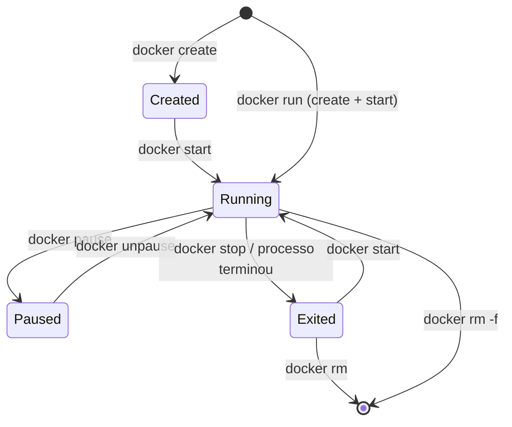
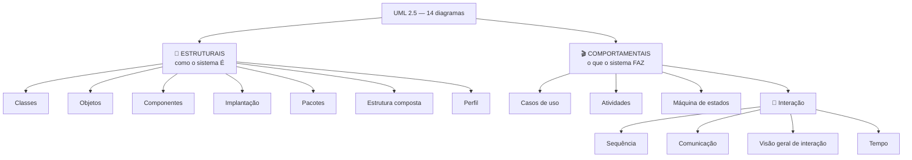
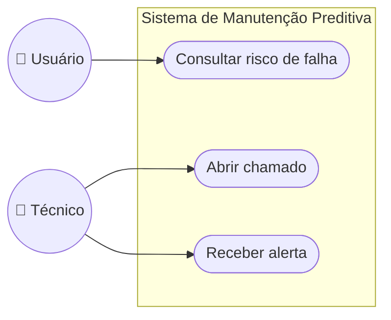
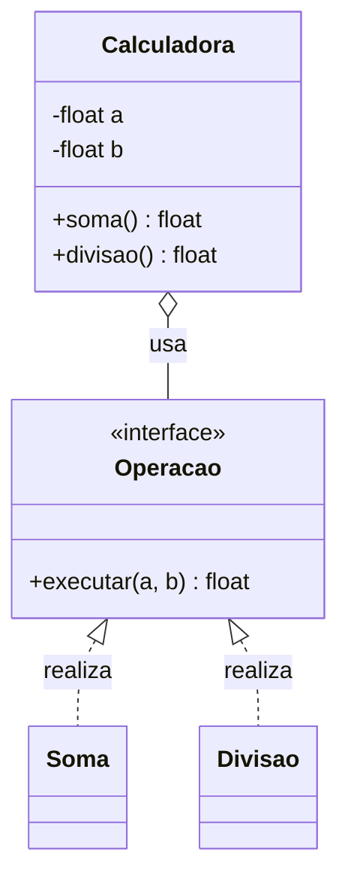
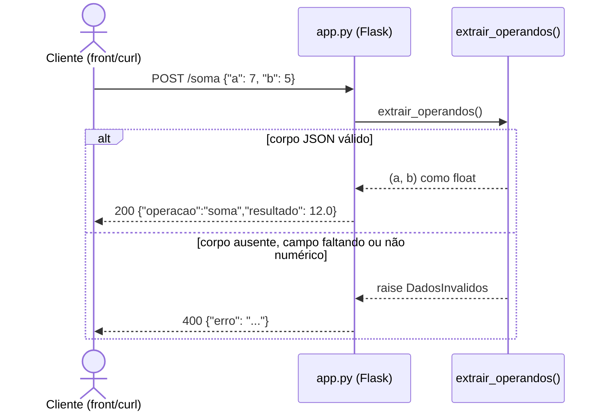
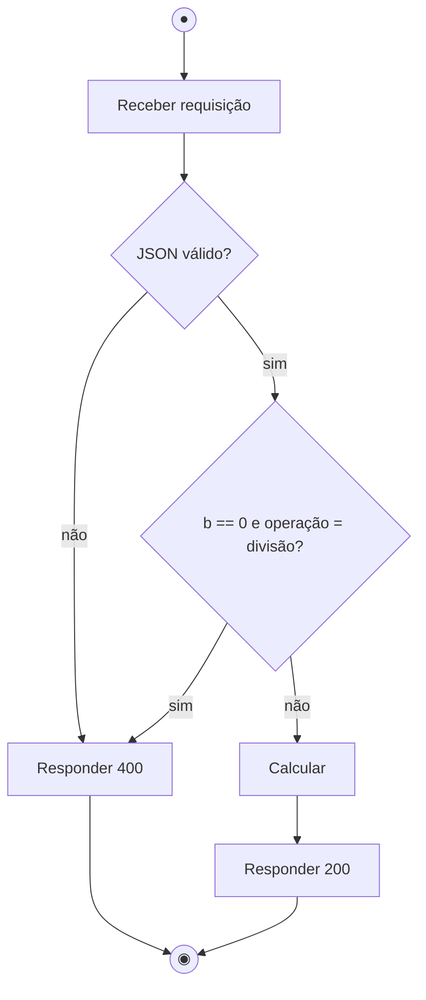
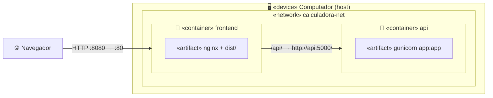
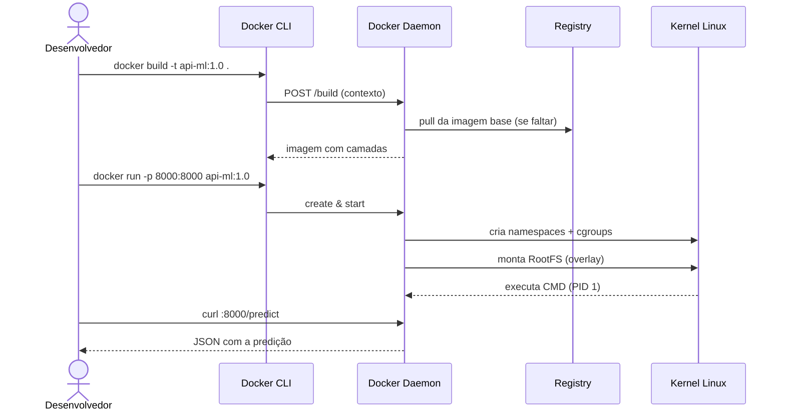
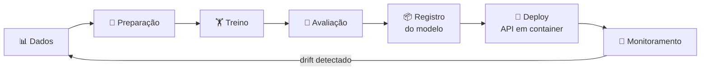
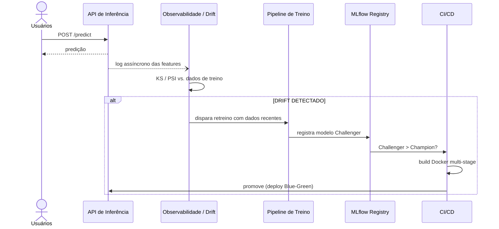

# 🐳 Guia de Estudos: Docker, UML e MLOps

> Guia do básico ao avançado, explicado **como se você tivesse 7 anos**, mas sem perder a precisão técnica.
> Cada assunto segue a mesma receita: **🧸 explicação de criança → 🔧 o que é de verdade → 🎯 para que serve → ⚠️ limitações → 💻 exemplo**.
>
> Material baseado nas aulas do prof. Murilo (Inteli, Módulo 07), nos arquivos deste repositório e nas fontes listadas em [📚 Fontes](#-parte-6--fontes-e-onde-se-aprofundar).

---

## 🗺️ Sumário

- [Como usar este guia](#-como-usar-este-guia)
- [Mapa do repositório](#-mapa-do-repositório)
- **[Parte 1: Docker](#-parte-1--docker)**
  - [Nível 1: Básico](#-nível-1--básico-o-que-é-e-por-que-existe)
  - [Nível 2: Intermediário](#-nível-2--intermediário-construindo-e-conectando)
  - [Nível 3: Avançado](#-nível-3--avançado-por-dentro-produção-e-nuvem)
- **[Parte 2: UML](#-parte-2--uml)**
- **[Parte 3: MLOps](#-parte-3--mlops)**
- **[Parte 4: Como resolver um problema (ciclo 5C)](#-parte-4--como-resolver-um-problema-ciclo-5c)**
- **[Parte 5: Folha de cola](#-parte-5--folha-de-cola)**
- **[Parte 6: Fontes](#-parte-6--fontes-e-onde-se-aprofundar)**

---

## 📖 Como usar este guia

1. **Leia na ordem.** Cada parte começa simples e vai ficando mais técnica. Se um nível ficou confuso, volte ao anterior.
2. **Rode os exemplos.** Docker se aprende com o terminal aberto. Todo exemplo aqui pode ser executado.
3. **Use o [ciclo 5C](#-parte-4--como-resolver-um-problema-ciclo-5c)** quando travar. O professor quer ver **como você entende e resolve um problema**, e não só a resposta certa.
4. **O livro [Descomplicando o Docker](https://livro.descomplicandodocker.com.br/) é essencial para a ponderada.** Este guia indica o capítulo do livro correspondente a cada assunto (📕).

---

## 📂 Mapa do repositório

| Caminho | O que tem | Nível |
|---|---|---|
| [`Encontro 01 - Containers e Docker (1).pdf`](<Encontro 01 - Containers e Docker (1).pdf>) | Slides: o que é container, VM × container, namespaces, cgroups, comandos | Básico |
| [`Lista 01 - Docker - Primeiros Passos_1 (1).pdf`](<Lista 01 - Docker - Primeiros Passos_1 (1).pdf>) | 10 exercícios progressivos sem Dockerfile | Básico |
| [`estudo-docker-aplicacoes/`](estudo-docker-aplicacoes/) | Repositório do professor: API calculadora em Flask (casos 01 → 03) + diagramas UML + desafios | Básico → Intermediário |
| [`Encontro 04 - Build Multi-stage e 5C revisado.pdf`](<Encontro 04 - Build Multi-stage e 5C revisado.pdf>) | Slides: multi-stage, Dockerfile × Compose, ciclo 5C | Intermediário |
| [`encontro4/`](encontro4/) | Exemplos do Encontro 04: C em `scratch`, calculadora Flask + React, desafio Go | Intermediário → Avançado |
| [`Guia_uso_IA_atividade_5C_IA_PBL-revisado.pdf`](Guia_uso_IA_atividade_5C_IA_PBL-revisado.pdf) | Como usar IA sem terceirizar o raciocínio (5C) | Método |
| [`Engenharia de Machine Learning e MLOps.pdf`](<Engenharia de Machine Learning e MLOps.pdf>) | MLOps: maturidade, drift, Dockerfile de produção para ML, UML de sequência | Avançado |
| [`Encontro 04 - Orientacao Planning Sprint 3 - EC07.pptx.pdf`](<Encontro 04 - Orientacao Planning Sprint 3 - EC07.pptx.pdf>) | Sprint 3: rótulo, comparação de modelos, RNN + API | Projeto |
| [`README-cabral.md`](README-cabral.md) | Guia de consulta enorme (UML + Docker), com banco de 50 perguntas | Consulta |

> 💡 O PDF `Encontro 04 - Build Multi-stage e 5C revisado (1).pdf` é uma cópia idêntica do arquivo sem `(1)`.

---

# 🐳 PARTE 1 — DOCKER

## 🟢 Nível 1 — Básico: o que é e por que existe

### 1.1 O problema: "na minha máquina funciona" 🤷

🧸 **Para uma criança:**
Imagine que você fez um bolo delicioso na sua casa. Aí você vai fazer **o mesmo bolo** na casa da sua avó e ele sai murcho. O forno é diferente, a farinha é de outra marca, falta fermento... A receita era a mesma, mas **a cozinha era diferente**.

🔧 **De verdade:**
Um programa não depende só do código. Ele depende da **versão da linguagem**, das **bibliotecas instaladas**, do **sistema operacional**, de **variáveis de ambiente**... Quando você entrega só o código, a outra máquina pode ter outra "cozinha". Como diz o slide do Encontro 01:

> *"O problema nunca foi empacotar código. Foi reproduzir o ambiente."*

**Exemplo real de ML** (do PDF de MLOps): você treina um `modelo.pkl` e ele quebra no servidor porque:
- o servidor tem outra versão do Python;
- a versão do scikit-learn é diferente (erro de *unpickling*);
- falta a biblioteca `libgomp`;
- o código tem caminhos fixos como `/Users/murilo/...`.

🎯 **O Docker resolve isso** entregando **o bolo junto com a cozinha inteira**: código + dependências + configurações, tudo num pacote que roda igual em qualquer lugar.

---

### 1.2 O que é um container? 🧺

🧸 **Para uma criança:**
Um container é uma **cesta de piquenique**. Dentro dela está **tudo** o que você precisa para o lanche: sanduíche, suco, guardanapo, talher. Não importa se o piquenique é no parque, na praia ou no quintal: você abre a cesta e está tudo lá.

🔧 **De verdade** (definição do Encontro 01):
> Um container é **um ou mais processos rodando no kernel do host**, com:
> - a **visão restrita** por **namespaces** (o que ele enxerga);
> - o **consumo limitado** por **cgroups** (quanto ele pode gastar);
> - um **sistema de arquivos** montado a partir de **camadas de imagem** (de onde vem o disco dele).

> *"Não é uma máquina pequena. É um processo do host com a visão restrita."*

📕 Livro: [cap. 1 — O que é container?](https://livro.descomplicandodocker.com.br/chapters/chapter_01.html)

---

### 1.3 Container × Máquina Virtual 🏠🏢

🧸 **Para uma criança:**
- **Máquina virtual (VM)** = alugar **uma casa inteira** só para você. Tem encanamento próprio, telhado próprio, tudo próprio. É caro e demora para arrumar.
- **Container** = morar num **apartamento num prédio**. Todo mundo divide a estrutura do prédio (os canos, o elevador = **o kernel**), mas cada apartamento tem **sua fechadura** (namespaces) e **seu relógio de luz** (cgroups).

🔧 **De verdade:**

| | 🖥️ Servidor físico | 🏠 Máquina Virtual | 🏢 Container |
|---|---|---|---|
| O que é virtualizado | nada | o **hardware** (via hipervisor) | o **sistema operacional** |
| Tem SO/kernel próprio? | — | ✅ cada VM tem o seu | ❌ compartilha o kernel do host |
| Tempo para iniciar | — | dezenas de segundos a minutos | milissegundos a segundos |
| Tamanho | — | GBs | MBs (camadas compartilhadas) |
| Isolamento | — | forte | mais fraco (mesmo kernel) |

> ❓ **Pergunta-chave da aula:** *o que está sendo virtualizado, o hardware ou o sistema operacional?*

⚠️ **Limitações: quando o container NÃO substitui a VM:**
- quando você precisa de um **kernel diferente** do host. Um container Linux precisa de kernel Linux. Por isso, no Windows e no Mac, o Docker Desktop roda **dentro de uma VM Linux escondida**.
- quando você precisa de **isolamento forte** entre programas que não confiam um no outro;
- quando você precisa de **acesso direto a hardware** ou a módulos de kernel próprios.

> 💡 Na nuvem, o normal é usar **os dois juntos**: containers rodando dentro de VMs.

---

### 1.4 Os 3 personagens principais: Imagem, Container e Registry 🎂

🧸 **Para uma criança:**
- **Imagem** = a **forma de bolo** (ou a receita congelada). Ela não muda. Com uma forma você faz quantos bolos quiser.
- **Container** = o **bolo pronto**, feito com aquela forma. Você pode comer, decorar, jogar fora... e a forma continua lá, intacta.
- **Registry** (ex.: Docker Hub) = a **loja de formas**. Você pega formas prontas que outras pessoas fizeram ou guarda as suas lá.
- **Dockerfile** = o **papel com a receita** que explica como montar a forma.

🔧 **De verdade:**

```
Dockerfile ──(docker build)──▶ Imagem ──(docker run)──▶ Container
                                  ▲   │
                    (docker pull) │   │ (docker push)
                                  │   ▼
                              Registry (Docker Hub)
```

| Conceito | Definição | Comando |
|---|---|---|
| **Imagem** | Pacote **somente leitura** com tudo o que é necessário para rodar: código, runtime, bibliotecas, configurações | `docker pull`, `docker images` |
| **Container** | Uma **instância em execução** de uma imagem | `docker run`, `docker ps` |
| **Registry** | Repositório de imagens (Docker Hub, AWS ECR, Azure ACR...) | `docker push`, `docker pull` |
| **Dockerfile** | Arquivo de texto com as instruções para construir a imagem | `docker build` |

> 💡 *"A imagem está para o container como a **classe** está para o **objeto**."* (Encontro 01)
> Você pode ter **várias instâncias** (containers) da mesma imagem rodando ao mesmo tempo.

---

### 1.5 Primeiros comandos 🎮

> Pré-requisito: instale o [Docker Desktop](https://docs.docker.com/get-docker/) (Windows/Mac) ou o Docker Engine (Linux).

#### Testando a instalação
```bash
docker version          # mostra Client (você) e Server/Engine (o daemon)
docker run hello-world  # baixa uma imagem de teste e roda
```

O que acontece no `docker run hello-world` ([firelink](https://firelink-library.github.io/engsoft/container-docker/)):
1. O **cliente** (seu terminal) fala com o **daemon** (o "motor" do Docker).
2. O daemon procura a imagem `hello-world` no seu computador. Como não acha, **baixa do Docker Hub**.
3. O daemon **cria um container** a partir da imagem.
4. O container imprime a mensagem e **termina**.

#### 🔑 Regra de ouro: um container só vive enquanto seu processo principal vive

🧸 O container é como um **balão de festa segurado por uma pessoa**. Se a pessoa (o processo principal) vai embora, o balão voa e some.

```bash
docker run ubuntu              # inicia e morre na hora: não tem nada rodando dentro
docker ps                      # lista containers RODANDO → vazio
docker ps -a                   # lista TODOS, inclusive os que pararam → aparece o ubuntu "Exited"

docker run -it ubuntu bash     # -i = interativo, -t = terminal; o bash mantém o container vivo
# dentro do container:
ls ; hostname ; exit           # o exit mata o bash → o container para
```

> 💡 Para **sair sem matar** o container: `Ctrl + p` e depois `Ctrl + q` (📕 [cap. 4](https://livro.descomplicandodocker.com.br/chapters/chapter_04.html)).

#### Ciclo de vida de um container



| Comando | O que faz |
|---|---|
| `docker run <imagem>` | **cria um container NOVO** e inicia |
| `docker start <nome>` | inicia um container **que já existe** |
| `docker stop <nome>` | para com educação (manda SIGTERM e espera) |
| `docker rm <nome>` | apaga o container |
| `docker rm -f <nome>` | para e apaga de uma vez |
| `docker exec -it <nome> sh` | abre um terminal **dentro** de um container que está rodando |
| `docker logs -f <nome>` | mostra (e acompanha) o que o container imprime |

⚠️ **Pegadinha:** cada `docker run` cria um container **novo**. Rodou 3 vezes? Agora são 3 containers (veja com `docker ps -a`).

#### Attached × Detached
```bash
docker run --name web1 nginx:alpine      # attached: prende seu terminal
docker run -d --name web nginx:alpine    # -d = detached: roda em segundo plano
docker logs -f web                       # para ver o que ele está fazendo
```

---

### 1.6 Portas: a portinha do apartamento 🚪

🧸 **Para uma criança:**
O container mora num apartamento **com a porta trancada**. Mesmo que tenha uma festa lá dentro (sua aplicação rodando na porta 80), quem está no corredor (seu navegador) não consegue entrar. Você precisa **abrir uma porta** e dizer: *"quem bater na porta 8080 do prédio entra na porta 80 do apartamento"*.

🔧 **De verdade:**
Cada container tem **a sua própria interface de rede** (namespace `net`). O `localhost` do container **não é** o `localhost` do seu computador. Por isso você precisa **mapear (publicar)** a porta:

```bash
docker run -d --name web -p 8080:80 nginx:alpine
#                           │    │
#                           │    └── porta DENTRO do container
#                           └─────── porta no SEU computador (host)
# abra http://localhost:8080
```

| Flag | O que faz |
|---|---|
| `-p 8080:80` | mapeia a porta 8080 do host → 80 do container |
| `-P` (maiúsculo) | o Docker escolhe portas aleatórias do host para todas as portas que a imagem declara com `EXPOSE` |
| `docker port web` | mostra os mapeamentos |

⚠️ Erros comuns:
- `port is already allocated`: já existe algo usando essa porta no host. Use outra (`-p 8081:80`).
- Se você rodou `docker run` **sem `-p`**, a aplicação está rodando, mas você **não consegue acessar** de fora.

---

### 1.7 A camada de escrita: o que você salva some 🧽

🧸 O container é como um **quadro branco**. Você pode escrever o quanto quiser nele, mas quando o container é **apagado** (`docker rm`), alguém passa o apagador. Se você só **pausa** ou **para** (`stop`), o desenho continua lá.

```bash
docker exec -it web sh -c 'echo oi > /tmp/anotacao.txt'
docker stop web && docker start web
docker exec web cat /tmp/anotacao.txt   # ✅ ainda existe
docker rm -f web                        # 🧽 apagou o container → apagou o arquivo
```

👉 Para guardar dados de verdade, use **volumes** ([nível 2](#25-volumes-a-caixinha-que-não-some-)).

---

### ⚠️ Limitações do nível básico (o que guardar)
- O container **não tem kernel próprio**: um container Linux não roda nativamente no Windows/Mac (lá existe uma VM escondida).
- O container **não guarda dados** sozinho: apagou, perdeu.
- Container **sem porta publicada** = inacessível de fora.
- Se o **processo principal termina**, o container termina.

📝 **Pratique:** faça a [`Lista 01`](<Lista 01 - Docker - Primeiros Passos_1 (1).pdf>) inteira. Ela cobre exatamente este nível, com 10 exercícios.

---

## 🟡 Nível 2 — Intermediário: construindo e conectando

### 2.1 Dockerfile: a receita do bolo 📜

🧸 **Para uma criança:**
O Dockerfile é uma **lista de passos**, como uma receita:
1. *"Comece com uma massa pronta de chocolate"* → `FROM`
2. *"Vá para a mesa da cozinha"* → `WORKDIR`
3. *"Coloque os ingredientes na mesa"* → `COPY`
4. *"Misture tudo"* → `RUN`
5. *"Quando alguém pedir, sirva o bolo"* → `CMD`

🔧 **De verdade:** exemplo do [caso01 do professor](estudo-docker-aplicacoes/caso01/), uma API calculadora em Flask:

```dockerfile
# 1. imagem base: um Linux pequeno com Python 3.12 já instalado
FROM python:3.12-slim

# 2. diretório de trabalho dentro da imagem
WORKDIR /app

# 3. copia a lista de dependências ANTES do código (por causa do cache, veja 2.3)
COPY requirements.txt .

# 4. instala as dependências (roda durante o BUILD)
RUN pip install --no-cache-dir -r requirements.txt

# 5. agora sim copia o resto do código
COPY . .

# 6. DOCUMENTA que a app escuta na 5050 (NÃO publica nada!)
EXPOSE 5050

# 7. comando que roda quando o CONTAINER inicia
CMD ["python", "main.py"]
```

```bash
docker build -t calculadora:1.0 .          # o "." é a PASTA (contexto de build), não o arquivo
docker run -d --name calc -p 5050:5050 calculadora:1.0
curl -X POST localhost:5050/soma -H "Content-Type: application/json" -d '{"a": 2, "b": 3}'
# {"a": 2.0, "b": 3.0, "operacao": "soma", "resultado": 5.0}
```

#### As instruções principais (📕 [cap. 8](https://livro.descomplicandodocker.com.br/chapters/chapter_08.html))

| Instrução | Para que serve | Quando roda |
|---|---|---|
| `FROM` | imagem base (sempre a primeira) | build |
| `WORKDIR` | "entra" numa pasta (cria se não existir) | build |
| `COPY` | copia arquivos do seu PC para a imagem | build |
| `ADD` | como COPY, mas também baixa URLs e descompacta `.tar` (prefira `COPY`) | build |
| `RUN` | executa um comando e **salva o resultado como uma camada** | build |
| `ENV` | variável de ambiente (existe no build **e** no container) | build + execução |
| `ARG` | variável que **só existe no build** | build |
| `EXPOSE` | **documenta** a porta (não publica!) | — |
| `USER` | troca o usuário (o padrão é root 😬) | build + execução |
| `CMD` | comando padrão ao iniciar o container (pode ser sobrescrito) | execução |
| `ENTRYPOINT` | o "executável" do container; o CMD vira os argumentos dele | execução |
| `HEALTHCHECK` | comando que diz se o container está saudável | execução |
| `LABEL` | metadados (autor, versão...) | — |

#### 🤔 `RUN` × `CMD` × `ENTRYPOINT`
- `RUN` = **cozinhar** (acontece **uma vez**, no build).
- `CMD` = **servir** (acontece **toda vez** que o container liga). Pode ser trocado: `docker run imagem outro-comando`.
- `ENTRYPOINT` = o **garçom fixo**; o `CMD` vira o "pedido" que ele recebe.

```dockerfile
ENTRYPOINT ["python", "main.py"]
CMD ["--porta", "5050"]       # docker run img --porta 9000 → troca só o CMD
```

> ⚠️ Prefira a **forma exec** (`["python", "main.py"]`) à forma shell (`python main.py`). Na forma exec, seu programa vira o **PID 1** e recebe o sinal de `docker stop` direitinho.

---

### 2.2 Camadas: a torre de panquecas 🥞

🧸 Uma imagem é uma **pilha de panquecas**. Cada instrução do Dockerfile (`RUN`, `COPY`...) é **uma panqueca**. Quando o container liga, o Docker coloca **um pratinho de vidro por cima** (a camada de escrita). Tudo o que o container muda fica no pratinho, e as panquecas de baixo nunca são tocadas.

🔧 **De verdade** (📕 [cap. 2](https://livro.descomplicandodocker.com.br/chapters/chapter_02.html)):
- A imagem é feita de **N camadas somente leitura** + **1 camada de escrita** em cima (do container).
- Isso funciona com um **Union Filesystem** (hoje, o **overlay2**) e **Copy-On-Write**: um arquivo só é copiado para a camada de cima quando alguém o modifica.
- **Vantagem:** 10 containers da mesma imagem **compartilham** as camadas, sem duplicar espaço.

```bash
docker image history python:3.12-slim   # vê as camadas
docker system df                        # quanto espaço imagens/containers/volumes usam
```

---

### 2.3 Cache: por que a ORDEM importa ⚡

🧸 Se você muda **a panqueca do meio**, precisa refazer **ela e todas as de cima**. As de baixo continuam prontas.

🔧 O Docker reaproveita (cache) cada camada **até a primeira que mudou**. Daí em diante, refaz tudo.

```dockerfile
# ❌ RUIM: qualquer mudança no código reinstala TODAS as dependências
COPY . .
RUN pip install -r requirements.txt

# ✅ BOM: dependências mudam pouco → ficam em cache; só o código é recopiado
COPY requirements.txt .
RUN pip install --no-cache-dir -r requirements.txt
COPY . .
```

> 💡 Repare: o [`caso01/resposta/Dockerfile`](estudo-docker-aplicacoes/caso01/resposta/Dockerfile) do professor faz `COPY . .` **antes** do install. Funciona, mas não aproveita o cache. É um bom exercício de melhoria!

---

### 2.4 `.dockerignore`: não leve o lixo junto 🗑️

🧸 Na hora de fazer a mudança, você não leva o lixo da cozinha.

O `.dockerignore` diz quais arquivos **não** entram no contexto do build:

```gitignore
.venv/
__pycache__/
*.pyc
.git/
node_modules/
.env
tests/
```

Isso deixa o build mais rápido, a imagem menor e evita vazar segredos (`.env`!). Veja o exemplo em [`encontro4/02-calculadora-flask-react/api/.dockerignore`](encontro4/02-calculadora-flask-react/api/.dockerignore).

---

### 2.5 Volumes: a caixinha que não some 📦

🧸 Lembra que o quadro branco é apagado quando o container morre? O **volume** é uma **caixinha guardada fora do apartamento**. O container usa a caixinha, mas se ele for embora, a caixinha **continua lá** para o próximo morador.

🔧 **De verdade** (📕 [cap. 7](https://livro.descomplicandodocker.com.br/chapters/chapter_07.html)): volumes ficam **fora** do sistema de camadas, então sobrevivem quando o container é removido.

| Tipo | Onde fica | Uso típico | Exemplo |
|---|---|---|---|
| **Volume nomeado** | gerenciado pelo Docker (`/var/lib/docker/volumes/`) | **dados de banco**, persistência | `-v dados:/var/lib/postgresql/data` |
| **Bind mount** | uma pasta **do seu PC** | **desenvolvimento** (editar e ver na hora) | `-v $(pwd)/index.html:/usr/share/nginx/html/index.html` |
| **tmpfs** | memória RAM | dados temporários e sensíveis | `--tmpfs /tmp` |

```bash
docker volume create meus-dados
docker run -d --name db -e POSTGRES_PASSWORD=exemplo -v meus-dados:/var/lib/postgresql/data postgres:16
docker rm -f db             # apagou o container...
docker volume ls            # ...mas o volume "meus-dados" continua aqui ✅
```

⚠️ **Limitações:**
- **Bind mount** depende da pasta existir no host. Em cluster (várias máquinas) isso é um problema.
- `docker compose down -v` e `docker volume prune` **apagam volumes**. Use com cuidado!

---

### 2.6 Redes: como os containers conversam 📞

🧸 **Para uma criança:**
Containers numa **mesma rede** são como crianças na **mesma sala de aula**: chamam umas às outras **pelo nome** ("Ô, *backend*!"). Crianças de **salas diferentes** não se ouvem. E quando uma criança fala "eu mesma" (`localhost`), está falando **dela própria**, não da sala.

🔧 **De verdade:**

| Rede | Característica |
|---|---|
| `bridge` padrão (`docker0`) | containers se falam só por IP, **sem DNS por nome** |
| **bridge criada por você** (`docker network create` ou `networks:` do Compose) | ✅ **DNS automático**: o container `backend` é achado pelo nome `backend` |
| `host` | o container usa a rede do host direto (o `-p` é ignorado) |
| `none` | sem rede nenhuma |
| `overlay` | rede entre várias máquinas (Swarm) |
| `macvlan` / `ipvlan` | o container aparece na rede física com MAC/IP próprio |

```bash
# caso03 do professor, SEM Compose:
docker network create calc-net
docker run -d --rm --name backend  --network calc-net calculadora:1.0
docker run -d --rm --name frontend --network calc-net -p 8080:80 calc-front:1.0
# dentro do frontend, "http://backend:5050" funciona.
# no SEU navegador, "backend" NÃO existe → você acessa só o frontend (localhost:8080)
```

⚠️ **As 3 pegadinhas de rede mais comuns:**
1. **`localhost` dentro do container é o próprio container**, não o seu PC e nem outro container.
2. **O nome do serviço só existe dentro da rede Docker.** Do seu PC, `curl http://backend:5050` dá `Could not resolve host`.
3. **A aplicação precisa escutar em `0.0.0.0`**, não em `127.0.0.1`. O `app.run()` do Flask, por padrão, escuta só em `127.0.0.1`, e aí nada de fora do container consegue falar com ele. Use `app.run(host="0.0.0.0")` ou o Gunicorn com `--bind 0.0.0.0:5000`.

🎥 Para entender **como** isso funciona por baixo (bridge, veth, NAT), assista [How Docker Networking Actually Works (KodeKloud)](https://youtu.be/W7X6u2BGVRY) e, para os tipos de rede, [Docker networking is CRAZY (NetworkChuck)](https://youtu.be/bKFMS5C4CG0).

---

### 2.7 Docker Compose: o maestro da orquestra 🎼

🧸 **Para uma criança:**
Rodar 3 containers à mão é como pedir para cada músico tocar sozinho e torcer para dar certo. O **Compose** é o **maestro com a partitura**: num único arquivo, ele diz *quem toca, em que sala, por qual porta o público entra e quem começa primeiro*. Um comando (`docker compose up`) e a orquestra toda toca.

🔧 **De verdade:** um arquivo `compose.yaml` descreve **serviços, redes e volumes**. Exemplo real do [`encontro4/02-calculadora-flask-react/compose.yaml`](encontro4/02-calculadora-flask-react/compose.yaml):

```yaml
services:
  frontend:                 # nome do serviço = nome na rede (DNS)
    build:
      context: ./frontend   # onde está o Dockerfile
    ports:
      - "8080:80"           # ✅ SÓ o frontend é publicado para o mundo
    depends_on:
      - api
    networks:
      - calculadora-net

  api:
    build:
      context: ./api
    expose:
      - "5000"              # visível só DENTRO da rede; o navegador não alcança
    networks:
      - calculadora-net

networks:
  calculadora-net:
    driver: bridge
```

```
Navegador ──▶ localhost:8080 ──▶ [frontend: Nginx :80] ──/api/──▶ [api: Flask :5000]
                                  └──────────── rede calculadora-net ────────────┘
```

#### Comandos do Compose
```bash
docker compose config          # mostra a configuração final (ótimo para achar erro de YAML)
docker compose up --build -d   # constrói e sobe tudo em segundo plano
docker compose ps              # status dos serviços
docker compose logs -f api     # logs de um serviço
docker compose exec api sh     # terminal dentro do serviço
docker compose stop api        # para um serviço (teste: o front deve dar erro → prova a dependência!)
docker compose down            # para e remove containers e rede
docker compose down -v         # ...e APAGA os volumes ⚠️
```

#### 🤔 `ports` × `expose` × `EXPOSE`, a confusão clássica

| | Onde fica | O que faz |
|---|---|---|
| `EXPOSE 5000` | Dockerfile | **só documenta** a porta. Não abre nada. |
| `expose: ["5000"]` | Compose | documenta que o serviço é acessível **dentro da rede** do Compose |
| `ports: ["8080:80"]` | Compose | **publica** a porta no seu computador. É o único que abre para fora. |

> 📌 *"Multi-stage fica no Dockerfile. Rede e portas ficam no Compose."* (Encontro 04)

#### ⚠️ `depends_on` NÃO espera o serviço ficar pronto
`depends_on: [api]` só garante que a API **inicia antes**, não que ela **já está respondendo**. Para esperar de verdade, use **healthcheck**:

```yaml
services:
  pedidos:
    depends_on:
      estoque:
        condition: service_healthy     # espera o healthcheck passar
  estoque:
    healthcheck:
      # imagens python:*-slim NÃO têm curl → use o próprio Python
      test: ["CMD", "python", "-c", "import urllib.request; urllib.request.urlopen('http://localhost:5000/health')"]
      interval: 5s
      timeout: 3s
      retries: 5
```

> 💡 O livro e o firelink usam a sintaxe antiga (`version: "3"` e `docker-compose` com hífen). Hoje o padrão é o arquivo **`compose.yaml` sem `version:`** e o comando **`docker compose`** (com espaço).

---

### 2.8 Proxy reverso com Nginx: o porteiro 🛎️

🧸 O **Nginx** é o **porteiro do prédio**. O visitante (navegador) só conhece a portaria. Quando ele pede algo que começa com `/api/`, o porteiro leva o pedido até o apartamento do `backend` e traz a resposta de volta. O visitante nem sabe que o backend existe.

[`estudo-docker-aplicacoes/caso03/frontend/nginx.conf`](estudo-docker-aplicacoes/caso03/frontend/nginx.conf):
```nginx
location /api/ {
    proxy_pass http://backend:5050/;   # ⚠️ a BARRA FINAL importa!
}
```

- Com a barra final: `/api/soma` → chega no backend como **`/soma`** ✅
- Sem a barra final: chega como `/api/soma` → **404** ❌

🎯 **Vantagens:** só uma porta é publicada; o frontend usa **rota relativa** (`fetch("/api/calcular")`), então não tem CORS nem IP fixo no código.

---

### 2.9 Servidor de produção: Gunicorn 🦄

O `app.run(debug=True)` do Flask é um servidor **de desenvolvimento**: atende um pedido por vez e não serve para produção. O professor mostra a evolução:

| Caso | Comando | Observação |
|---|---|---|
| [`caso01`](estudo-docker-aplicacoes/caso01/resposta/Dockerfile) | `CMD ["python", "main.py"]` | servidor de dev |
| [`caso02`](estudo-docker-aplicacoes/caso02/resposta/Dockerfile) | `CMD ["gunicorn", "--bind", "0.0.0.0:5050", "--workers", "2", "main:app"]` | ✅ produção: 2 processos atendendo |

> `main:app` = *"no arquivo `main.py`, use a variável `app`"*.
> Adicione `ENV PYTHONUNBUFFERED=1` para os `print()` aparecerem na hora em `docker logs`.

---

### ⚠️ Limitações do nível intermediário
- `EXPOSE` **não** publica porta (todo mundo erra isso uma vez).
- `depends_on` **não** espera o serviço ficar pronto.
- O DNS por nome **não funciona** na rede `bridge` padrão, só em redes criadas por você.
- O Compose roda **numa máquina só**. Para várias máquinas, use Swarm ou Kubernetes ([nível 3](#38-orquestração-swarm-e-kubernetes-)).
- Imagens `-slim` **não têm `curl`**. Para testar de dentro, use `python -c "import urllib.request..."`.

📝 **Pratique:** [`estudo-docker-aplicacoes`](estudo-docker-aplicacoes/), casos 01 → 02 → 03, e os 10 desafios em [`materiais/lista_exercicios_docker_desafios.docx`](estudo-docker-aplicacoes/materiais/).

---

## 🔴 Nível 3 — Avançado: por dentro, produção e nuvem

### 3.1 Por dentro: namespaces, cgroups e overlayfs 🔬

🧸 **Para uma criança:** lembra do apartamento?
- **Namespaces** = as **paredes e cortinas**. Elas decidem **o que você enxerga**. De dentro do seu apartamento, você não vê os vizinhos.
- **cgroups** = o **relógio de luz e água**. Ele decide **quanto você pode gastar**. Gastou demais? Cortam a luz.
- **overlayfs** = a **pilha de panquecas com o pratinho de vidro** (camadas).

🔧 **Namespaces: o que o processo enxerga** (📕 [cap. 2.5](https://livro.descomplicandodocker.com.br/chapters/chapter_02.html)):

| Namespace | Isola | Na prática |
|---|---|---|
| `pid` | árvore de processos | dentro, seu app é o **PID 1**; no host, é outro número |
| `net` | interfaces, IP, portas | cada container tem seu `eth0` e seu `localhost` |
| `mnt` | pontos de montagem | o container tem seu próprio `/` (evolução do `chroot`) |
| `uts` | hostname | `hostname` dentro ≠ fora |
| `ipc` | memória compartilhada, filas | |
| `user` | usuários | root dentro **sem** ser root fora (se configurado) |
| `cgroup`, `time` | visão de cgroups, relógios | |

```bash
docker run -d --name lab alpine sleep 1000
docker inspect -f '{{.State.Pid}}' lab   # PID do container NO HOST
ps aux | grep "sleep 1000"               # 😮 o processo aparece no host! É só um processo.
sudo ls -l /proc/<PID>/ns                # os namespaces dele
```

🔧 **cgroups: quanto o processo pode consumir:**

| Flag | Arquivo no cgroup v2 | O que acontece ao estourar |
|---|---|---|
| `--memory=128m` | `memory.max` | 💥 **OOM kill**, código de saída **137** |
| `--cpus=0.5` | `cpu.max` | 🐢 fica **lento** (throttling), sem erro |
| `--pids-limit=50` | `pids.max` | ❌ falha ao criar processos (protege de *fork bomb*) |
| `--memory-reservation=64m` | `memory.low` | reserva "macia" |
| `--cpu-shares=512` | `cpu.weight` | peso relativo na disputa por CPU |

> 📌 *"Memória é limite **rígido**, CPU é limite **elástico**."*
> 📌 *"Um container sem limites é um processo comum do host com um nome bonito."* (Encontro 01)

```bash
# provocando um OOM de propósito (exercício 8 da Lista 01):
docker run --name oom --memory=64m --memory-swap=64m python:3.12-alpine \
  python -c 'a = bytearray(300 * 1024 * 1024)'
echo $?                                               # 137
docker inspect -f '{{.State.OOMKilled}}' oom          # true
```

> 💡 Os `requests/limits` do Kubernetes **são cgroups** por baixo. Aprender aqui vale para lá.

---

### 3.2 Build multi-stage: a fábrica e a vitrine 🏭➡️🏪

🧸 **Para uma criança:**
Para fazer um brinquedo, você precisa de uma **fábrica** cheia de máquinas, ferramentas e serragem. Mas você não entrega a fábrica para a criança: entrega **só o brinquedo**, numa caixinha bonita. O multi-stage faz isso: um estágio **constrói** (fábrica) e outro **só leva o resultado** (vitrine).

🔧 **De verdade** (Encontro 04 + 📕 [cap. 8.4](https://livro.descomplicandodocker.com.br/chapters/chapter_08.html)):
- Um Dockerfile com **vários `FROM`**. Cada um é um **estágio**.
- O estágio de build tem compilador, dependências de desenvolvimento e código-fonte, e produz um **artefato** (binário, `dist/`, venv).
- `COPY --from=<estágio>` copia **só o caminho indicado**. O estágio final **não herda** nada do anterior.

**Exemplo 1: C em `scratch`** ([`encontro4/01-hello-c-multistage/Dockerfile`](encontro4/01-hello-c-multistage/Dockerfile)):
```dockerfile
FROM alpine:3.20 AS builder
RUN apk add --no-cache build-base
WORKDIR /src
COPY hello.c .
RUN gcc -static -Os -s -o hello hello.c   # binário estático: não depende de nada

FROM scratch AS runtime                    # scratch = imagem VAZIA, nem shell tem
COPY --from=builder /src/hello /hello
ENTRYPOINT ["/hello"]
```
> ❓ *Por que a imagem final não precisa de gcc?* Porque o gcc só era necessário para **fabricar** o binário. Para **rodar**, basta o binário.

**Exemplo 2: Python com venv** ([`encontro4/02-calculadora-flask-react/api/Dockerfile`](encontro4/02-calculadora-flask-react/api/Dockerfile)):
```dockerfile
# Estágio de build: prepara as dependências fora da imagem de execução.
FROM python:3.12-slim AS builder
ENV VIRTUAL_ENV=/opt/venv
RUN python -m venv "$VIRTUAL_ENV"
ENV PATH="$VIRTUAL_ENV/bin:$PATH"
WORKDIR /build
COPY requirements.txt .
RUN pip install --no-cache-dir -r requirements.txt

# Estágio de execução: copia somente o ambiente já preparado e o código necessário.
FROM python:3.12-slim AS runtime
ENV VIRTUAL_ENV=/opt/venv
ENV PATH="$VIRTUAL_ENV/bin:$PATH"
WORKDIR /app
RUN useradd --create-home --uid 10001 appuser
COPY --from=builder /opt/venv /opt/venv
COPY app.py .
USER appuser
EXPOSE 5000
CMD ["gunicorn", "--bind", "0.0.0.0:5000", "app:app"]
```

**Exemplo 3: React → Nginx** ([`encontro4/02-calculadora-flask-react/frontend/Dockerfile`](encontro4/02-calculadora-flask-react/frontend/Dockerfile)): o Node **só existe no build** (`npm run build`), e a imagem final é um Nginx servindo a pasta `dist/`.

📏 **O ganho:** no livro, uma app Go caiu de **781 MB para 7 MB**. No PDF de MLOps, uma API de ML caiu de **~3,8 GB para ~160 MB**.

```bash
docker build --target builder -t hello-c-builder:1.0 .   # constrói só até o estágio "builder"
docker image ls                                          # compare os tamanhos!
```

🎥 [Docker Multi-Stage Builds (Depot)](https://youtu.be/_Q9KSFUZH0c)

#### Escolhendo a imagem base

| Base | Tamanho | Tem shell? | Quando usar |
|---|---|---|---|
| `scratch` | 0 | ❌ | binários estáticos (C, Go com `CGO_ENABLED=0`) |
| `distroless` | mínimo | ❌ | produção, com menos superfície de ataque |
| `alpine` | ~5 MB | ✅ (`sh`) | pequeno, mas usa **musl** em vez de glibc (alguns pacotes Python quebram) |
| `slim` (Debian) | ~50 MB | ✅ | bom equilíbrio para Python |
| completa (`python:3.12`) | ~1 GB | ✅ | só para build/desenvolvimento |

⚠️ **Limitação:** sem shell (`scratch`/`distroless`), você **não consegue** fazer `docker exec -it ... sh` para depurar.

---

### 3.3 Boas práticas de produção ✅

O **Dockerfile ingênuo** (o que NÃO fazer, segundo o PDF de MLOps):
```dockerfile
FROM python:3.11          # ❌ imagem enorme (~1 GB)
WORKDIR /app
COPY . .                  # ❌ quebra o cache e leva lixo junto
RUN pip install -r requirements.txt
CMD ["python", "app.py"]  # ❌ roda como root, servidor de dev, sem healthcheck
```

**Os 10 mandamentos:**
1. **Base pequena e com versão fixa**: `python:3.12-slim`, **nunca `latest`** (*"latest não explica qual versão"*).
2. **Multi-stage**: ferramentas de build ficam fora da imagem final.
3. **Ordene para o cache**: dependências antes do código.
4. **Sempre use `.dockerignore`.**
5. **Junte comandos num `RUN` só** e limpe caches nele (`apt-get ... && rm -rf /var/lib/apt/lists/*`).
6. **Usuário não-root**: `USER appuser`.
7. **Forma exec** no `CMD`/`ENTRYPOINT`.
8. **Escute em `0.0.0.0`.**
9. **Configuração e segredos por variável de ambiente em tempo de execução**, nunca dentro da imagem.
10. **Um processo principal por container.**

---

### 3.4 Segurança: o que o container NÃO isola 🔒

🧸 No prédio, todo mundo divide **o mesmo encanamento** (o kernel). Se alguém quebrar o cano, pode alagar o prédio todo.

| Risco | Explicação | Defesa |
|---|---|---|
| Kernel compartilhado | uma falha no kernel afeta todos | atualize o host; use VM para isolamento forte |
| Root dentro = root fora | sem *user namespace*, um "escape" vira root no host | `USER` não-root |
| `--privileged` | desliga quase todas as proteções | evite! |
| Segredo na imagem | qualquer um com a imagem lê (`docker history`) | variáveis em tempo de execução, Docker Secrets |
| `/proc/meminfo` | mostra a memória **do host**, não o limite | leia `memory.max` do cgroup |

> 📌 *"Container não é fronteira de segurança equivalente a uma máquina virtual."* (Encontro 01)

**Docker Secrets** (📕 [cap. 14](https://livro.descomplicandodocker.com.br/chapters/chapter_14.html)), no modo Swarm: o segredo aparece como arquivo em `/run/secrets/<nome>`, montado em memória.

---

### 3.5 HEALTHCHECK: o médico do container 🩺

```dockerfile
HEALTHCHECK --interval=20s --timeout=3s --retries=3 \
  CMD python -c "import urllib.request; urllib.request.urlopen('http://localhost:8000/health')" || exit 1
```

O `docker ps` passa a mostrar `(healthy)` ou `(unhealthy)`, e orquestradores podem **reiniciar** sozinhos um container doente.

---

### 3.6 Registry e deploy na nuvem ☁️

🧸 Você fez a forma de bolo em casa. Agora quer que a **padaria lá do centro** (servidor na nuvem) faça o mesmo bolo. Você **envia a forma para a loja** (Docker Hub), e a padaria **pega lá**.

Passo a passo (baseado no vídeo [Docker do zero ao deploy, da Fernanda Kipper](https://www.youtube.com/watch?v=DdoncfOdru8)):

```bash
# 1. no SEU computador: login no Docker Hub (use um Access Token como senha)
docker login -u seu-usuario

# 2. build com o nome no formato usuario/repositorio:tag
docker build -t seu-usuario/minha-api:1.0 .

# 3. envia para o Docker Hub (como um git push)
docker push seu-usuario/minha-api:1.0

# 4. no SERVIDOR (VPS), via SSH:
ssh root@IP-DO-SERVIDOR
docker run -d -p 8080:8080 seu-usuario/minha-api:1.0
# acesse http://IP-DO-SERVIDOR:8080/hello
```

#### ⚠️ A armadilha da arquitetura (ARM × AMD) 💥

🧸 Lembra que o container usa **o encanamento do prédio** (o kernel/CPU do host)? Se você montou o bolo pensando num **forno a gás** (Mac M1/M2 = **ARM64**) e a padaria tem **forno elétrico** (servidor = **AMD64**), não funciona!

```
The requested image's platform (linux/arm64) does not match the detected host platform (linux/amd64)
```
ou, ao rodar: `exec format error`.

**Solução 1:** build para a plataforma certa e uma **tag diferente** (a mesma tag sobrescreveria a outra):
```bash
docker build --platform linux/amd64 -t seu-usuario/minha-api:1.0-amd64 .
docker push seu-usuario/minha-api:1.0-amd64
# no servidor:
docker run -d -p 8080:8080 seu-usuario/minha-api:1.0-amd64
```

**Solução 2 (melhor): imagem multiplataforma com `buildx`**, uma tag só que serve para as duas arquiteturas:
```bash
docker buildx build --platform linux/amd64,linux/arm64 -t seu-usuario/minha-api:1.0 --push .
```

**Registry local** (📕 [cap. 9](https://livro.descomplicandodocker.com.br/chapters/chapter_09.html)):
```bash
docker run -d -p 5000:5000 --restart=always --name registry registry:2
docker tag minha-api:1.0 localhost:5000/minha-api:1.0
docker push localhost:5000/minha-api:1.0
```

---

### 3.7 Docker para IA: Model Runner 🤖

O Docker também roda **modelos de linguagem (LLMs) localmente** com o **Docker Model Runner**, que expõe uma API compatível com a da OpenAI. Veja [The Easiest Ways to Run LLMs Locally (Tech With Tim)](https://www.youtube.com/watch?v=GOgfQxDPaDw). É uma ponte com a [Parte 3: MLOps](#-parte-3--mlops).

---

### 3.8 Orquestração: Swarm e Kubernetes 🐝☸️

🧸 O Compose é o maestro de **uma** orquestra. Quando você tem **várias orquestras em várias cidades** (vários servidores), precisa de um **diretor geral**: o **orquestrador**.

**Docker Swarm** (📕 [cap. 13](https://livro.descomplicandodocker.com.br/chapters/chapter_13.html)): cluster nativo do Docker, com **managers** (coordenam) e **workers** (executam).
```bash
docker swarm init
docker service create --name web --replicas 5 -p 8080:80 nginx
docker service scale web=10               # aumentou para 10 cópias
docker stack deploy -c compose.yaml app   # sobe um compose no cluster
```

**Kubernetes**: o padrão da indústria para orquestração. Os mesmos conceitos (réplicas, limites de recursos, healthchecks) aparecem lá com outros nomes (`Deployment`, `requests/limits`, `livenessProbe`).

---

### 3.9 Troubleshooting: o kit de detetive 🕵️

| Sintoma | Provável causa | Como investigar / resolver |
|---|---|---|
| Container sai na hora (`Exited (0)`) | o processo principal terminou | `docker logs`; o CMD precisa ficar rodando |
| `Exited (137)` | **falta de memória** (OOM) | `docker inspect -f '{{.State.OOMKilled}}'`; aumente `--memory` |
| `Exited (1)` | erro na aplicação | `docker logs <nome>` |
| `port is already allocated` | porta do host ocupada | use outra porta; `docker ps` para ver quem usa |
| `name is already in use` | já existe um container com esse nome | `docker rm -f <nome>` |
| `Cannot connect to the Docker daemon` | o Docker não está rodando | abra o Docker Desktop / `sudo systemctl start docker` |
| `permission denied ... docker.sock` | usuário fora do grupo docker | `sudo usermod -aG docker $USER` e relogue |
| Acesso pelo navegador não funciona | faltou `-p`, ou a app escuta em `127.0.0.1` | `docker port`; use `0.0.0.0` |
| `Could not resolve host: backend` | chamando o nome do serviço **fora** da rede Docker | do host use `localhost:<porta publicada>` |
| `host not found in upstream` (Nginx) | nome errado no `proxy_pass` ou fora da mesma rede | confira `networks:` e o nome do serviço |
| **HTTP 502 Bad Gateway** | o proxy recebeu o pedido mas **não falou com o destino** | o backend está de pé? Porta certa? `0.0.0.0`? |
| 404 em `/api/...` | barra final do `proxy_pass` | `proxy_pass http://backend:5050/;` |
| `exec format error` | imagem de outra arquitetura (ARM × AMD) | `--platform linux/amd64` ou `buildx` |
| Container lento, sem erro | limite de CPU (throttling) | `docker stats` |

**Comandos de investigação:**
```bash
docker ps -a                     # o que está rodando / parado
docker logs -f <nome>            # o que ele disse
docker inspect <nome>            # tudo sobre ele (rede, IP, mounts, estado)
docker stats                     # CPU/memória ao vivo
docker exec -it <nome> sh        # entra e investiga por dentro
docker compose config            # o YAML que o Compose realmente entendeu
docker system df                 # espaço em disco
docker system prune              # limpeza (cuidado!)
```

---

### ⚠️ Limitações gerais do Docker (resumo)
1. **Kernel compartilhado**: isolamento menor que o de uma VM; um container Linux exige kernel Linux.
2. **Dados efêmeros**: sem volume, tudo some com o container.
3. **Arquitetura de CPU**: uma imagem ARM não roda em AMD sem emulação/multiplataforma.
4. **Interface gráfica e hardware** (GPU, USB) exigem configuração extra.
5. **Não é orquestrador**: para várias máquinas, alta disponibilidade e escala, use Swarm/Kubernetes.
6. **Desempenho no Windows/Mac**: roda sobre uma VM; bind mounts podem ser lentos.
7. **Não é segurança por si só**: imagem com root, segredos embutidos e `latest` são riscos.

---

# 📐 PARTE 2 — UML

## 🟢 Básico: o que é UML?

🧸 **Para uma criança:**
Antes de construir uma casa de LEGO gigante, você **desenha** como ela vai ser: onde fica a porta, quantos quartos, quem mora onde. A **UML** é um jeito de **desenhar programas** que **todo mundo entende igual**, como os desenhos que os arquitetos usam e que qualquer arquiteto do mundo consegue ler.

🔧 **De verdade:**
- **UML** (*Unified Modeling Language*) é uma **linguagem visual padronizada** (mantida pela OMG, versão 2.5.1) para **especificar, visualizar e documentar** sistemas.
- ⚠️ UML **não é** uma metodologia nem uma linguagem de programação. É **notação**: um vocabulário de desenhos.

🎯 **Para que serve:**
- **comunicar** ideias entre pessoas (equipe, professor, cliente);
- **planejar** antes de programar;
- **documentar** como o sistema funciona.

### Os 14 diagramas: 2 famílias



🧸 **Estruturais** = a **foto** do brinquedo parado (as peças e como se encaixam).
🧸 **Comportamentais** = o **filme** do brinquedo funcionando (quem faz o quê e quando).

> ⚠️ **Pegadinha de prova:** o diagrama de **sequência** é **comportamental** (de interação). O diagrama de **implantação** é **estrutural**.

---

## 🟡 Intermediário: os diagramas mais usados

### Diagrama de Casos de Uso 🙋

🧸 Mostra **quem** usa o brinquedo e **o que** cada um pode fazer com ele.



- `<<include>>` = o caso **sempre** inclui o outro (obrigatório).
- `<<extend>>` = o caso **às vezes** estende o outro (opcional, sob condição).

⚠️ **Limitação:** não mostra **ordem** nem **como** as coisas acontecem. Para isso, use sequência ou atividades.

---

### Diagrama de Classes 🧱

🧸 É a **ficha de cada tipo de peça**: o nome, o que ela **tem** (atributos) e o que ela **sabe fazer** (métodos).



| Símbolo | Significado | 🧸 Analogia |
|---|---|---|
| `+` / `-` / `#` / `~` | público / privado / protegido / pacote | quem pode mexer |
| `──▷` (seta vazada) | **herança** ("é um") | o filhote é um cachorro |
| `- - ▷` | **realização** (implementa interface) | promete seguir as regras |
| `◇──` | **agregação** ("tem um", vive sem o todo) | o time tem jogadores; se o time acaba, os jogadores continuam |
| `◆──` | **composição** ("é parte de", morre junto) | a casa tem quartos; se a casa acaba, os quartos também |
| `──>` | associação / dependência | conhece / usa |
| `1`, `0..1`, `*`, `1..*` | multiplicidade | quantos |

---

### Diagrama de Sequência 🎬 (o mais cobrado!)

🧸 É uma **história em quadrinhos de quem fala com quem**, de cima para baixo, na ordem do tempo. Cada personagem tem uma **linha da vida** (a linha tracejada) e as setas são **as falas**.

🔧 O professor fez diagramas de sequência para cada rota da calculadora: veja os SVGs em [`estudo-docker-aplicacoes/caso01/`](estudo-docker-aplicacoes/caso01/) (`diagrama-1-soma.svg` … `diagrama-5-rotas.svg`). Uma versão em Mermaid do `POST /soma`:



| Elemento | Significado |
|---|---|
| `──▶` seta cheia | mensagem **síncrona** (espera a resposta) |
| `──>` seta aberta | mensagem **assíncrona** (não espera) |
| `- - >` tracejada | **retorno** |
| retângulo na linha da vida | **ativação** (está trabalhando) |
| `alt` | se/senão (condições alternativas) |
| `opt` | opcional (um `if` sem `else`) |
| `loop` | repetição |
| `par` | em paralelo |
| `break`, `critical`, `ref` | interrompe, região crítica, referência a outro diagrama |

---

### Diagrama de Atividades 🔀

🧸 É um **fluxograma**: o caminho que você segue com as decisões ("se chover, leva guarda-chuva").



---

### Diagrama de Máquina de Estados 🚦

🧸 Mostra **os humores** de uma coisa e **o que faz ela mudar de humor**, como um semáforo (verde → amarelo → vermelho).

O ciclo de vida do container ([seção 1.5](#ciclo-de-vida-de-um-container)) **é** um diagrama de estados!

---

## 🔴 Avançado: UML conversando com Docker e MLOps

### Diagrama de Componentes e Implantação 🖥️🐳

🧸 O diagrama de implantação é o **mapa da cidade**: mostra **em qual prédio** (servidor/container) mora **cada programa**, e **por qual rua** (rede/porta) eles conversam.

> 📌 **É o diagrama UML que conversa com Docker.** Cada **nó** (`<<device>>`, `<<executionEnvironment>>`) vira um host ou container; cada **artefato** vira uma imagem/arquivo.



### Sequência do ciclo de vida do Docker (do PDF de MLOps)



### Padrões de projeto (GoF) que aparecem no curso

| Padrão | 🧸 Ideia | Onde aparece |
|---|---|---|
| **Singleton** | só existe **um** | uma única instância do modelo carregado na API |
| **Factory** | uma "fábrica" que cria o objeto certo | escolher a `Operacao` pela string `"soma"` |
| **Builder** | monta passo a passo | o próprio Dockerfile! |
| **Facade** | uma porta simples para algo complicado | a API escondendo o modelo |
| **Proxy** | um intermediário | **Nginx `proxy_pass`** |
| **Observer** | avisa quem está inscrito | alertas de drift |
| **State** | muda o comportamento conforme o estado | ciclo de vida do container |

Mais detalhes (e os outros padrões) em [`README-cabral.md`](README-cabral.md), Parte A.

### ⚠️ Limitações da UML
- **Desatualiza fácil**: o código muda e o desenho fica velho. Mantenha **poucos diagramas e úteis**.
- **Excesso de detalhe** atrapalha. O diagrama é para **comunicar**, não para substituir o código.
- **Não executa nem testa nada**. Um diagrama bonito não prova que o sistema funciona.
- Ferramentas variam na notação. Mermaid/PlantUML são práticos, mas simplificam alguns símbolos.

---

# 🤖 PARTE 3 — MLOps

## 🟢 Básico: o que é MLOps e por que existe

### O problema

🧸 **Para uma criança:**
Você ensinou seu cachorro a dar a pata **na sala da sua casa**. Aí leva ele para a casa da vovó e... ele não dá a pata. Depois de um tempo, ele até **esquece** o truque. Treinar o cachorro (o modelo) é só o começo: você precisa **levar o truque para outros lugares** e **ficar de olho se ele continua sabendo**. Isso é MLOps.

🔧 **De verdade:**
- Estima-se que **de 80% a 87% dos projetos de ML nunca chegam à produção** (Gartner, VentureBeat).
- Um sistema de ML **não é só código**:

> **Sistema inteligente = f(Código, Dados, Hiperparâmetros)**
> Se **qualquer um** dos três muda, o comportamento muda.

- Software clássico: **Regras + Dados ⇒ Respostas**.
- Machine Learning: **Dados + Respostas ⇒ Regras**, o que gera comportamento "emergente" e mais difícil de testar.

### Definição

> **MLOps** é a união sistemática de **práticas culturais**, **automação de processos** e **padrões de arquitetura** que integra **Engenharia de Dados + Ciência de Dados + DevOps**, para entregar modelos de ML em produção de forma **contínua, confiável, rastreável e auditável**. (PDF de MLOps)

> ⚠️ MLOps **não é uma ferramenta** que se instala com `pip install`. É um **jeito de trabalhar**.

### A dívida técnica escondida 🧊

🧸 O modelo é só **a pontinha do iceberg**. Embaixo d'água tem uma montanha de coisas.

Segundo *Hidden Technical Debt in ML Systems* (Sculley et al., Google, 2015), o código do modelo é **~5%** do sistema. O resto é:

```
                 ┌──────────┐
                 │ ML Code  │  ← só isso aparece no notebook
┌────────────────┴──────────┴─────────────────┐
│ coleta de dados │ validação │ features      │
│ configuração    │ recursos  │ serving (API) │
│ monitoramento   │ registry  │ infraestrutura│
└─────────────────────────────────────────────┘
```

---

## 🟡 Intermediário: ciclo de vida e ferramentas

### O ciclo de vida de um modelo



### CD4ML: as 3 coisas que precisam de versão

🧸 Para refazer exatamente o mesmo bolo, você precisa saber **a receita** (código), **os ingredientes** (dados) e **a temperatura do forno** (hiperparâmetros/modelo).

| O quê | Ferramenta | 🧸 |
|---|---|---|
| **Código** | Git | a receita |
| **Dados** | DVC (+ S3/MinIO) | os ingredientes, com etiqueta de lote |
| **Modelos e experimentos** | MLflow (tracking + model registry) | o caderno com cada tentativa e a nota que tirou |

### Caixa de ferramentas (do vídeo [O que é MLOps?, de Samuel Macêdo](https://youtu.be/nFwD6kPPS5c))

| Etapa | Ferramentas |
|---|---|
| Versionar código e dados | Git, **DVC** |
| Rastrear experimentos | **MLflow** |
| Empacotar dependências | Poetry, pip, **Docker** |
| Servir o modelo | **FastAPI**, Flask, Docker, nuvem |
| CI/CD e orquestração | GitHub Actions, Airflow, Dagster, Kubeflow |
| Monitorar | Grafana, métricas de drift e de negócio |

> 💡 Comece **simples**. Só adicione uma ferramenta quando sentir a dor que ela resolve.

### Servindo um modelo: a API com contrato 📜

🧸 A API é o **atendente da lanchonete**. Ele só aceita pedidos **no formato do cardápio** (contrato) e sempre entrega a comida **num prato com etiqueta** (versão do modelo).

Boas práticas (PDF de MLOps + Sprint 3):
- **Contrato validado** com Pydantic: idade entre 18 e 120, valor positivo etc.
- **O mesmo pré-processamento do treino.** Se for diferente, acontece *train-serving skew*.
- Retornar **probabilidade + decisão** (pelo limiar escolhido).
- Retornar **qual versão do modelo** respondeu.
- Ter **`/health`** para o healthcheck.
- ⚠️ `pickle` pode **executar código arbitrário** ao carregar. Só carregue modelos de fontes confiáveis.

```python
from fastapi import FastAPI
from pydantic import BaseModel, Field

app = FastAPI()
MODEL_VERSION = "1.0.0"

class Pedido(BaseModel):
    idade: int = Field(ge=18, le=120)
    renda: float = Field(gt=0)

class Resposta(BaseModel):
    probabilidade: float
    decisao: bool
    model_version: str

@app.get("/health")
def health():
    return {"status": "ok"}

@app.post("/predict", response_model=Resposta)
def predict(p: Pedido):
    prob = 0.3  # aqui entraria modelo.predict_proba(...)
    return Resposta(probabilidade=prob, decisao=prob >= 0.45, model_version=MODEL_VERSION)
```

### O Dockerfile de produção para ML (do PDF de MLOps)

```dockerfile
# ---------- estágio 1: fábrica ----------
FROM python:3.11-slim AS builder
WORKDIR /build
COPY requirements.txt .
RUN pip install --user --no-cache-dir -r requirements.txt

# ---------- estágio 2: vitrine ----------
FROM python:3.11-slim
RUN groupadd -r mlops && useradd -r -g mlops -s /sbin/nologin mlops
WORKDIR /app
COPY --from=builder /root/.local /home/mlops/.local
COPY --chown=mlops:mlops app.py .
ENV PATH=/home/mlops/.local/bin:$PATH \
    PYTHONUNBUFFERED=1 \
    PYTHONDONTWRITEBYTECODE=1
USER mlops
EXPOSE 8000
HEALTHCHECK --interval=20s --timeout=3s --retries=3 \
  CMD python3 -c "import urllib.request; urllib.request.urlopen('http://localhost:8000/health')" || exit 1
CMD ["python3", "app.py", "8000"]
```

| | ❌ Antes (script amador) | ✅ Depois |
|---|---|---|
| Deploy | 2 semanas a 2 meses | < 5 minutos |
| Imagem | ~3,8 GB | ~160 MB |
| Usuário | root | não-root |
| Entrada | sem validação | contrato Pydantic |
| Saúde | ninguém sabe | healthcheck + reinício automático |

### 🎯 Aplicando no projeto (Sprint 3: manutenção preditiva)

- **O rótulo vem do chamado, não do alarme.** *"O alarme é sinal, não evento."* Os alarmes viram **features (X)**, e o **chamado** define o **y**.
- **Sem vazamento temporal:** nada **depois** do instante `t0` entra nas features.
- **Split temporal**, não aleatório.
- **Desbalanceamento:** com 2% de positivos, prever sempre "não" dá **98% de acurácia**, e ainda assim o modelo é inútil. Use **matriz de confusão, precisão/revocação, F1 e PR-AUC**.
- **Modelos só são comparáveis** com a mesma tarefa, os mesmos dados, a mesma partição e a mesma métrica.
- **Dois baselines:** um modelo simples + a regra atual do alarme.

---

## 🔴 Avançado: maturidade, drift e loop fechado

### Os 3 níveis de maturidade (Google Cloud)

🧸 É como **aprender a andar de bicicleta**:
- **Nível 0** = com rodinhas e alguém empurrando. Tudo é manual.
- **Nível 1** = sem rodinhas. A bicicleta anda sozinha quando você pedala (treino automático).
- **Nível 2** = bicicleta elétrica com GPS: ela percebe a subida e ajusta sozinha.

| Nível | Como é | Velocidade | Quando algo quebra... |
|---|---|---|---|
| **0: Manual** | Jupyter, scripts avulsos, `.pkl` enviado por e-mail | meses | ...o **usuário reclama** |
| **1: Treino contínuo (CT)** | pipelines automáticos, validação de dados e do modelo contra um baseline | semanas/dias | ...há monitoramento básico |
| **2: CI/CD completo de ML** | esteiras de código + dados + modelo, Champion × Challenger, deploy em container sem parar | minutos/horas | ...**alarme e retreino automáticos** |

### Drift: quando o mundo muda 🌊

🧸 Você ensinou o robô a reconhecer **cachorros** com fotos de verão. Chega o inverno e todos os cachorros estão **de casaquinho**. O robô se confunde. O mundo **mudou** e o modelo **não sabe**.

🔧 **Data drift** = a distribuição dos dados de produção se afasta da de treino. Medidas:

| Teste | Ideia | Regra prática |
|---|---|---|
| **KS-test** | maior distância entre as duas distribuições acumuladas: D = sup\|F_ref − F_prod\| | p < 0,05 → drift |
| **PSI** | Σ (P − Q) · ln(P / Q) por faixas | < 0,10 estável · 0,10–0,25 moderado · **≥ 0,25 crítico → retreinar** |
| **KL-divergence** | o quanto uma distribuição "surpreende" a outra | — |

### O loop fechado (Nível 2)



### Estratégias de deploy de modelos

| Estratégia | 🧸 Ideia | Como |
|---|---|---|
| **Champion × Challenger** | o campeão defende o título contra o desafiante | o novo modelo só entra se for **melhor** nas métricas |
| **Shadow mode** | o novato **observa** sem jogar | o novo modelo recebe o tráfego, mas sua resposta **não é usada**; só se compara |
| **Canary** | o canário na mina | manda **5%** do tráfego para o novo e aumenta aos poucos |
| **Blue-Green** | dois palcos | sobe o novo (green) ao lado do velho (blue) e troca o tráfego de uma vez, com **rollback** fácil |

### Para ir além
Feature stores (Feast, Uber Michelangelo), Kubeflow e Ray, ONNX/TensorRT e quantização, **Model Cards** (documentação ética do modelo), Fairlearn/AIF360 (viés), LGPD e AI Act.

### ⚠️ Limitações e cuidados do MLOps
- **Complexidade e custo**: o nível 2 exige muita infraestrutura. Não pule do 0 para o 2.
- **Ferramenta não resolve cultura**: sem o time combinar processos, o MLflow vira só mais um sistema.
- **Métricas offline ≠ produção**: um modelo ótimo no teste pode piorar com drift.
- **Retreino automático pode piorar o modelo** se os dados novos tiverem problema. Por isso existem os *gates* (Champion × Challenger).
- **Explicabilidade, viés e privacidade** não são resolvidos automaticamente.

---

# 🧠 PARTE 4 — Como resolver um problema (ciclo 5C)

> O professor disse: *"quero saber como vocês **entendem e resolvem um problema** quando olham pra ele. Basicamente, vocês vão ter algo em Docker e precisarão responder como resolveriam."*

🧸 **Para uma criança:** quando seu brinquedo quebra, você não sai chutando. Você:
1. **olha** o que aconteceu;
2. **pergunta** para alguém;
3. **confere** se o que disseram faz sentido;
4. **conserta**;
5. **mostra** que voltou a funcionar.

### O ciclo 5C

> *"A resposta de uma IA ou de um colega entra como **hipótese** e precisa de **evidência**."*

| C | Pergunta-guia | Evidência que você registra |
|---|---|---|
| **1. Contextualizar** | Qual é o problema? O que a solução precisa fazer? Qual é o critério de aceitação? | requisito, contrato (ex.: `POST /calcular` → `200 {"resultado": 5}`) |
| **2. Consultar** | Qual é a **dúvida pequena** que preciso resolver? (compreender, não terceirizar) | a pergunta feita + **síntese** da resposta (não cole tudo) |
| **3. Confrontar** | Qual fonte e qual teste **confirmam ou refutam** a hipótese? | link da documentação/livro com versão + teste executado |
| **4. Construir** | Que decisão entrou no Dockerfile e no Compose? Por quê? | trecho de código, commit, justificativa |
| **5. Comprovar** | Que resultado **prova** o requisito? Consigo explicar **sem consultar a IA**? | comando executado + saída observada + explicação própria |

Template: [`encontro4/03-desafio-go-compose-5c/registro-5c.md`](encontro4/03-desafio-go-compose-5c/registro-5c.md)

### Exemplo resolvido: "o frontend dá 502" 🕵️

1. **Contextualizar:** o navegador abre `localhost:8080`, mas ao calcular aparece **502 Bad Gateway**. Requisito: `POST /api/calcular` deve retornar 200.
2. **Consultar:** *"O que significa 502 num proxy reverso?"* Hipótese: o Nginx recebeu o pedido, mas não conseguiu falar com a API.
3. **Confrontar:**
   ```bash
   docker compose ps                 # a api está "Up"?
   docker compose logs api           # "Listening at: http://127.0.0.1:5000" ← 🎯 achou!
   docker compose exec frontend wget -qO- http://api:5000/health   # falha
   ```
   A API está escutando em `127.0.0.1`, então só aceita conexões **de dentro do próprio container**.
4. **Construir:** trocar para `CMD ["gunicorn", "--bind", "0.0.0.0:5000", "app:app"]`. Motivo: `0.0.0.0` aceita conexões vindas da rede do Compose.
5. **Comprovar:**
   ```bash
   docker compose up --build -d
   http POST :8080/api/calcular a:=10 b:=2 operacao=dividir   # → 200 {"resultado": 5.0}
   docker compose stop api                                     # → volta o 502: prova a dependência
   ```

### Usando IA do jeito certo (Guia 5C)

| ✅ Pode | ❌ Evite |
|---|---|
| validar seu entendimento | pedir a solução inteira |
| explicar um erro | copiar código sem ler |
| pedir exemplos pequenos | pedir que a IA "invente" resultados de teste |
| comparar estratégias | colar senhas, dados pessoais, código sigiloso |
| gerar casos de teste | |

**Converter em aprendizado:** dúvida → hipótese → **verifique** (documentação + teste) → ajuste (modifique ou rejeite) → **explique sem a IA**.

### Roteiro para a ponderada 🗒️

1. **Leia a aplicação**: quais serviços, portas, rotas, quem fala com quem.
2. Garanta que cada app escuta em **`0.0.0.0`**.
3. Escreva um **Dockerfile por serviço** (multi-stage quando houver build).
4. `docker build` e **teste cada imagem isolada**.
5. Escreva o **`compose.yaml`**: rede, `ports` só no que é público, `depends_on` + healthcheck.
6. `docker compose config` → `docker compose up --build -d`.
7. **Prove a comunicação**: chame o serviço público e veja-o falar com o interno; depois **pare o interno** e mostre o erro.
8. Registre as **evidências** (comandos + saídas + prints).
9. **README** explicando **qual recurso resolve qual problema e por quê**.
10. `docker compose down`.

| Problema | Recurso do Docker |
|---|---|
| "na minha máquina funciona" | imagem / Dockerfile |
| imagem gigante com compilador | **multi-stage** |
| build lento a cada mudança | **ordem das camadas** + `.dockerignore` |
| dados somem ao recriar | **volume** |
| containers precisam se achar pelo nome | **rede definida pelo usuário** / Compose |
| acessar do navegador | **`ports`** |
| esconder a API do mundo | só o proxy com `ports`; a API com `expose` |
| serviço sobe antes da dependência estar pronta | **healthcheck + `condition: service_healthy`** |
| um container comendo toda a memória | **limites (cgroups)** |
| configuração diferente por ambiente | **variáveis de ambiente** |
| rodar em servidor de outra arquitetura | **`--platform` / `buildx`** |

> 💡 Segundo o [`README-cabral.md`](README-cabral.md), o professor não desconta pequenos erros de sintaxe. Ele avalia se você **sabe qual recurso usar e por quê**.

---

# 📋 PARTE 5 — Folha de cola

### Docker CLI ([cheat sheet oficial](https://docs.docker.com/get-started/docker_cheatsheet.pdf))

```bash
# --- imagens ---
docker build -t nome:tag .            # constrói
docker build --no-cache -t nome:tag . # sem cache
docker images                         # lista
docker rmi nome:tag                   # remove
docker image prune                    # remove imagens órfãs
docker image history nome:tag         # camadas

# --- containers ---
docker run -d --name app -p 8080:80 nome:tag
docker run -it --rm alpine sh         # --rm apaga ao sair
docker ps / docker ps -a
docker start|stop|restart app
docker rm -f app
docker exec -it app sh
docker logs -f app
docker inspect app
docker stats

# --- registry ---
docker login -u usuario
docker tag nome:tag usuario/nome:tag
docker push usuario/nome:tag
docker pull usuario/nome:tag

# --- redes e volumes ---
docker network create minha-rede
docker network ls / inspect
docker volume create dados
docker volume ls / inspect / rm

# --- limpeza ---
docker system df
docker system prune         # ⚠️ remove o que está parado/sem uso
```

### Docker Compose
```bash
docker compose config
docker compose up --build -d
docker compose ps
docker compose logs -f <serviço>
docker compose exec <serviço> sh
docker compose stop <serviço>
docker compose down        # -v apaga volumes ⚠️
```

### Testando APIs com HTTPie 🥧 (recomendação do professor)

[HTTPie](https://httpie.io/download) é um cliente HTTP "para humanos". Tem versão desktop e de terminal.

```bash
pip install httpie                     # ou: sudo apt install httpie / brew install httpie

http :5050/rotas                       # GET (":5050" = http://localhost:5050)
http POST :5050/soma a:=2 b:=3         # := envia NÚMERO → {"a": 2, "b": 3}
http POST :5050/soma a=2 b=3           # =  envia TEXTO   → {"a": "2", "b": "3"}
http -v POST :5050/divisao a:=1 b:=0   # -v mostra requisição + resposta (esperado: 400)
```

| Sintaxe | Significado |
|---|---|
| `Header:valor` | cabeçalho |
| `campo=texto` | campo JSON como string |
| `campo:=10` | campo JSON cru (número, bool, lista) |
| `param==valor` | query string (`?param=valor`) |

Equivalente em curl:
```bash
curl -X POST localhost:5050/soma -H "Content-Type: application/json" -d '{"a":2,"b":3}'
```

---

# 📚 PARTE 6 — Fontes e onde se aprofundar

### 📕 Leitura
| Fonte | Para quê |
|---|---|
| ⭐ [Livro Descomplicando o Docker](https://livro.descomplicandodocker.com.br/) | **Essencial para a ponderada.** Containers, camadas, volumes, Dockerfile, multi-stage, registry, Swarm, Secrets. ⚠️ Usa sintaxes antigas (`version:` no compose, Docker Machine, `MAINTAINER`). |
| ⭐ [Firelink: Container e Docker](https://firelink-library.github.io/engsoft/container-docker/) | Material do prof. Murilo: hello-world explicado, bind mount, Compose com Postgres e Flask, limites. |
| [Docker CLI Cheat Sheet](https://docs.docker.com/get-started/docker_cheatsheet.pdf) | Comandos em uma página |
| [Documentação oficial do Docker](https://docs.docker.com/) | Referência sempre atualizada |
| [Murilo-ZC/estudo-docker-aplicacoes](https://github.com/Murilo-ZC/estudo-docker-aplicacoes) | Casos práticos (cópia local em [`estudo-docker-aplicacoes/`](estudo-docker-aplicacoes/)) |
| [Cabral-rcs/Ponderada-MLU-Docker](https://github.com/Cabral-rcs/Ponderada-MLU-Docker/tree/main) | Guia de consulta UML + Docker (cópia local em [`README-cabral.md`](README-cabral.md)) |
| [HTTPie](https://httpie.io/download) | Cliente HTTP recomendado |

### 🎥 Vídeos
| Vídeo | Canal | Tema | Idioma |
|---|---|---|---|
| [Aprenda Docker do zero: tutorial completo com deploy](https://www.youtube.com/watch?v=DdoncfOdru8) | Fernanda Kipper | Conceitos, comandos, Dockerfile Java, portas, Docker Hub, VPS, ARM × AMD | 🇧🇷 |
| [Docker Crash Course for Absolute Beginners](https://www.youtube.com/watch?v=pg19Z8LL06w) | TechWorld with Nana | Fundamentos completos | 🇺🇸 |
| [How Docker Networking Actually Works](https://youtu.be/W7X6u2BGVRY) | KodeKloud | bridge, veth, NAT, portas | 🇺🇸 |
| [Docker networking is CRAZY!!](https://youtu.be/bKFMS5C4CG0) | NetworkChuck | tipos de rede (bridge, macvlan, ipvlan, overlay, none) | 🇺🇸 |
| [Docker Multi-Stage Builds](https://youtu.be/_Q9KSFUZH0c) | Depot | multi-stage e cache | 🇺🇸 |
| [O que é MLOps? Quando usar cada ferramenta](https://youtu.be/nFwD6kPPS5c) | Samuel Macêdo | ferramentas de MLOps por nível | 🇧🇷 |
| [Run LLMs Locally: Docker Model Runner](https://www.youtube.com/watch?v=GOgfQxDPaDw) | Tech With Tim | Docker + LLMs | 🇺🇸 |

### 📄 Referências acadêmicas (citadas no PDF de MLOps)
- Sculley et al. (2015). *Hidden Technical Debt in Machine Learning Systems*. NeurIPS.
- Amershi et al. (2019). *Software Engineering for Machine Learning: A Case Study*. ICSE.
- Sato, Wider, Windheuser (2019). *Continuous Delivery for Machine Learning (CD4ML)*. martinfowler.com.
- Baylor et al. (2017). *TFX: A TensorFlow-Based Production-Scale ML Platform*. KDD.
- Kreuzberger et al. (2023). *Machine Learning Operations (MLOps): Overview, Definition, and Architecture*. IEEE Access.
- Huyen, C. (2022). *Designing Machine Learning Systems*. O'Reilly.
- Mitchell et al. (2019). *Model Cards for Model Reporting*. FAT\*.
- Google Cloud (2021). *MLOps: Continuous delivery and automation pipelines in machine learning*.

---

<p align="center">
  🐳 <i>"Um container é um processo do host com a visão restrita."</i> 🐳<br/>
  Bons estudos!
</p>
